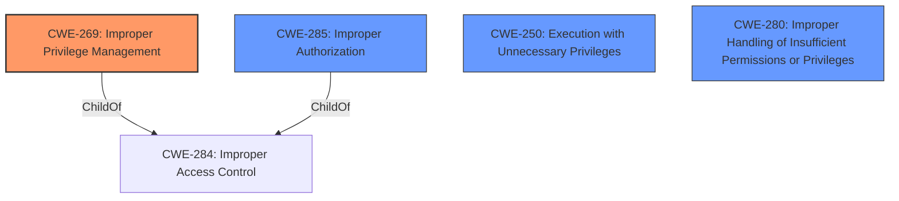

# Raw Analyzer Response for CVE-2024-0126

# Summary
| CWE ID    | CWE Name                                                       | Confidence | CWE Abstraction Level | CWE Vulnerability Mapping Label | CWE-Vulnerability Mapping Notes |
| --------- | -------------------------------------------------------------- | ---------- | --------------------- | ------------------------------- | ------------------------------- |
| CWE-269   | Improper Privilege Management                                  | 0.7        | Class                 | Primary CWE                     | Discouraged                    |
| CWE-285   | Improper Authorization                                          | 0.6        | Class                 | Secondary Candidate             | Discouraged                    |
| CWE-250   | Execution with Unnecessary Privileges                        | 0.5        | Base                  | Secondary Candidate             | Allowed                         |
| CWE-280   | Improper Handling of Insufficient Permissions or Privileges   | 0.5        | Base                  | Secondary Candidate             | Allowed                         |

## Evidence and Confidence

*   **Confidence Score:** 0.7
*   **Evidence Strength:** MEDIUM

## Relationship Analysis
The primary relationship influencing the CWE selection is the hierarchical structure within the CWE framework, particularly the parent-child relationships. Several candidate CWEs such as CWE-285 (Improper Authorization) and CWE-269 (Improper Privilege Management) are Class-level CWEs with more specific Base-level children. However, given the limited details about the root cause, the Class-level CWEs are considered more appropriate. The retriever also listed CWE-250, CWE-280 and others which were considered to be lower in score and less appropriate.

## Vulnerability Chain
The vulnerability chain starts with **Improper Privilege Management** (CWE-269) or **Improper Authorization** (CWE-285), potentially leading to **escalation of privileges**, code execution, denial of service, information disclosure, and data tampering. The chain reflects a progression from an initial **flaw** in privilege or authorization handling to a range of severe impacts.

## Summary of Analysis
The initial analysis focused on identifying the root cause of the vulnerability in the NVIDIA GPU Display Driver. The key phrase "escalate permissions" suggests a problem with privilege management. The retriever results pointed to several relevant CWEs, including CWE-269 (Improper Privilege Management) and CWE-285 (Improper Authorization), along with CWE-250 (Execution with Unnecessary Privileges) and CWE-280 (Improper Handling of Insufficient Permissions or Privileges).

The evidence from the "CVE Reference Links Content Summary" states:
- **Weaknesses/Vulnerabilities Present:**
    - Improper input validation (CWE-20)

However, **Improper input validation** (CWE-20) is not the root cause, and instead, the root cause is a vulnerability within the NVIDIA GPU Display Driver for Windows and Linux. The specific nature of the vulnerability is not detailed beyond that it exists within the driver, which makes it hard to pin point.

Given the **privileged attacker** requirement and the potential for **escalation of privileges**, CWE-269 (Improper Privilege Management) is selected as the primary CWE due to its direct relevance. However, the description also implies that an authorization check might be failing or implemented incorrectly, making CWE-285 (Improper Authorization) a secondary candidate. CWE-250, CWE-280 are also secondary candidates.

CWE-269 is a Class-level CWE, and while it is generally preferred to choose a Base-level CWE, the lack of specific details about the vulnerability makes a more specific classification difficult. The decision is based on the available evidence and the relationships between the CWEs, with a focus on the root cause of the privilege escalation.

**CWE-269: Improper Privilege Management**
*   **Technical Explanation:** The NVIDIA GPU Display Driver **does not properly manage privileges**, allowing a privileged attacker to escalate their permissions. This could involve incorrect assignment, modification, tracking, or checking of privileges.
*   **Security Implications:** An attacker with already high privileges can gain even more control over the system, potentially leading to code execution, denial of service, information disclosure, and data tampering.
*   **Relationship Analysis:** CWE-269 is a Class-level CWE and a child of CWE-284 (Improper Access Control). While more specific Base-level CWEs could be considered, the lack of detailed information makes CWE-269 the most appropriate choice.
*   **Mapping Guidance:** CWE-269 is discouraged due to its broad nature, but in this case, the vulnerability's high-level description warrants its use.
*   **Evidence:** "NVIDIA GPU Display Driver for Windows and Linux contains a vulnerability which could allow a privileged attacker to escalate permissions."
*   **Confidence:** 0.7

**CWE-285: Improper Authorization**
*   **Technical Explanation:** The NVIDIA GPU Display Driver **does not correctly perform an authorization check**, allowing a privileged attacker to escalate their permissions. This could involve failing to properly validate the attacker's privileges before granting access to sensitive resources or actions.
*   **Security Implications:** An attacker with already high privileges can bypass authorization checks and gain even more control over the system, potentially leading to code execution, denial of service, information disclosure, and data tampering.
*   **Relationship Analysis:** CWE-285 is a Class-level CWE and a child of CWE-284 (Improper Access Control). While more specific Base-level CWEs could be considered, the lack of detailed information makes CWE-285 a possible choice.
*   **Mapping Guidance:** CWE-285 is discouraged due to its broad nature, but in this case, the vulnerability's high-level description warrants its use.
*   **Evidence:** "NVIDIA GPU Display Driver for Windows and Linux contains a vulnerability which could allow a privileged attacker to escalate permissions."
*   **Confidence:** 0.6

**CWE-250: Execution with Unnecessary Privileges**
*   **Technical Explanation:** The NVIDIA GPU Display Driver may be executing code with higher privileges than necessary, which could allow an attacker to exploit this vulnerability and escalate their permissions.
*   **Security Implications:** If code is running with elevated privileges, an attacker could potentially leverage this to perform unauthorized actions, leading to code execution, denial of service, information disclosure, and data tampering.
*   **Relationship Analysis:** CWE-250 is a Base-level CWE.
*   **Mapping Guidance:** CWE-250 is Allowed.
*   **Evidence:** "NVIDIA GPU Display Driver for Windows and Linux contains a vulnerability which could allow a privileged attacker to escalate permissions."
*   **Confidence:** 0.5

**CWE-280: Improper Handling of Insufficient Permissions or Privileges**
*   **Technical Explanation:** The NVIDIA GPU Display Driver may not be properly handling scenarios where it has insufficient privileges, which could lead to unexpected code paths and potential security vulnerabilities.
*   **Security Implications:** If the driver does not handle insufficient privileges correctly, it could lead to code execution, denial of service, information disclosure, and data tampering.
*   **Relationship Analysis:** CWE-280 is a Base-level CWE.
*   **Mapping Guidance:** CWE-280 is Allowed.
*   **Evidence:** "NVIDIA GPU Display Driver for Windows and Linux contains a vulnerability which could allow a privileged attacker to escalate permissions."
*   **Confidence:** 0.5

**Other CWEs Considered:**

*   CWE-732 (Incorrect Permission Assignment for Critical Resource): This CWE was considered but not selected because it focuses on incorrect permission assignments for specific resources, while the vulnerability description suggests a more general privilege management issue.
*   CWE-427 (Uncontrolled Search Path Element): This CWE was considered but not selected because it relates to the use of uncontrolled search paths, which is not directly relevant to the privilege escalation vulnerability described.
*   CWE-20 (Improper Input Validation): Though mentioned, this is likely a secondary weakness rather than the primary cause of the privilege escalation.
*   CWE-367 (Time-of-check Time-of-use (TOCTOU) Race Condition): This CWE was considered but not selected because it relates to race conditions, which is not directly mentioned in the vulnerability description.