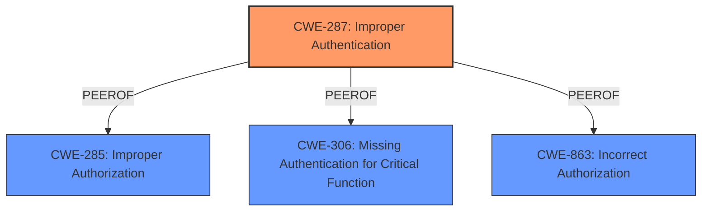

# Analysis Report for CVE-2024-0130

# Vulnerability Analysis Report: CVE-2024-0130

## Description

NVIDIA UFM Enterprise, UFM Appliance, and UFM CyberAI contain a vulnerability where an attacker can cause an **improper **authentication issue**** by sending a malformed request through the Ethernet management interface. A successful exploit of this vulnerability might lead to escalation of privileges, data tampering, denial of service, and information disclosure.

## Vulnerability Description Key Phrases

- **Rootcause:** improper authentication issue
- **Weakness:** authentication issue
- **Impact:** ["['escalation of privileges'", "'data tampering'", "'denial of service'", "'information disclosure']"]
- **Vector:** malformed request
- **Attacker:** attacker
- **Product:** ['NVIDIA UFM Enterprise', 'UFM Appliance', 'and UFM CyberAI']
- **Component:** Ethernet management interface

## Analysis (with Relationship Data)

# Summary

| CWE ID  | CWE Name                       | Confidence | CWE Abstraction Level | CWE Vulnerability Mapping Label | CWE-Vulnerability Mapping Notes |
| :-------- | :----------------------------- | :--------- | :-------------------- | :------------------------------ | :------------------------------ |
| CWE-287   | Improper Authentication        | 0.9        | Class                 | Primary                       | Discouraged                   |

## Evidence and Confidence

*   **Confidence Score:** 0.9
*   **Evidence Strength:** HIGH

## Relationship Analysis

The primary CWE identified is CWE-287 (Improper Authentication), which is a class-level CWE. While there may be more specific child CWEs, the provided information does not give enough evidence to refine it further. The CWE-287 is related to other authentication and authorization CWEs. The guidance provided on authentication vs authorization was key.



## Vulnerability Chain

The vulnerability chain starts with the **improper authentication issue** (CWE-287). This allows an attacker to potentially escalate privileges, tamper with data, cause a denial of service, or disclose information. The root cause is the **improper authentication**, and the impacts are privilege escalation, data tampering, DoS, and information disclosure.

## Summary of Analysis

The vulnerability description clearly states that the root cause is an "**improper authentication issue**" due to a malformed request. The summary of the CVE Reference Links reinforces this by explicitly mentioning "**Improper authentication (CWE-287)**." The retriever results also list CWE-287 as a relevant CWE.

The classification guidance highlights the differences between authentication, authorization, and access control. Since the vulnerability is explicitly related to "**improper authentication**," CWE-287 is the most appropriate choice.

Other CWEs like Improper Input Validation (CWE-20), Improper Privilege Management (CWE-269), and Improper Authorization (CWE-285) were considered but deemed less accurate since the core issue is related to authentication. I considered the guidance about authentication vs authorization: **Authentication** determines *who* the actor is (identity validation). This is typically the *first step* in access control, and **Authorization** determines *what* an authenticated actor is allowed to do. It decides access *after* identity is verified.

The selection of CWE-287 is at the class level because the description does not provide sufficient detail to determine the specific type of authentication failure, which would allow mapping to a base or variant level CWE.


## CWE Relationship Analysis

Current CWEs represent these abstraction levels: .


### Vulnerability Chain Analysis

**Chain starting from CWE-863:**
- 863 (Incorrect Authorization) - ROOT


**Chain starting from CWE-306:**
- 306 (Missing Authentication for Critical Function) - ROOT


### CWE Relationship Diagram

```mermaid
graph TD
    classDef primary fill:#f96,stroke:#333,stroke-width:2px
    classDef secondary fill:#69f,stroke:#333
    classDef tertiary fill:#9e9,stroke:#333
```


*Report generated on 2025-07-12 23:43:46*
