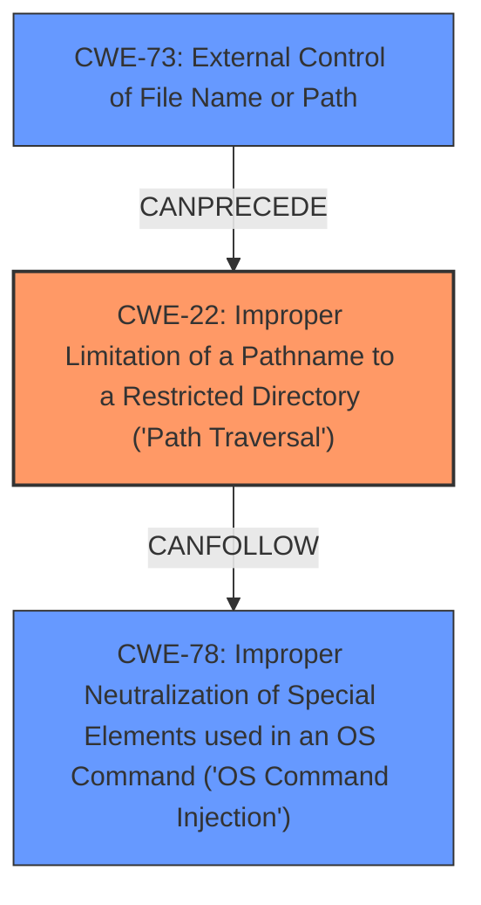

# Analysis Report for CVE-2024-0520

# Vulnerability Analysis Report: CVE-2024-0520

## Description

A vulnerability in mlflow/mlflow version 8.2.1 allows for remote code execution due to **improper neutralization of special elements** used in an OS command (Command Injection) within the `mlflow.data.http_dataset_source.py` module. Specifically, when loading a dataset from a source URL with an HTTP scheme, the filename extracted from the `Content-Disposition` header or the URL path is used to generate the final file path without proper sanitization. This flaw enables an attacker to control the file path fully by utilizing **path traversal** or absolute path techniques, such as ../../tmp/poc.txt or /tmp/poc.txt, leading to arbitrary file write. Exploiting this vulnerability could allow a malicious user to execute commands on the vulnerable machine, potentially gaining access to data and model information. The issue is fixed in version 2.9.0.

## Vulnerability Description Key Phrases

- **Rootcause:** ['improper input sanitization', 'improper neutralization of special elements']
- **Weakness:** ['command injection', 'path traversal']
- **Impact:** ['arbitrary file write', 'execute commands', 'remote code execution']
- **Product:** mlflow/mlflow
- **Version:** 8.2.1
- **Component:** mlflow.data.http_dataset_source.py

## Analysis (with Relationship Data)

# Summary
| CWE ID  | CWE Name                                                                                                | Confidence | CWE Abstraction Level | CWE Vulnerability Mapping Label | CWE-Vulnerability Mapping Notes |
| :-------- | :-------------------------------------------------------------------------------------------------------- | :--------- | :---------------------- | :-------------------------------- | :-------------------------------- |
| CWE-22    | Improper Limitation of a Pathname to a Restricted Directory ('Path Traversal')                             | 0.95       | Base                    | Primary                           | Allowed                           |
| CWE-73   | External Control of File Name or Path                                                                | 0.75       | Base                    | Secondary                         | Allowed                           |
| CWE-78 | Improper Neutralization of Special Elements used in an OS Command ('OS Command Injection') | 0.60       | Base                    | Secondary                         | Allowed                           |

## Evidence and Confidence

*   **Confidence Score:** 0.85
*   **Evidence Strength:** HIGH

## Relationship Analysis
The primary weakness is CWE-22, which describes the **improper limitation of a pathname to a restricted directory**. This is a base-level CWE that directly aligns with the **path traversal** vulnerability described. CWE-73 (External Control of File Name or Path) and CWE-78 (Improper Neutralization of Special Elements used in an OS Command) are related weaknesses. CWE-73 describes the broader issue of user-controlled file paths, while CWE-22 is a specific type of that issue. CWE-78 is a related weakness because the ability to control the file path can lead to OS command injection if the file path is used in a command. The relationships between these CWEs help provide a more complete understanding of the vulnerability.



## Vulnerability Chain
The vulnerability chain starts with the **improper neutralization of special elements** in the file name/path, leading to a **path traversal** vulnerability, which allows for **arbitrary file write** and potentially **command injection** and ultimately **remote code execution**.

## Summary of Analysis
The primary CWE is CWE-22 because the vulnerability description explicitly mentions **path traversal** and the **improper limitation of a pathname to a restricted directory**. The description states that an attacker can control the file path using **path traversal** techniques.

The supporting evidence is from the vulnerability description: "This flaw enables an attacker to control the file path fully by utilizing **path traversal** or absolute path techniques, such as ../../tmp/poc.txt or /tmp/poc.txt, leading to arbitrary file write."

CWE-73 is included as a secondary CWE because the vulnerability allows for external control of the file name or path. The description states that the filename extracted from the `Content-Disposition` header or the URL path is used to generate the final file path.

CWE-78 is included as a secondary CWE because the **arbitrary file write** could lead to command injection if the written file is executed as a command.

CWE-20 was considered but not selected as the primary CWE because it is a high-level class and more specific CWEs like CWE-22 are available.
CWE-138 was also considered but deemed too general compared to CWE-22.
CWE-23 was considered, but CWE-22 is more encompassing.
CWE-1336 was considered, but not applicable since it concerns template engines.


## CWE Relationship Analysis

Current CWEs represent these abstraction levels: .


### Vulnerability Chain Analysis

**Chain starting from CWE-22:**
- 22 (Improper Limitation of a Pathname to a Restricted Directory ('Path Traversal')) - ROOT


**Chain starting from CWE-73:**
- 73 (External Control of File Name or Path) - ROOT


### CWE Relationship Diagram

```mermaid
graph TD
    classDef primary fill:#f96,stroke:#333,stroke-width:2px
    classDef secondary fill:#69f,stroke:#333
    classDef tertiary fill:#9e9,stroke:#333
```


*Report generated on 2025-07-12 23:46:27*
