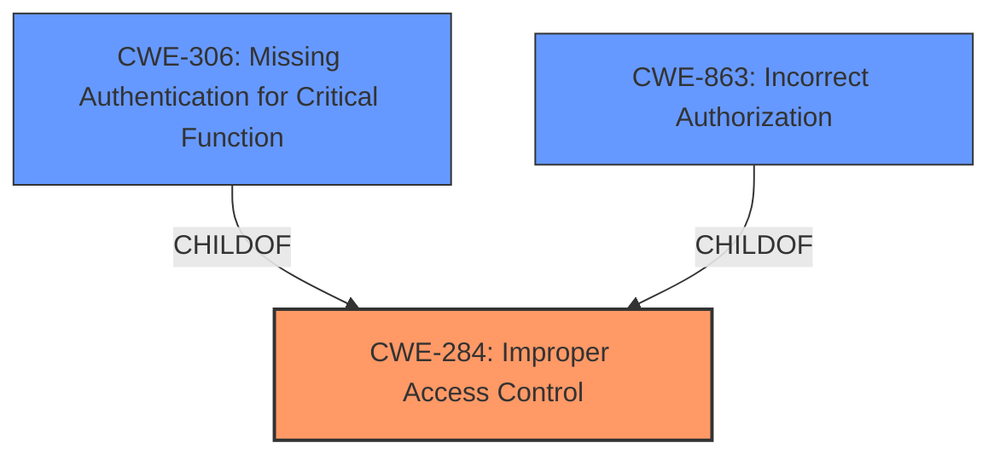

# Raw Analyzer Response for CVE-2024-0949

# Summary
| CWE ID | CWE Name | Confidence | CWE Abstraction Level | CWE Vulnerability Mapping Label | CWE-Vulnerability Mapping Notes |
|---|---|---|---|---|---|
| CWE-284 | Improper Access Control | 0.7 | Pillar | Primary | Allowed |
| CWE-306 | Missing Authentication for Critical Function | 0.6 | Base | Secondary | Allowed |
| CWE-863 | Incorrect Authorization | 0.6 | Class | Secondary | Allowed-with-Review |

## Evidence and Confidence

*   **Confidence Score:** 0.7
*   **Evidence Strength:** MEDIUM

## Relationship Analysis
The primary CWE selected is CWE-284, Improper Access Control, which is a high-level category. The vulnerability description mentions **Improper Access Control**, **Missing Authorization**, **Incorrect Authorization**, **Incorrect Permission Assignment for Critical Resource**, **Missing Authentication**, **Weak Authentication**, **Improper Restriction of Communication Channel to Intended Endpoints**. Given this information, I considered child CWEs. Specifically, CWE-306 (Missing Authentication for Critical Function) and CWE-863 (Incorrect Authorization) are considered as secondary CWEs because the description explicitly mentions both missing authentication and incorrect authorization. These secondary CWEs provide more specific information about the access control issues.

## Vulnerability Chain
The vulnerability chain starts with **improper access control**, **missing authentication**, or **incorrect authorization**. This leads to impacts such as Exploiting Incorrectly Configured Access Control Security Levels, Manipulating Web Input to File System Calls, Embedding Scripts within Scripts, Malicious Logic Insertion, and Modification of Windows Service Configuration. The **root cause** is the **improper access control**, which enables a wide range of exploits due to the lack of or incorrect security measures.

## Summary of Analysis
The initial analysis identified several potential CWEs based on the vulnerability description, particularly focusing on access control, authentication, and authorization. The description explicitly mentions **Improper Access Control, Missing Authorization, Incorrect Authorization, Incorrect Permission Assignment for Critical Resource, Missing Authentication, Weak Authentication, Improper Restriction of Communication Channel to Intended Endpoints**.

The guidance provided in the prompt suggests differentiating between authentication and authorization issues. Since the description mentions both **missing authentication** and **incorrect authorization**, I chose CWE-306 and CWE-863 as secondary CWEs to provide more specific details.

The final selection of CWE-284 as the primary CWE, with CWE-306 and CWE-863 as secondary CWEs, provides a balanced view of the vulnerability. It captures the high-level issue of access control while also specifying the more detailed issues of missing authentication and incorrect authorization. The selected CWEs are at the optimal level of specificity given the information available in the vulnerability description.

Relevant CWE Information:

# Enhanced Context (25 CWEs)
The following CWEs were identified as potentially relevant to this vulnerability:

## CWE-284: Improper Access Control
**Abstraction Level**: Pillar
**Similarity Score**: 0.800

**Description**:
The software does not restrict or incorrectly restricts access to resources (data, files, actions, etc.) to only the intended users.

**Mapping Guidance**:
- Usage: Allowed

## CWE-306: Missing Authentication for Critical Function
**Abstraction Level**: Base
**Similarity Score**: 0.436
**Source**: sparse

**Description**:
The product does not perform any authentication for functionality that requires a provable user identity or consumes a significant amount of resources.

**Mapping Guidance**:
- Usage: Allowed

## CWE-863: Incorrect Authorization
**Abstraction Level**: Class
**Similarity Score**: 0.446
**Source**: sparse

**Description**:
The product performs an authorization check when an actor attempts to access a resource or perform an action, but it does not correctly perform the check.

**Mapping Guidance**:
- Usage: Allowed-with-Review