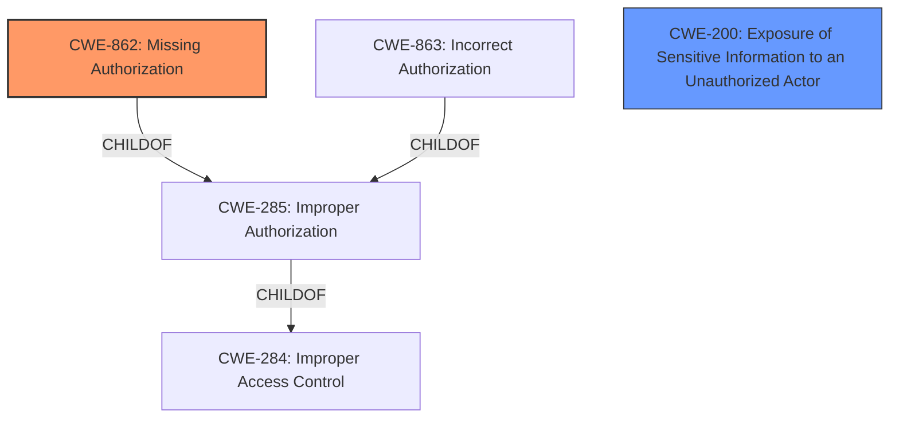

# Analysis Report for CVE-2024-0972

# Vulnerability Analysis Report: CVE-2024-0972

## Description

The BuddyPress Members Only plugin for WordPress is vulnerable to **Sensitive Information Exposure** in all versions up to, and including, 3.3.5 via the REST API. This makes it possible for unauthenticated attackers to bypass the plugins All Other Sections On Your Site Will be Opened to Guest feature (when unset) and view restricted page and post content.

## Vulnerability Description Key Phrases

- **Rootcause:** improper access control
- **Weakness:** Sensitive Information Exposure
- **Impact:** view restricted page and post content
- **Vector:** REST API
- **Attacker:** unauthenticated attackers
- **Product:** BuddyPress Members Only plugin for WordPress
- **Version:** all versions up to and including 3.3.5

## Analysis (with Relationship Data)

# Summary
| CWE ID  | CWE Name                                                                             | Confidence | CWE Abstraction Level | CWE Vulnerability Mapping Label | CWE-Vulnerability Mapping Notes |
| :-------- | :----------------------------------------------------------------------------------- | :--------- | :---------------------- | :------------------------------ | :-------------------------------- |
| CWE-862   | Missing Authorization                                                              | 1.0        | Class                   | Primary CWE                     | Allowed-with-Review               |
| CWE-200   | Exposure of Sensitive Information to an Unauthorized Actor                         | 0.8        | Class                   | Secondary Candidate             | Discouraged                       |

## Evidence and Confidence

*   **Confidence Score:** 0.9
*   **Evidence Strength:** HIGH

## Relationship Analysis

The primary relationship influencing the decision is the hierarchical relationship between CWE-284 (Improper Access Control), CWE-285 (Improper Authorization), CWE-862 (Missing Authorization), and CWE-863 (Incorrect Authorization). The guidance clearly distinguishes between authentication and authorization issues, leading to a focus on authorization-related CWEs. CWE-862 is chosen because the description emphasizes the complete lack of authorization checks. CWE-200 is included as a secondary candidate to account for the sensitive information exposure aspect of the vulnerability.



## Vulnerability Chain

The vulnerability chain starts with **missing authorization**, leading to the **exposure of sensitive information** to unauthorized actors.

Missing Authorization (CWE-862) -> Exposure of Sensitive Information (CWE-200)

CWE-862 is the root cause, and CWE-200 is the impact.

## Summary of Analysis

The initial analysis focused on identifying the root cause of the vulnerability. The key phrases "improper access control" and the description of unauthenticated attackers being able to bypass restrictions pointed towards an authorization or authentication issue. The provided guidance helped differentiate between these two, leading to the selection of CWE-862 as the primary CWE.

The evidence from the CVE Reference Links Content Summary clearly states: "The vulnerability stems from **improper access control** within the BuddyPress Members Only plugin's REST API implementation. The plugin **fails to properly enforce access restrictions**, allowing unauthenticated users to bypass intended limitations." This statement, coupled with the phrase "**Improper Access Control:** The core issue is that the plugin **does not adequately verify user authentication/authorization** when handling requests via the REST API," provides strong support for CWE-862.

The selection is based on the understanding that the plugin completely lacks authorization checks for certain resources, allowing unauthenticated users to access them. While **Sensitive Information Exposure** is a clear symptom, it is a consequence of the **missing authorization**. Therefore, CWE-862 is the more accurate representation of the root cause.

The other CWEs considered, such as CWE-306 (Missing Authentication), were ruled out because the issue is not a complete lack of authentication but rather the absence of authorization checks after a user (potentially unauthenticated) makes a request.

CWE-862 is at the appropriate level of specificity, as it directly addresses the missing authorization component. CWE-285 (Improper Authorization) is a more general class, and CWE-863 (Incorrect Authorization) implies that an authorization check exists but is flawed, which is not the case here.
The final decision is based on the provided evidence and guidance, resulting in a high level of confidence in the mapping.

Relevant CWE Information:

# Enhanced Context (25 CWEs)
The following CWEs were identified as potentially relevant to this vulnerability:

## CWE-639: Authorization Bypass Through User-Controlled Key
**Abstraction Level**: Base
**Similarity Score**: 0.76
**Source**: dense

**Description**:
The system's authorization functionality does not prevent one user from gaining access to another user's data or record by modifying the key value identifying the data.

**Mapping Guidance**:
- Usage: Allowed
- Rationale: This CWE entry is at the Base level of abstraction, which is a preferred level of abstraction for mapping to the root causes of vulnerabilities.


## CWE-425: Direct Request ('Forced Browsing')
**Abstraction Level**: Base
**Similarity Score**: 0.76
**Source**: dense

**Description**:
The web application does not adequately enforce appropriate authorization on all restricted URLs, scripts, or files.

**Mapping Guidance**:
- Usage: Allowed
- Rationale: This CWE entry is at the Base level of abstraction, which is a preferred level of abstraction for mapping to the root causes of vulnerabilities.


## CWE-472: External Control of Assumed-Immutable Web Parameter
**Abstraction Level**: Base
**Similarity Score**: 0.75
**Source**: dense

**Description**:
The web application does not sufficiently verify inputs that are assumed to be immutable but are actually externally controllable, such as hidden form fields.

**Mapping Guidance**:
- Usage: Allowed
- Rationale: This CWE entry is at the Base level of abstraction, which is a preferred level of abstraction for mapping to the root causes of vulnerabilities.


## CWE-668: Exposure of Resource to Wrong Sphere
**Abstraction Level**: Class
**Similarity Score**: 0.75
**Source**: dense

**Description**:
The product exposes a resource to the wrong control sphere, providing unintended actors with inappropriate access to the resource.

**Mapping Guidance**:
- Usage: Discouraged
- Rationale: CWE-668 is high-level and is often misused as a catch-all when lower-level CWE IDs might be applicable. It is sometimes used for low-information vulnerability reports [REF-1287]. It is a level-1 Class (i.e., a child of a Pillar). It is not useful for trend analysis.


## CWE-1390: Weak Authentication
**Abstraction Level**: Class
**Similarity Score**: 0.75
**Source**: dense

**Description**:
The product uses an authentication mechanism to restrict access to specific users or identities, but the mechanism does not sufficiently prove that the claimed identity is correct.

**Mapping Guidance**:
- Usage: Allowed-with-Review
- Rationale: This CWE entry is a Class and might have Base-level children that would be more appropriate


## CWE-538: Insertion of Sensitive Information into Externally-Accessible File or Directory
**Abstraction Level**: Base
**Similarity Score**: 0.75
**Source**: dense

**Description**:
The product places sensitive information into files or directories that are accessible to actors who are allowed to have access to the files, but not to the sensitive information.

**Mapping Guidance**:
- Usage: Allowed
- Rationale: This CWE entry is at the Base level of abstraction, which is a preferred level of abstraction for mapping to the root causes of vulnerabilities.


## CWE-41: Improper Resolution of Path Equivalence
**Abstraction Level**: Base
**Similarity Score**: 0.74
**Source**: dense

**Description**:
The product is vulnerable to file system contents disclosure through path equivalence. Path equivalence involves the use of special characters in file and directory names. The associated manipulations are intended to generate multiple names for the same object.

**Mapping Guidance**:
- Usage: Allowed
- Rationale: This CWE entry is at the Base level of abstraction, which is a preferred level of abstraction for mapping to the root causes of vulnerabilities.


## CWE-497: Exposure of Sensitive System Information to an Unauthorized Control Sphere
**Abstraction Level**: Base
**Similarity Score**: 0.74
**Source**: dense

**Description**:
The product does not properly prevent sensitive system-level information from being accessed by unauthorized actors who do not have the same level of access to the underlying system as the product does.

**Mapping Guidance**:
- Usage: Allowed
- Rationale: This CWE entry is at the Base level of abstraction, which is a preferred level of abstraction for mapping to the root causes of vulnerabilities.


## CWE-74: Improper Neutralization of Special Elements in Output Used by a Downstream Component ('Injection')
**Abstraction Level**: Class
**Similarity Score**: 0.74
**Source**: dense

**Description**:
The product constructs all or part of a command, data structure, or record using externally-influenced input from an upstream component, but it does not neutralize or incorrectly neutralizes special elements that could modify how it is parsed or interpreted when it is sent to a downstream component.

**Mapping Guidance**:
- Usage: Discouraged
- Rationale: CWE-74


## CWE Relationship Analysis

Current CWEs represent these abstraction levels: .


### Vulnerability Chain Analysis

**Chain starting from CWE-1390:**
- 1390 (Weak Authentication) - ROOT


**Chain starting from CWE-863:**
- 863 (Incorrect Authorization) - ROOT


### CWE Relationship Diagram

```mermaid
graph TD
    classDef primary fill:#f96,stroke:#333,stroke-width:2px
    classDef secondary fill:#69f,stroke:#333
    classDef tertiary fill:#9e9,stroke:#333
```


*Report generated on 2025-07-12 23:48:26*
