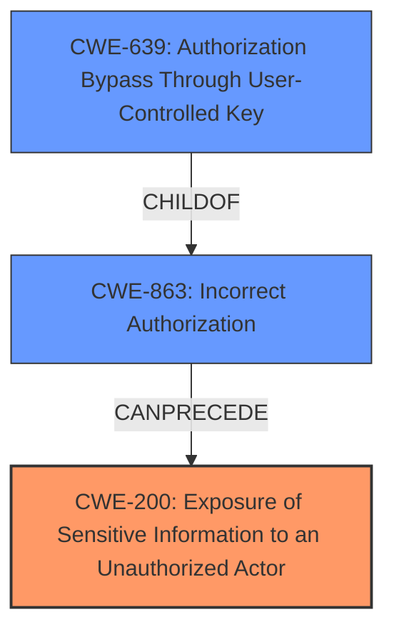

# Enhanced Analysis for CVE-2024-10084

# Summary
| CWE ID | CWE Name | Confidence | CWE Abstraction Level | CWE Vulnerability Mapping Label | CWE-Vulnerability Mapping Notes |
|---|---|---|---|---|---|
| CWE-200 | Exposure of Sensitive Information to an Unauthorized Actor | 0.9 | Class | Primary | Allowed-with-Review |
| CWE-863 | Incorrect Authorization | 0.7 | Class | Secondary | Allowed-with-Review |
| CWE-639 | Authorization Bypass Through User-Controlled Key | 0.6 | Base | Secondary | Allowed |

## Evidence and Confidence

*   **Confidence Score:** 0.8
*   **Evidence Strength:** HIGH

## Relationship Analysis
The primary CWE is CWE-200 [Exposure of Sensitive Information to an Unauthorized Actor], which is a Class-level CWE. The **root cause** is an authorization issue, which could be represented by CWE-862 [Missing Authorization] or CWE-863 [Incorrect Authorization]. Since the attacker is authenticated but can access resources they should not, CWE-863 is more appropriate. CWE-639 [Authorization Bypass Through User-Controlled Key] is also applicable as the attacker uses the shortcode to access unauthorized resources, essentially bypassing authorization through a user-controlled key (the post ID in the shortcode). CWE-863 and CWE-639 are more specific than CWE-200 but are related, influencing the choice of CWE-200 as the main issue with the authorization as the rootcause.



## Vulnerability Chain
The vulnerability chain starts with **incorrect authorization** (CWE-863), leading to an **authorization bypass through a user-controlled key** (CWE-639) and finally resulting in **exposure of sensitive information** (CWE-200).

## Summary of Analysis
The analysis is based on the provided vulnerability description and the CVE reference links content summary. The key evidence is that the `CF7_get_post_var` shortcode allows authenticated attackers to extract the titles and text contents of private and password-protected posts they do not own. This indicates that there is an issue with authorization, where the plugin **does not properly validate access permissions** when retrieving post data. The retriever results also suggest CWE-200 [Exposure of Sensitive Information to an Unauthorized Actor], CWE-863 [Incorrect Authorization], and CWE-639 [Authorization Bypass Through User-Controlled Key] as potential candidates.

The relationship graph shows that CWE-639 [Authorization Bypass Through User-Controlled Key] is a child of CWE-863 [Incorrect Authorization], and both can lead to CWE-200 [Exposure of Sensitive Information to an Unauthorized Actor]. The selection of CWE-200 as the primary CWE is based on the direct impact of the vulnerability, while CWE-863 and CWE-639 are secondary issues that contribute to the vulnerability.

The selected CWEs are at the optimal level of specificity, as they accurately represent the weakness and its impact. CWE-200 [Exposure of Sensitive Information to an Unauthorized Actor] describes the outcome of the vulnerability, while CWE-863 [Incorrect Authorization] identifies the **root cause**, and CWE-639 [Authorization Bypass Through User-Controlled Key] specifies how the authorization is bypassed.

Relevant CWE Information:

# Enhanced Context (25 CWEs)
The following CWEs were identified as potentially relevant to this vulnerability:

## CWE-352: Cross-Site Request Forgery (CSRF)
**Abstraction Level**: Compound
**Similarity Score**: 0.74
**Source**: dense

**Description**:
The web application does not, or can not, sufficiently verify whether a well-formed, valid, consistent request was intentionally provided by the user who submitted the request.

**Mapping Guidance**:
- Usage: Allowed
- Rationale: This is a well-known Composite of multiple weaknesses that must all occur simultaneously, although it is attack-oriented in nature.

*Not Used:* This is not related to CSRF because it is not about verifying the origin of the request but rather about access control.

## CWE-425: Direct Request ('Forced Browsing')
**Abstraction Level**: Base
**Similarity Score**: 0.72
**Source**: dense

**Description**:
The web application does not adequately enforce appropriate authorization on all restricted URLs, scripts, or files.

**Mapping Guidance**:
- Usage: Allowed
- Rationale: This CWE entry is at the Base level of abstraction, which is a preferred level of abstraction for mapping to the root causes of vulnerabilities.

*Not Used:* While related to authorization, it is less specific than CWE-863 because it refers to the general lack of authorization enforcement.

## CWE-472: External Control of Assumed-Immutable Web Parameter
**Abstraction Level**: Base
**Similarity Score**: 0.71
**Source**: dense

**Description**:
The web application does not sufficiently verify inputs that are assumed to be immutable but are actually externally controllable, such as hidden form fields.

**Mapping Guidance**:
- Usage: Allowed
- Rationale: This CWE entry is at the Base level of abstraction, which is a preferred level of abstraction for mapping to the root causes of vulnerabilities.

*Not Used:* Although the post ID is externally controlled, the primary issue isn't the lack of verification of an assumed-immutable parameter, but the lack of authorization checks.

## CWE-434: Unrestricted Upload of File with Dangerous Type
**Abstraction Level**: Base
**Similarity Score**: 0.69
**Source**: dense

**Description**:
The product allows the upload or transfer of dangerous file types that are automatically processed within its environment.

**Mapping Guidance**:
- Usage: Allowed
- Rationale: This CWE entry is at the Base level of abstraction, which is a preferred level of abstraction for mapping to the root causes of vulnerabilities.

*Not Used:* This CWE is not applicable as the vulnerability is not related to file uploads.

## CWE-639: Authorization Bypass Through User-Controlled Key
**Abstraction Level**: Base
**Similarity Score**: 0.69
**Source**: dense

**Description**:
The system's authorization functionality does not prevent one user from gaining access to another user's data or record by modifying the key value identifying the data.

**Mapping Guidance**:
- Usage: Allowed
- Rationale: This CWE entry is at the Base level of abstraction, which is a preferred level of abstraction for mapping to the root causes of vulnerabilities.

*Used:* This is a secondary CWE. The vulnerability allows attackers to access unauthorized data by manipulating the post ID, which acts as a user-controlled key.

## CWE-538: Insertion of Sensitive Information into Externally-Accessible File or Directory
**Abstraction Level**: Base
**Similarity Score**: 0.69
**Source**: dense

**Description**:
The product places sensitive information into files or directories that are accessible to actors who are allowed to have access to the files, but not to the sensitive information.

**Mapping Guidance**:
- Usage: Allowed
- Rationale: This CWE entry is at the Base level of abstraction, which is a preferred level of abstraction for mapping to the root causes of vulnerabilities.

*Not Used:* The sensitive information isn't being placed in a file or directory, but is being directly exposed through the application.

## CWE-359: Exposure of Private Personal Information to an Unauthorized Actor
**Abstraction Level**: Base
**Similarity Score**: 0.69
**Source**: dense

**Description**:
The product does not properly prevent a person's private, personal information from being accessed by actors who either (1) are not explicitly authorized to access the information or (2) do not have the implicit consent of the person about whom the information is collected.

**Mapping Guidance**:
- Usage: Allowed
- Rationale: This CWE entry is at the Base level of abstraction, which is a preferred level of abstraction for mapping to the root causes of vulnerabilities.

*Not Used:* CWE-200 [Exposure of Sensitive Information to an Unauthorized Actor] is a better fit because it's a more general description of exposing sensitive information, which is the direct result of the vulnerability.

## CWE-201: Insertion of Sensitive Information Into Sent Data
**Abstraction Level**: Base
**Similarity Score**: 0.69
**Source**: dense

**Description**:
The code transmits data to another actor, but a portion of the data includes sensitive information that should not be accessible to that actor.

**Mapping Guidance**:
- Usage: Allowed
- Rationale: This CWE entry is at the Base level of abstraction, which


## CWE Relationship Analysis

Current CWEs represent these abstraction levels: .


### Vulnerability Chain Analysis

**Chain starting from CWE-863:**
- 863 (Incorrect Authorization) - ROOT


**Chain starting from CWE-359:**
- 359 (Exposure of Private Personal Information to an Unauthorized Actor) - ROOT


### CWE Relationship Diagram

```mermaid
graph TD
    classDef primary fill:#f96,stroke:#333,stroke-width:2px
    classDef secondary fill:#69f,stroke:#333
    classDef tertiary fill:#9e9,stroke:#333
```