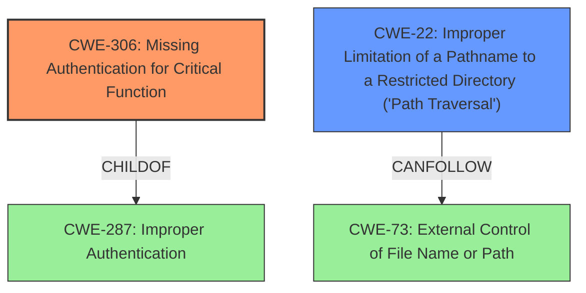

# Enhanced Analysis for CVE-2024-10121

# Summary
| CWE ID | CWE Name | Confidence | CWE Abstraction Level | CWE Vulnerability Mapping Label | CWE-Vulnerability Mapping Notes |
|---|---|---|---|---|---|
| CWE-306 | Missing Authentication for Critical Function | 0.9 | Base | Primary | Allowed |
| CWE-22 | Improper Limitation of a Pathname to a Restricted Directory ('Path Traversal') | 0.6 | Base | Secondary | Allowed |

## Evidence and Confidence

*   **Confidence Score:** 0.8
*   **Evidence Strength:** MEDIUM

## Relationship Analysis
The primary CWE is CWE-306, indicating a **missing authentication** issue. While the vulnerability description mentions that this is not a **path traversal** issue, the fact that the input `/../` leads to an **authorization bypass** suggests a potential secondary weakness related to **path traversal**, which is reflected in the selection of CWE-22. CWE-306 is a child of CWE-287 (Improper Authentication), and CWE-22 can lead to CWE-73 (External Control of File Name or Path). The analysis focuses on identifying the root cause (missing authentication) and any contributing factors (path manipulation), leading to the selection of these two CWEs.



## Vulnerability Chain
The vulnerability chain starts with the **missing authentication** (CWE-306). The ability to manipulate the path using `/../` (potentially CWE-22) allows bypassing **authorization checks**, ultimately leading to unauthorized access.
  - CWE-306: Missing Authentication for Critical Function (Root Cause)
  - CWE-22: Improper Limitation of a Pathname to a Restricted Directory ('Path Traversal') (Contributing Factor)
  - Authorization Bypass (Impact)

## Summary of Analysis
The primary focus is on identifying the root cause of the vulnerability based on the provided evidence. The description highlights an **authorization bypass** due to the manipulation of input `/../`. The analysis determined that the **missing authentication** is the main reason an attacker can bypass **authorization checks**.

The evidence supporting this includes:
- "The manipulation with the input /../ leads to authorization bypass."
- "The vulnerability is due to an authorization bypass in the `wfh45678 Radar` application. Specifically, the application fails to properly restrict access to its interfaces, allowing unauthenticated users to access any interface by manipulating the URL with `/../`."
- "Authentication Bypass: The core issue is the lack of proper authentication checks, which allows unauthorized access to application functionalities."

CWE-306 is selected as the primary CWE because the application lacks authentication for critical functions. Although the vulnerability description mentions it "appears not to be a path traversal weakness," the ability to manipulate the URL with `/../` suggests a path traversal-like technique is used to bypass authorization checks. Therefore, CWE-22 is included as a secondary CWE.

The selected CWEs are at the appropriate level of specificity because they directly represent the **missing authentication** and the potential contributing factor of **path manipulation**.

Relevant CWE Information:

# Enhanced Context (25 CWEs)

## CWE-41: Improper Resolution of Path Equivalence
**Abstraction Level**: Base
**Similarity Score**: 0.77
**Source**: dense

**Description**:
The product is vulnerable to file system contents disclosure through path equivalence. Path equivalence involves the use of special characters in file and directory names. The associated manipulations are intended to generate multiple names for the same object.

**Mapping Guidance**:
- Usage: Allowed
- Rationale: This CWE entry is at the Base level of abstraction, which is a preferred level of abstraction for mapping to the root causes of vulnerabilities.
*This CWE was considered because the vulnerability involves manipulation of paths, but it focuses on path equivalence issues, not the lack of authentication. It was not selected because the primary issue is missing authentication.*

## CWE-807: Reliance on Untrusted Inputs in a Security Decision
**Abstraction Level**: Base
**Similarity Score**: 0.76
**Source**: dense

**Description**:
The product uses a protection mechanism that relies on the existence or values of an input, but the input can be modified by an untrusted actor in a way that bypasses the protection mechanism.

**Mapping Guidance**:
- Usage: Allowed
- Rationale: This CWE entry is at the Base level of abstraction, which is a preferred level of abstraction for mapping to the root causes of vulnerabilities.
*This CWE was considered, but the root cause is more directly related to the lack of authentication than reliance on untrusted inputs.*

## CWE-668: Exposure of Resource to Wrong Sphere
**Abstraction Level**: Class
**Similarity Score**: 0.76
**Source**: dense

**Description**:
The product exposes a resource to the wrong control sphere, providing unintended actors with inappropriate access to the resource.

**Mapping Guidance**:
- Usage: Discouraged
- Rationale: CWE-668 is high-level and is often misused as a catch-all when lower-level CWE IDs might be applicable. It is sometimes used for low-information vulnerability reports [REF-1287]. It is a level-1 Class (i.e., a child of a Pillar). It is not useful for trend analysis.
*This CWE was considered but is too generic and doesn't reflect the specific root cause of missing authentication.*

## CWE-472: External Control of Assumed-Immutable Web Parameter
**Abstraction Level**: Base
**Similarity Score**: 0.76
**Source**: dense

**Description**:
The web application does not sufficiently verify inputs that are assumed to be immutable but are actually externally controllable, such as hidden form fields.

**Mapping Guidance**:
- Usage: Allowed
- Rationale: This CWE entry is at the Base level of abstraction, which is a preferred level of abstraction for mapping to the root causes of vulnerabilities.
*This CWE was considered, but the vulnerability is more related to missing authentication than external control of assumed-immutable parameters.*

## CWE-497: Exposure of Sensitive System Information to an Unauthorized Control Sphere
**Abstraction Level**: Base
**Similarity Score**: 0.76
**Source**: dense

**Description**:
The product does not properly prevent sensitive system-level information from being accessed by unauthorized actors who do not have the same level of access to the underlying system as the product does.

**Mapping Guidance**:
- Usage: Allowed
- Rationale: This CWE entry is at the Base level of abstraction, which is a preferred level of abstraction for mapping to the root causes of vulnerabilities.
*This CWE was considered, but the root cause is more directly related to the lack of authentication than exposure of sensitive system information.*

## CWE-425: Direct Request ('Forced Browsing')
**Abstraction Level**: Base
**Similarity Score**: 0.76
**Source**: dense

**Description**:
The web application does not adequately enforce appropriate authorization on all restricted URLs, scripts, or files.

**Mapping Guidance**:
- Usage: Allowed
- Rationale: This CWE entry is at the Base level of abstraction, which is a preferred level of abstraction for mapping to the root causes of vulnerabilities.
*This CWE was considered, but the missing authentication makes CWE-306 a more accurate fit.*

## CWE-23: Relative Path Traversal
**Abstraction Level**: Base
**Similarity Score**: 0.76
**Source**: dense

**Description**:
The product uses external input to construct a pathname that should be within a restricted directory, but it does not properly neutralize sequences such as ".." that can resolve to a location that is outside of that directory.

**Mapping Guidance**:
- Usage: Allowed
- Rationale: This CWE entry is at the Base level of abstraction, which is a preferred level of abstraction for mapping to the root causes of vulnerabilities.
*CWE-23 was not selected, however CWE-22 was selected because while the vulnerability description indicates it does not appear to be path traversal, the fact that the input `/../` leads to authorization bypass suggested a potential secondary weakness related to path traversal.*

## CWE-923: Improper Restriction of Communication Channel to Intended Endpoints
**Abstraction Level**: Class
**Similarity Score**: 0.75
**Source**: dense

**Description**:
The product establishes a communication channel to (or from) an endpoint for privileged or protected operations, but it does not properly ensure that it is communicating with the correct endpoint.

**Mapping Guidance**:
- Usage: Allowed-with-Review
- Rationale: This CWE entry is a Class and


## CWE Relationship Analysis

Current CWEs represent these abstraction levels: .


### Vulnerability Chain Analysis

**Chain starting from CWE-22:**
- 22 (Improper Limitation of a Pathname to a Restricted Directory ('Path Traversal')) - ROOT


**Chain starting from CWE-73:**
- 73 (External Control of File Name or Path) - ROOT


### CWE Relationship Diagram

```mermaid
graph TD
    classDef primary fill:#f96,stroke:#333,stroke-width:2px
    classDef secondary fill:#69f,stroke:#333
    classDef tertiary fill:#9e9,stroke:#333
```