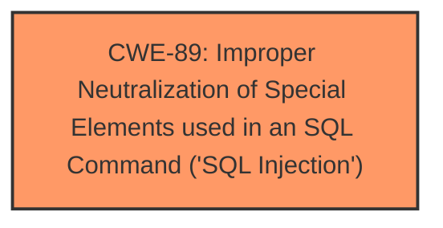

# Analysis for CVE-2024-10157

# Summary
| CWE ID | CWE Name | Confidence | CWE Abstraction Level | CWE Vulnerability Mapping Label | CWE-Vulnerability Mapping Notes |
|---|---|---|---|---|---|
| CWE-89 | Improper Neutralization of Special Elements used in an SQL Command ('SQL Injection') | 1.0 | Base | Primary | Allowed |

## Evidence and Confidence

*   **Confidence Score:** 1.0
*   **Evidence Strength:** HIGH

## Relationship Analysis
The primary relationship is that CWE-89 stands as a base level weakness, directly describing the **SQL Injection** vulnerability. There are no parent or child relationships that are relevant to this analysis. The suggested alternate CWEs like CWE-79 (Cross-site Scripting) and CWE-74 (Improper Neutralization of Special Elements in Output Used by a Downstream Component) are not applicable because the root cause is specifically related to the construction of SQL queries.

## Vulnerability Chain
The vulnerability chain starts with the **improper neutralization** of the `username` parameter which leads directly to **SQL Injection**. The exploitation of this **SQL Injection** vulnerability can then lead to unauthorized data access, data modification, or denial of service.

## Summary of Analysis
The analysis is based on the provided evidence, which clearly indicates an **SQL Injection** vulnerability. The vulnerability description explicitly mentions the **manipulation of the argument username leads to sql injection**. The CVE Reference Links Content Summary confirms that the root cause is the lack of proper sanitization of the `username` parameter, allowing attackers to inject malicious SQL code. The Retriever Results also lists CWE-89 as the top candidate. Therefore, CWE-89 is the most appropriate CWE for this vulnerability.

Relevant CWE Information:

# Enhanced Context (25 CWEs)
The following CWEs were identified as potentially relevant to this vulnerability:

## CWE-89: Improper Neutralization of Special Elements used in an SQL Command ('SQL Injection')
**Abstraction Level**: Base
**Similarity Score**: 0.77
**Source**: dense

**Description**:
The product constructs all or part of an SQL command using externally-influenced input from an upstream component, but it does not neutralize or incorrectly neutralizes special elements that could modify the intended SQL command when it is sent to a downstream component. Without sufficient removal or quoting of SQL syntax in user-controllable inputs, the generated SQL query can cause those inputs to be interpreted as SQL instead of ordinary user data.

**Mapping Guidance**:
- Usage: Allowed
- Rationale: This CWE entry is at the Base level of abstraction, which is a preferred level of abstraction for mapping to the root causes of vulnerabilities.

## CWE-89: Improper Neutralization of Special Elements used in an SQL Command ('SQL Injection')
**Abstraction Level**: Base
**Similarity Score**: 1226.23
**Source**: sparse

**Description**:
The product constructs all or part of an SQL command using externally-influenced input from an upstream component, but it does not neutralize or incorrectly neutralizes special elements that could modify the intended SQL command when it is sent to a downstream component. Without sufficient removal or quoting of SQL syntax in user-controllable inputs, the generated SQL query can cause those inputs to be interpreted as SQL instead of ordinary user data.

**Mapping Guidance**:
- Usage: Allowed
- Rationale: This CWE entry is at the Base level of abstraction, which is a preferred level of abstraction for mapping to the root causes of vulnerabilities.

CWE-89 is the most specific and accurate representation of the vulnerability. Other CWEs were considered but ultimately deemed less relevant because they address different types of weaknesses (e.g., Cross-site Scripting, File Upload).