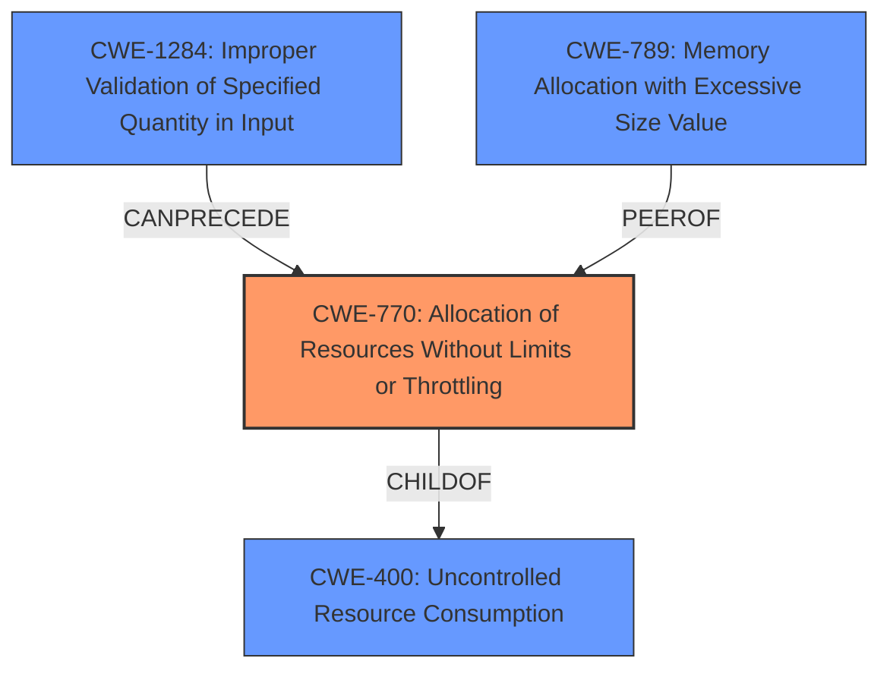

# Enhanced Analysis for CVE-2024-10225

# Summary

| CWE ID  | CWE Name                                                       | Confidence | CWE Abstraction Level | CWE Vulnerability Mapping Label | CWE-Vulnerability Mapping Notes |
| :-------- | :------------------------------------------------------------- | :--------- | :---------------------- | :------------------------------ | :------------------------------ |
| CWE-770   | Allocation of Resources Without Limits or Throttling         | 0.85       | Base                    | Primary                         | Allowed                       |
| CWE-400   | Uncontrolled Resource Consumption                            | 0.70       | Class                   | Secondary                       | Discouraged                    |
| CWE-1284  | Improper Validation of Specified Quantity in Input           | 0.60       | Base                    | Secondary                       | Allowed                       |
| CWE-789   | Memory Allocation with Excessive Size Value                   | 0.50       | Variant                 | Secondary                       | Allowed                       |

## Evidence and Confidence

*   **Confidence Score:** 0.80
*   **Evidence Strength:** MEDIUM

## Relationship Analysis

The primary CWE, CWE-770 Allocation of Resources Without Limits or Throttling, is a base-level CWE that directly addresses the vulnerability of the server continuously processing characters due to a lack of limits on resource allocation. CWE-400 Uncontrolled Resource Consumption, a class-level CWE, is a broader category encompassing CWE-770 and represents the overall impact of the vulnerability. CWE-1284 Improper Validation of Specified Quantity in Input could be related as the size of the uploaded file or the multipart boundary is not validated. CWE-789 Memory Allocation with Excessive Size Value could be relevant if the excessive characters lead to memory allocation issues, but this is less direct.



## Vulnerability Chain

The vulnerability chain starts with an attacker sending a malicious file upload request containing an excessively large multipart boundary. The server, due to the **lack of limits or throttling (CWE-770 Allocation of Resources Without Limits or Throttling)**, processes each character in the oversized boundary. This leads to **uncontrolled resource consumption (CWE-400 Uncontrolled Resource Consumption)**, ultimately resulting in a Denial of Service (DoS).

## Summary of Analysis

The analysis is primarily based on the vulnerability description, which clearly states that the server continuously processes characters due to the large multipart boundary, leading to a denial of service.

The most appropriate CWE is **CWE-770 Allocation of Resources Without Limits or Throttling** because the root cause is the **lack of any restrictions on the resources allocated for processing the multipart boundary**. This directly leads to the described denial-of-service condition.

While CWE-400 Uncontrolled Resource Consumption is a relevant consequence, it's a higher-level abstraction. The relationship analysis shows that CWE-770 is a child of CWE-400, making CWE-770 a more specific and appropriate choice.

**Evidence:** "This causes the server to continuously process each character, rendering the application inaccessible." This indicates that the server is allocating resources to process the oversized boundary without any limits.

Other CWEs like CWE-1284 Improper Validation of Specified Quantity in Input and CWE-789 Memory Allocation with Excessive Size Value were considered, but they are less directly relevant. CWE-1284 could apply if the size of the multipart boundary is not validated, but the primary issue is the lack of resource limits, not necessarily the validation of the size. CWE-789 could apply if memory allocation is involved, but the description doesn't explicitly mention it. Therefore, while they may be contributing factors, they are not the primary cause of the vulnerability.

Relevant CWE Information:

# Enhanced Context (25 CWEs)
The following CWEs were identified as potentially relevant to this vulnerability:

## CWE-789: Memory Allocation with Excessive Size Value
**Abstraction Level**: Variant
**Similarity Score**: 0.68
**Source**: dense

**Description**:
The product allocates memory based on an untrusted, large size value, but it does not ensure that the size is within expected limits, allowing arbitrary amounts of memory to be allocated.

**Mapping Guidance**:
- Usage: Allowed
- Rationale: This CWE entry is at the Variant level of abstraction, which is a preferred level of abstraction for mapping to the root causes of vulnerabilities.


## CWE-434: Unrestricted Upload of File with Dangerous Type
**Abstraction Level**: Base
**Similarity Score**: 0.68
**Source**: dense

**Description**:
The product allows the upload or transfer of dangerous file types that are automatically processed within its environment.

**Mapping Guidance**:
- Usage: Allowed
- Rationale: This CWE entry is at the Base level of abstraction, which is a preferred level of abstraction for mapping to the root causes of vulnerabilities.


## CWE-193: Off-by-one Error
**Abstraction Level**: Base
**Similarity Score**: 0.65
**Source**: dense

**Description**:
A product calculates or uses an incorrect maximum or minimum value that is 1 more, or 1 less, than the correct value.

**Mapping Guidance**:
- Usage: Allowed
- Rationale: This CWE entry is at the Base level of abstraction, which is a preferred level of abstraction for mapping to the root causes of vulnerabilities.


## CWE-130: Improper Handling of Length Parameter Inconsistency
**Abstraction Level**: Base
**Similarity Score**: 0.65
**Source**: dense

**Description**:
The product parses a formatted message or structure, but it does not handle or incorrectly handles a length field that is inconsistent with the actual length of the associated data.

**Mapping Guidance**:
- Usage: Allowed
- Rationale: This CWE entry is at the Base level of abstraction, which is a preferred level of abstraction for mapping to the root causes of vulnerabilities.


## CWE-131: Incorrect Calculation of Buffer Size
**Abstraction Level**: Base
**Similarity Score**: 0.64
**Source**: dense

**Description**:
The product does not correctly calculate the size to be used when allocating a buffer, which could lead to a buffer overflow.

**Mapping Guidance**:
- Usage: Allowed
- Rationale: This CWE entry is at the Base level of abstraction, which is a preferred level of abstraction for mapping to the root causes of vulnerabilities.


## CWE-134: Use of Externally-Controlled Format String
**Abstraction Level**: Base
**Similarity Score**: 0.63
**Source**: dense

**Description**:
The product uses a function that accepts a format string as an argument, but the format string originates from an external source.

**Mapping Guidance**:
- Usage: Allowed
- Rationale: This CWE entry is at the Base level of abstraction, which is a preferred level of abstraction for mapping to the root causes of vulnerabilities.


## CWE-617: Reachable Assertion
**Abstraction Level**: Base
**Similarity Score**: 0.63
**Source**: dense

**Description**:
The product contains an assert() or similar statement that can be triggered by an attacker, which leads to an application exit or other behavior that is more severe than necessary.

**Mapping Guidance**:
- Usage: Allowed
- Rationale: This CWE entry is at the Base level of abstraction, which is a preferred level of abstraction for mapping to the root causes of vulnerabilities.


## CWE-1284: Improper Validation of Specified Quantity in Input
**Abstraction Level**: Base
**Similarity Score**: 0.63
**Source**: dense

**Description**:
The product receives input that is expected to specify a quantity (such as size or length), but it does not validate or incorrectly validates that the quantity has the required properties.

**Mapping Guidance**:
- Usage: Allowed
- Rationale: This CWE entry is at the Base level of abstraction, which is a preferred level of abstraction for mapping to the root causes of vulnerabilities.


## CWE-407: Inefficient Algorithmic Complexity
**Abstraction Level**: Class
**Similarity Score**: 0.63
**Source**: dense

**Description**:
An algorithm in a product has an inefficient worst-case computational complexity that may be detrimental to system performance and can be triggered by an attacker, typically using crafted manipulations that ensure that the worst case is being reached.

**Mapping Guidance**:
- Usage: Allowed-with-Review
- Rationale: This CWE entry is a Class and might have Base-level children that would


## CWE Relationship Analysis

Current CWEs represent these abstraction levels: .


### Vulnerability Chain Analysis

**Chain starting from CWE-1284:**
- 1284 (Improper Validation of Specified Quantity in Input) - ROOT


**Chain starting from CWE-400:**
- 400 (Uncontrolled Resource Consumption) - ROOT


### CWE Relationship Diagram

```mermaid
graph TD
    classDef primary fill:#f96,stroke:#333,stroke-width:2px
    classDef secondary fill:#69f,stroke:#333
    classDef tertiary fill:#9e9,stroke:#333
```