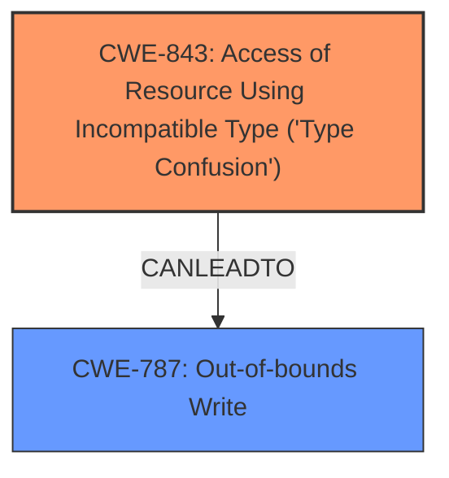

# Enhanced Analysis for CVE-2024-10231

# Summary
| CWE ID | CWE Name | Confidence | CWE Abstraction Level | CWE Vulnerability Mapping Label | CWE-Vulnerability Mapping Notes |
|---|---|---|---|---|---|
| CWE-843 | Access of Resource Using Incompatible Type ('Type Confusion') | 1.0 | Base | Allowed | Primary CWE. Matches the **rootcause** described in the vulnerability report. |
| CWE-787 | Out-of-bounds Write | 0.7 | Base | Allowed | Secondary CWE. The **type confusion** could lead to out-of-bounds write. |

## Evidence and Confidence

*   **Confidence Score:** 0.9
*   **Evidence Strength:** HIGH

## Relationship Analysis
The primary relationship influencing the decision is the direct match between the vulnerability description and CWE-843, Access of Resource Using Incompatible Type ('Type Confusion'). CWE-787 Out-of-bounds Write is a potential consequence of type confusion. The abstraction levels were considered, favoring Base and Variant for accuracy.



## Vulnerability Chain
The vulnerability chain starts with **Type Confusion** (CWE-843). This **type confusion** can then lead to heap corruption, which can be exploited further. One potential exploitation path could be an Out-of-bounds Write (CWE-787).
- Root Cause: CWE-843 (**Type Confusion**)
- Impact: Potential Heap Corruption, leading to potential Out-of-bounds Write (CWE-787)

## Summary of Analysis
The analysis is heavily based on the provided evidence, specifically the "Vulnerability Description Key Phrases" which identifies the **rootcause** as "**Type Confusion**". The "CVE Reference Links Content Summary" also confirms that the vulnerability is related to **Type Confusion** in the V8 JavaScript engine.

The selection of CWE-843 is further supported by the "CWE for similar CVE Descriptions" section, which lists CWE-843 as the primary CWE match and the top CWE. The Retriever Results also rank CWE-843 as the top result.

CWE-787 is added as a secondary CWE because the vulnerability description mentions that the **type confusion** could potentially exploit heap corruption. Heap corruption can often lead to out-of-bounds writes, making CWE-787 a plausible consequence.

The selected CWEs are at the optimal level of specificity because they accurately represent the **rootcause** (**Type Confusion**) and a potential impact (Out-of-bounds Write) of the vulnerability.

CWEs considered but not used:
*   CWE-416 (Use After Free): While memory corruption is mentioned, there is no direct evidence of a use-after-free condition.
*   CWE-122 (Heap-based Buffer Overflow): Similar to CWE-416, there's no specific mention of a buffer overflow. While heap corruption is a potential impact, it's not the primary weakness.
*   CWE-704 (Incorrect Type Conversion or Cast): While related to type issues, CWE-843 more accurately captures the essence of accessing a resource using an incompatible type, rather than a simple conversion error.


## CWE Relationship Analysis

Current CWEs represent these abstraction levels: .


### Vulnerability Chain Analysis

**Chain starting from CWE-416:**
- 416 (Use After Free) - ROOT


**Chain starting from CWE-787:**
- 787 (Out-of-bounds Write) - ROOT


### CWE Relationship Diagram

```mermaid
graph TD
    classDef primary fill:#f96,stroke:#333,stroke-width:2px
    classDef secondary fill:#69f,stroke:#333
    classDef tertiary fill:#9e9,stroke:#333
```