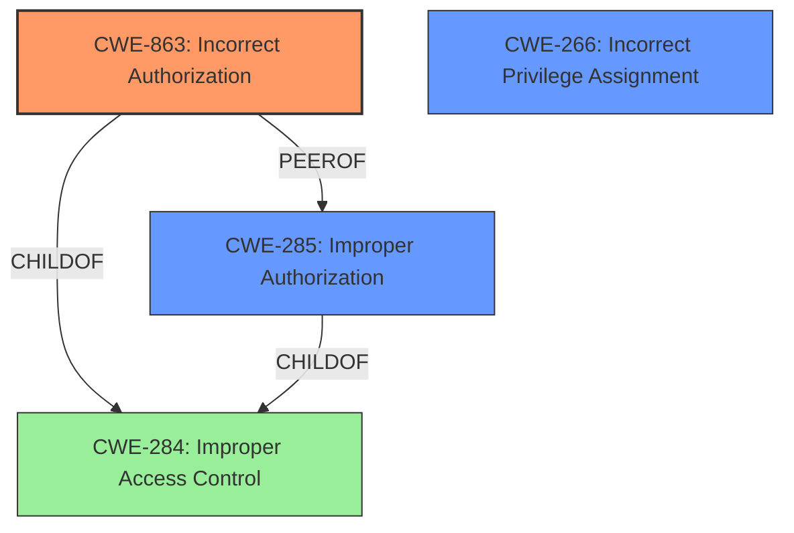

# Raw Analyzer Response for CVE-2024-10275

# Summary

| CWE ID  | CWE Name                                                                        | Confidence | CWE Abstraction Level | CWE Vulnerability Mapping Label | CWE-Vulnerability Mapping Notes |
| ------- | ------------------------------------------------------------------------------- | ---------- | --------------------- | ------------------------------- | ----------------------------- |
| CWE-863 | Incorrect Authorization                                                         | 0.9        | Class                 | Primary CWE                     | Allowed-with-Review           |
| CWE-266 | Incorrect Privilege Assignment                                                  | 0.8        | Base                  | Secondary Candidate             | Allowed                       |
| CWE-285 | Improper Authorization                                                          | 0.7        | Class                 | Secondary Candidate             | Discouraged                   |

## Evidence and Confidence

*   **Confidence Score:** 0.9
*   **Evidence Strength:** HIGH

## Relationship Analysis

The primary CWE is CWE-863, "Incorrect Authorization," because the vulnerability stems from the system performing an authorization check, but doing it incorrectly, allowing admins without billing permissions to grant those permissions to others. CWE-266 "Incorrect Privilege Assignment" is a closely related CWE because the admin is incorrectly assigning privileges. CWE-285 "Improper Authorization" is a more general case of authorization failure. While CWE-863 is a child of CWE-284 "Improper Access Control," CWE-863 is more specific and fits the vulnerability better.

## Vulnerability Chain

The vulnerability chain starts with the **incorrect authorization** (CWE-863) where admins can modify user permissions improperly. This leads to **incorrect privilege assignment** (CWE-266) as users are granted permissions they shouldn't have. Finally, this results in privilege escalation, where standard admins gain unauthorized access to billing resources, impacting financial resources.

## Summary of Analysis

The initial analysis focused on identifying the root cause of the vulnerability. The key phrases from the vulnerability description, such as "admins... can change the permissions of existing users to include billing permissions" and "bypassing the intended role-based access control," pointed towards an authorization issue rather than a lack of authentication. The retriever results and the provided CWE guidance further solidified this direction.

The analysis of the CVE reference links content summary reinforced the authorization issue, noting changes in the code to add `checkAccess` and `hasAccess` functions. This indicates that the **previous lack of proper authorization checks** was the root cause.

The selection of CWE-863, "Incorrect Authorization," is based on the fact that the system attempts to perform an authorization check but does so incorrectly. The vulnerability description clearly states that admins are able to circumvent restrictions, which indicates a flaw in the authorization logic. This is further supported by the code changes mentioned in the CVE reference links content summary.

CWE-266, "Incorrect Privilege Assignment", is considered a secondary candidate because the vulnerability involves the assignment of incorrect privileges, which is a direct consequence of the flawed authorization.

CWE-285, "Improper Authorization," is a broader category and is considered less specific than CWE-863. While it is a valid candidate, CWE-863 provides a more precise description of the weakness.

The final selection is based on the evidence that the system attempts authorization, but does so incorrectly, leading to the privilege escalation. The CWEs are selected to be at the optimal level of specificity, focusing on the root cause and direct consequences of the vulnerability.

Relevant CWE Information:

# Enhanced Context (25 CWEs)
The following CWEs were identified as potentially relevant to this vulnerability:

## CWE-267: Privilege Defined With Unsafe Actions
**Abstraction Level**: Base
**Similarity Score**: 0.74
**Source**: dense

**Description**:
A particular privilege, role, capability, or right can be used to perform unsafe actions that were not intended, even when it is assigned to the correct entity.

**Mapping Guidance**:
- Usage: Allowed
- Rationale: This CWE entry is at the Base level of abstraction, which is a preferred level of abstraction for mapping to the root causes of vulnerabilities.

## CWE-266: Incorrect Privilege Assignment
**Abstraction Level**: Base
**Similarity Score**: 0.74
**Source**: dense

**Description**:
A product incorrectly assigns a privilege to a particular actor, creating an unintended sphere of control for that actor.

**Mapping Guidance**:
- Usage: Allowed
- Rationale: This CWE entry is at the Base level of abstraction, which is a preferred level of abstraction for mapping to the root causes of vulnerabilities.

## CWE-274: Improper Handling of Insufficient Privileges
**Abstraction Level**: Base
**Similarity Score**: 0.71
**Source**: dense

**Description**:
The product does not handle or incorrectly handles when it has insufficient privileges to perform an operation, leading to resultant weaknesses.

**Mapping Guidance**:
- Usage: Discouraged
- Rationale: This CWE entry could be deprecated in a future version of CWE.

## CWE-668: Exposure of Resource to Wrong Sphere
**Abstraction Level**: Class
**Similarity Score**: 0.71
**Source**: dense

**Description**:
The product exposes a resource to the wrong control sphere, providing unintended actors with inappropriate access to the resource.

**Mapping Guidance**:
- Usage: Discouraged
- Rationale: CWE-668 is high-level and is often misused as a catch-all when lower-level CWE IDs might be applicable. It is sometimes used for low-information vulnerability reports [REF-1287]. It is a level-1 Class (i.e., a child of a Pillar). It is not useful for trend analysis.

## CWE-280: Improper Handling of Insufficient Permissions or Privileges 
**Abstraction Level**: Base
**Similarity Score**: 0.71
**Source**: dense

**Description**:
The product does not handle or incorrectly handles when it has insufficient privileges to access resources or functionality as specified by their permissions. This may cause it to follow unexpected code paths that may leave the product in an invalid state.

**Mapping Guidance**:
- Usage: Allowed
- Rationale: This CWE entry is at the Base level of abstraction, which is a preferred level of abstraction for mapping to the root causes of vulnerabilities.

## CWE-59: Improper Link Resolution Before File Access ('Link Following')
**Abstraction Level**: Base
**Similarity Score**: 0.70
**Source**: dense

**Description**:
The product attempts to access a file based on the filename, but it does not properly prevent that filename from identifying a link or shortcut that resolves to an unintended resource.

**Mapping Guidance**:
- Usage: Allowed
- Rationale: This CWE entry is at the Base level of abstraction, which is a preferred level of abstraction for mapping to the root causes of vulnerabilities.

## CWE-41: Improper Resolution of Path Equivalence
**Abstraction Level**: Base
**Similarity Score**: 0.70
**Source**: dense

**Description**:
The product is vulnerable to file system contents disclosure through path equivalence. Path equivalence involves the use of special characters in file and directory names. The associated manipulations are intended to generate multiple names for the same object.

**Mapping Guidance**:
- Usage: Allowed
- Rationale: This CWE entry is at the Base level of abstraction, which is a preferred level of abstraction for mapping to the root causes of vulnerabilities.

## CWE-639: Authorization Bypass Through User-Controlled Key
**Abstraction Level**: Base
**Similarity Score**: 0.70
**Source**: dense

**Description**:
The system's authorization functionality does not prevent one user from gaining access to another user's data or record by modifying the key value identifying the data.

**Mapping Guidance**:
- Usage: Allowed
- Rationale: This CWE entry is at the Base level of abstraction, which is a preferred level of abstraction for mapping to the root causes of vulnerabilities.

## CWE-472: External Control of Assumed-Immutable Web Parameter
**Abstraction Level**: Base
**Similarity Score**: 0.70
**Source**: dense

**Description**:
The web application does not sufficiently verify inputs that are assumed to be immutable but are actually externally controllable, such as hidden form fields.

**Mapping Guidance**:
- Usage: Allowed
- Rationale: This CWE entry is at the Base level of abstraction, which is a preferred level of abstraction for mapping to the root causes of vulnerabilities.

## CWE-1390: Weak Authentication
**Abstraction Level**: