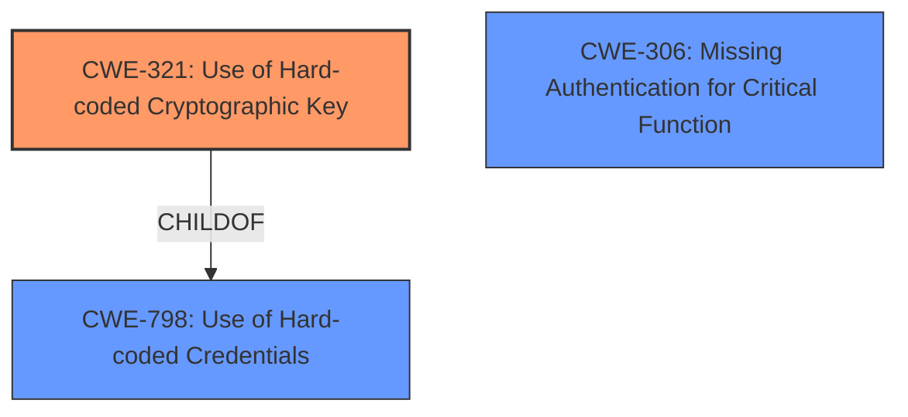

# Analysis for CVE-2024-10284

# Summary
| CWE ID | CWE Name | Confidence | CWE Abstraction Level | CWE Vulnerability Mapping Label | CWE-Vulnerability Mapping Notes |
|---|---|---|---|---|---|
| CWE-321 | Use of Hard-coded Cryptographic Key | 1.0 | Variant |  Primary CWE | Allowed |
| CWE-306 | Missing Authentication for Critical Function | 0.7 | Base | Secondary Candidate | Allowed |

## Evidence and Confidence

*   **Confidence Score:** 0.9
*   **Evidence Strength:** HIGH

## Relationship Analysis
The primary relationship that influenced the decision was the parent-child relationship between CWE-798 (Use of Hardcoded Credentials) and CWE-321 (Use of Hard-coded Cryptographic Key). Since the vulnerability specifically involves a cryptographic key, CWE-321 was selected as the more specific and appropriate choice. The retriever results also suggested CWE-321 as the top candidate. CWE-306 was considered as a possible secondary issue due to the authentication bypass, but the root cause is the hardcoded key enabling the bypass, making it a consequence rather than a direct cause.

## Vulnerability Chain
The vulnerability chain starts with the **hardcoded encryption key** (CWE-321), which allows an attacker to bypass authentication (CWE-306) and ultimately gain unauthorized access to the system.

## Summary of Analysis
The initial analysis focused on identifying the root cause of the vulnerability. The description clearly states that the vulnerability stems from a **hardcoded encryption key** in the `ce21_authentication_phrase` function. The CVE reference links content summary confirms this, stating "The vulnerability stems from a hardcoded encryption key...". This evidence strongly supports the selection of CWE-321 (Use of Hard-coded Cryptographic Key) as the primary CWE.

CWE-306 (Missing Authentication for Critical Function) was considered as a possible secondary CWE due to the authentication bypass, but the root cause is the hardcoded key enabling the bypass. The retriever results also suggested this as a possible candidate. The authentication bypass is a consequence of the **hardcoded key**, not a direct cause.

The graph relationships influenced the final selection by highlighting the hierarchical relationship between CWE-798 and CWE-321, allowing for a more specific classification. The selected CWEs are at the optimal level of specificity because CWE-321 directly addresses the **hardcoded key**, while CWE-306 describes the resulting impact.

Relevant CWE Information:

**CWE-321: Use of Hard-coded Cryptographic Key**
The product contains a hard-coded cryptographic key, which is used for encryption or decryption.
This allows an attacker to potentially decrypt sensitive information.

**CWE-306: Missing Authentication for Critical Function**
The product does not perform any authentication for functionality that requires a provable user identity or consumes a significant amount of resources.
This allows an attacker to perform actions without proper authorization.

# Complete CWE Specifications

CWE-321: Use of Hard-coded Cryptographic Key

CWE-798: Use of Hard-coded Credentials

CWE-306: Missing Authentication for Critical Function

CWE-352: Cross-Site Request Forgery (CSRF)

CWE-639: Authorization Bypass Through User-Controlled Key

CWE-863: Incorrect Authorization

CWE-259: Use of Hard-coded Password

CWE-862: Missing Authorization

CWE-425: Direct Request ('Forced Browsing')

CWE-471: Modification of Assumed-Immutable Data (MAID)