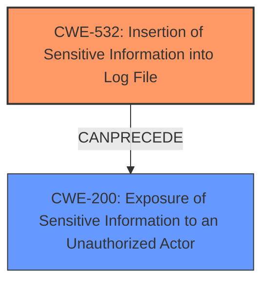

# Analysis Report for CVE-2024-10285

# Vulnerability Analysis Report: CVE-2024-10285

## Description

The CE21 Suite plugin for WordPress is vulnerable to sensitive information disclosure via the plugin-log.txt in versions up to, and including, 2.2.0. This makes it possible for unauthenticated attackers to log in the user associated with the JWT token.

## Vulnerability Description Key Phrases

- **Impact:** sensitive information disclosure
- **Attacker:** unauthenticated attackers
- **Product:** CE21 Suite plugin for WordPress
- **Version:** up to and including 2.2.0
- **Component:** plugin-log.txt

## Analysis (with Relationship Data)

# Summary
| CWE ID | CWE Name | Confidence | CWE Abstraction Level | CWE Vulnerability Mapping Label | CWE-Vulnerability Mapping Notes |
|---|---|---|---|---|---|
| CWE-532 | Insertion of Sensitive Information into Log File | 1.0 | Base | Allowed | Primary CWE: The **root cause** is the **insertion of JWT tokens (sensitive information) into a publicly accessible log file**. |
| CWE-200 | Exposure of Sensitive Information to an Unauthorized Actor | 0.8 | Class | Discouraged | Secondary Candidate: This CWE describes the **impact** of the vulnerability. |

## Evidence and Confidence

*   **Confidence Score:** 0.9
*   **Evidence Strength:** HIGH

## Relationship Analysis

The primary relationship is that CWE-532, as the root cause, leads directly to CWE-200. CWE-532 focuses on the insecure logging practice, while CWE-200 represents the resulting exposure of sensitive information. CWE-200 is a class, while CWE-532 is a base, so CWE-532 is more specific.



## Vulnerability Chain

The vulnerability chain starts with the **root cause**, **insertion of JWT tokens into a log file** (CWE-532). This leads to the **impact** of **exposure of sensitive information to unauthorized actors** (CWE-200). An attacker can then use the JWT tokens to log in as other users.

## Summary of Analysis

The analysis is based on the provided evidence, which clearly indicates that the CE21 Suite plugin stores JWT tokens in a publicly accessible log file (plugin-log.txt). This constitutes the **root cause** of the vulnerability. The direct consequence of this insecure storage is the exposure of sensitive information, allowing unauthenticated attackers to potentially gain administrative access by using the exposed JWT tokens.

CWE-532 (Insertion of Sensitive Information into Log File) is the most appropriate primary CWE because it accurately describes the **root cause** of the vulnerability, which is the **insecure storage of JWT tokens in a publicly accessible log file**.

CWE-200 (Exposure of Sensitive Information to an Unauthorized Actor) is considered a secondary CWE as it describes the **impact** of the vulnerability, which is the **exposure of the JWT tokens to unauthenticated attackers**.

The retriever results listed CWE-862 (Missing Authorization) and CWE-306 (Missing Authentication for Critical Function). These were not chosen because the **root cause** is not a missing authorization or authentication check, but the **insecure storage of sensitive information**. The attacker is not bypassing authentication or authorization; they are exploiting exposed credentials.

Relevant CWE Information:
*   CWE-532: Insertion of Sensitive Information into Log File
*   CWE-200: Exposure of Sensitive Information to an Unauthorized Actor


## CWE Relationship Analysis

Current CWEs represent these abstraction levels: .


### Vulnerability Chain Analysis

**Chain starting from CWE-200:**
- 200 (Exposure of Sensitive Information to an Unauthorized Actor) - ROOT


**Chain starting from CWE-306:**
- 306 (Missing Authentication for Critical Function) - ROOT


### CWE Relationship Diagram

```mermaid
graph TD
    classDef primary fill:#f96,stroke:#333,stroke-width:2px
    classDef secondary fill:#69f,stroke:#333
    classDef tertiary fill:#9e9,stroke:#333
```


*Report generated on 2025-07-13 00:01:25*
