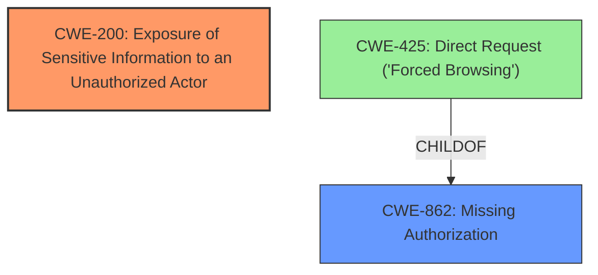

# Raw Analyzer Response for CVE-2024-10312

# Summary
| CWE ID  | CWE Name                                                                                       | Confidence | CWE Abstraction Level | CWE Vulnerability Mapping Label | CWE-Vulnerability Mapping Notes |
| :-------- | :--------------------------------------------------------------------------------------------- | :--------- | :---------------------- | :------------------------------ | :------------------------------ |
| CWE-200   | Exposure of Sensitive Information to an Unauthorized Actor                                     | 1.0        | Base                    | Primary                         | Allowed                         |
| CWE-862   | Missing Authorization                                                                          | 0.8        | Class                   | Secondary                       | Allowed-with-Review             |

## Evidence and Confidence

*   **Confidence Score:** 0.9
*   **Evidence Strength:** HIGH

## Relationship Analysis
The primary weakness is **CWE-200 (Exposure of Sensitive Information to an Unauthorized Actor)** because the vulnerability leads to the direct exposure of sensitive template data. **CWE-862 (Missing Authorization)** is a related weakness, as the exposure likely occurs due to a **lack of proper authorization checks** before rendering the template data. **CWE-862** is a parent of **CWE-425**, meaning a more specific instance of missing authorization might be **CWE-425**. However, without specifics, we remain with **CWE-862**.

## Vulnerability Chain
The vulnerability chain starts with a **missing authorization check** (**CWE-862**), leading to the **exposure of sensitive information** (**CWE-200**) when the 'render' function is called. The root cause is the **lack of access control**, and the impact is the **disclosure of sensitive data**.

## Summary of Analysis
The primary focus of this analysis is on identifying the CWE that best represents the root cause of the vulnerability. Based on the provided information, the most appropriate CWE is **CWE-200 (Exposure of Sensitive Information to an Unauthorized Actor)**, as it directly reflects the impact of the vulnerability. The vulnerability allows authenticated attackers to extract sensitive template data, which aligns perfectly with the description of **CWE-200**.

Additionally, **CWE-862 (Missing Authorization)** is included as a secondary CWE, as it is highly likely that the **information exposure** is a result of **missing authorization checks**. The vulnerability description explicitly mentions that authenticated attackers with Contributor-level access can extract sensitive data, implying a **failure to properly restrict access** based on user roles.

Other CWEs, such as **CWE-1336 (Improper Neutralization of Special Elements Used in a Template Engine)** and **CWE-863 (Incorrect Authorization)**, were considered but ultimately deemed less relevant. While a template engine is involved, the primary issue is the **exposure of sensitive information** rather than a failure to neutralize special elements.

Relevant CWE Information:
The vulnerability in the Exclusive Addons for Elementor plugin allows authenticated attackers to **extract sensitive private, pending, and draft template data**. This **sensitive information exposure** occurs due to the `render` function in `elements/tabs/tabs.php`.

**CWE-200: Exposure of Sensitive Information to an Unauthorized Actor**
The product exposes **sensitive information** to an actor that is not explicitly authorized to have access to that information. This vulnerability directly results in the **exposure of sensitive data**, making this CWE highly relevant.

**CWE-862: Missing Authorization**
The product does not perform an authorization check when an actor attempts to access a resource or perform an action. The fact that authenticated attackers with Contributor-level access can extract sensitive data suggests that there are **missing authorization checks** in place to prevent unauthorized access.