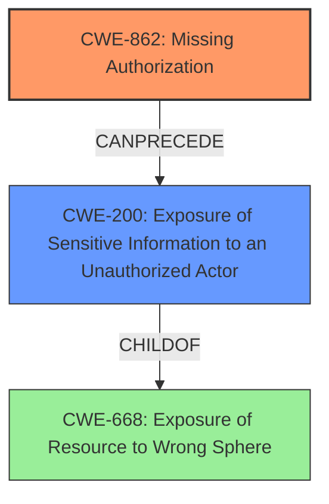

# Enhanced Analysis for CVE-2024-10316

# Summary
| CWE ID | CWE Name | Confidence | CWE Abstraction Level | CWE Vulnerability Mapping Label | CWE-Vulnerability Mapping Notes |
|---|---|---|---|---|---|
| CWE-862 | Missing Authorization | 0.9 | Class | Primary | Allowed-with-Review |
| CWE-200 | Exposure of Sensitive Information to an Unauthorized Actor | 0.7 | Base | Secondary | Discouraged |

## Evidence and Confidence

*   **Confidence Score:** 0.8
*   **Evidence Strength:** HIGH

## Relationship Analysis
The primary relationship influencing the CWE selection is that of parent and child. CWE-862 **Missing Authorization** is a class-level CWE, and while more specific base-level CWEs might exist, the provided information focuses on the lack of authorization as the root cause. CWE-200 **Exposure of Sensitive Information to an Unauthorized Actor** is a result of the missing authorization. It represents the direct impact of the vulnerability.



## Vulnerability Chain
The vulnerability chain starts with CWE-862 **Missing Authorization**, where the application **fails to perform an authorization check** before displaying template content. This leads to CWE-200 **Exposure of Sensitive Information to an Unauthorized Actor**, as unauthorized users can access sensitive data within the templates.

## Summary of Analysis
The initial assessment, based on the vulnerability description and the CVE Reference Links Content Summary, points towards a clear authorization issue. The plugin **does not adequately check** if the user has the necessary permissions to view draft or pending templates.

The CVE Reference Links Content Summary states that the root cause is that the plugin was using `get_builder_content` to display template content, which **doesn't perform sufficient access control checks.** The fix involves checking the post status and user capabilities before displaying the content using `get_builder_content_for_display`. This confirms that the core issue is related to authorization.

CWE-862 **Missing Authorization** accurately describes this **lack of authorization check**, leading to sensitive information exposure. CWE-200 **Exposure of Sensitive Information to an Unauthorized Actor** describes the direct impact of this **missing authorization**.

The retriever results also suggest CWE-862 and other authorization-related CWEs (e.g., CWE-863 **Incorrect Authorization**, CWE-285 **Improper Authorization**). However, the vulnerability description clearly states that there is no authorization check performed, making CWE-862 the most appropriate choice.

The final CWE selections are at the optimal level of specificity because they accurately capture the root cause (**missing authorization**) and the resulting impact (**sensitive information exposure**).

Relevant CWE Information:

# Enhanced Context (25 CWEs)
The following CWEs were identified as potentially relevant to this vulnerability:

## CWE-352: Cross-Site Request Forgery (CSRF)
**Abstraction Level**: Compound
**Similarity Score**: 0.72
**Source**: dense

**Description**:
The web application does not, or can not, sufficiently verify whether a well-formed, valid, consistent request was intentionally provided by the user who submitted the request.

**Mapping Guidance**:
- Usage: Allowed
- Rationale: This is a well-known Composite of multiple weaknesses that must all occur simultaneously, although it is attack-oriented in nature.

*NOT USED*: CSRF is not relevant as there is no evidence of request forgery.

## CWE-425: Direct Request ('Forced Browsing')
**Abstraction Level**: Base
**Similarity Score**: 0.72
**Source**: dense

**Description**:
The web application does not adequately enforce appropriate authorization on all restricted URLs, scripts, or files.

**Mapping Guidance**:
- Usage: Allowed
- Rationale: This CWE entry is at the Base level of abstraction, which is a preferred level of abstraction for mapping to the root causes of vulnerabilities.

*NOT USED*: Though related to authorization, CWE-425 is more about accessing resources directly, while the core issue here is the **lack of an authorization check** before displaying content.

## CWE-538: Insertion of Sensitive Information into Externally-Accessible File or Directory
**Abstraction Level**: Base
**Similarity Score**: 0.71
**Source**: dense

**Description**:
The product places sensitive information into files or directories that are accessible to actors who are allowed to have access to the files, but not to the sensitive information.

**Mapping Guidance**:
- Usage: Allowed
- Rationale: This CWE entry is at the Base level of abstraction, which is a preferred level of abstraction for mapping to the root causes of vulnerabilities.

*NOT USED*: The issue is not about sensitive information being placed in externally accessible files. It's about **unauthorized access** to existing data.

## CWE-434: Unrestricted Upload of File with Dangerous Type
**Abstraction Level**: Base
**Similarity Score**: 0.70
**Source**: dense

**Description**:
The product allows the upload or transfer of dangerous file types that are automatically processed within its environment.

**Mapping Guidance**:
- Usage: Allowed
- Rationale: This CWE entry is at the Base level of abstraction, which is a preferred level of abstraction for mapping to the root causes of vulnerabilities.

*NOT USED*: File uploads are not involved in this vulnerability.

## CWE-472: External Control of Assumed-Immutable Web Parameter
**Abstraction Level**: Base
**Similarity Score**: 0.70
**Source**: dense

**Description**:
The web application does not sufficiently verify inputs that are assumed to be immutable but are actually externally controllable, such as hidden form fields.

**Mapping Guidance**:
- Usage: Allowed
- Rationale: This CWE entry is at the Base level of abstraction, which is a preferred level of abstraction for mapping to the root causes of vulnerabilities.

*NOT USED*: There's no evidence of external control of assumed-immutable parameters.

## CWE-1336: Improper Neutralization of Special Elements Used in a Template Engine
**Abstraction Level**: Base
**Similarity Score**: 0.70
**Source**: dense

**Description**:
The product uses a template engine to insert or process externally-influenced input, but it does not neutralize or incorrectly neutralizes special elements or syntax that can be interpreted as template expressions or other code directives when processed by the engine.

**Mapping Guidance**:
- Usage: Allowed
- Rationale: This CWE entry is at the Base level of abstraction, which is a preferred level of abstraction for mapping to the root causes of vulnerabilities.

*NOT USED*: This vulnerability isn't about template engine issues or improper neutralization.

## CWE-639: Authorization Bypass Through User-Controlled Key
**Abstraction Level**: Base
**Similarity Score**: 0.70
**Source**: dense

**Description**:
The system's authorization functionality does not prevent one user from gaining access to another user's data or record by modifying the key value identifying the data.

**Mapping Guidance**:
- Usage: Allowed
- Rationale: This CWE entry is at the Base level of abstraction, which is a preferred level of abstraction for mapping to the root causes of vulnerabilities.

*NOT USED*: The vulnerability is not about bypassing authorization by manipulating keys. It's about **missing authorization checks** altogether.

## CWE-201: Insertion of Sensitive Information Into Sent Data
**Abstraction Level**: Base
**Similarity Score**: 0.70
**Source**: dense

**Description**:
The code transmits data to another actor, but a portion of the data includes sensitive information that should not be accessible to that actor.

**Mapping Guidance**:
- Usage: Allowed
- Rationale: This CWE entry is at the Base level of abstraction, which is a preferred level of abstraction for mapping to the root causes of vulnerabilities.

*NOT USED*: Though related to the impact, the root cause is a **missing authorization check**, not the insertion of information into sent data.

## CWE-116: Improper Encoding or Escaping of Output
**Abstraction Level**: Class
**Similarity Score**: 0.70
**Source**: dense

**Description**:
The product prepares a structured message for communication with another component, but encoding or escaping of the data is either missing or done incorrectly. As a result, the intended structure of the message is not preserved.

**Mapping Guidance**:
- Usage: Allowed-with-Review
- Rationale: This CWE entry is a Class and might have Base-level children that would be more appropriate

*NOT USED*: This is not related to encoding or escaping issues.

## CWE-497: Exposure of Sensitive System Information to an Unauthorized Control Sphere
**Abstraction Level**: Base
**Similarity Score**:


## CWE Relationship Analysis

Current CWEs represent these abstraction levels: .


### Vulnerability Chain Analysis

**Chain starting from CWE-863:**
- 863 (Incorrect Authorization) - ROOT


**Chain starting from CWE-116:**
- 116 (Improper Encoding or Escaping of Output) - ROOT


### CWE Relationship Diagram

```mermaid
graph TD
    classDef primary fill:#f96,stroke:#333,stroke-width:2px
    classDef secondary fill:#69f,stroke:#333
    classDef tertiary fill:#9e9,stroke:#333
```