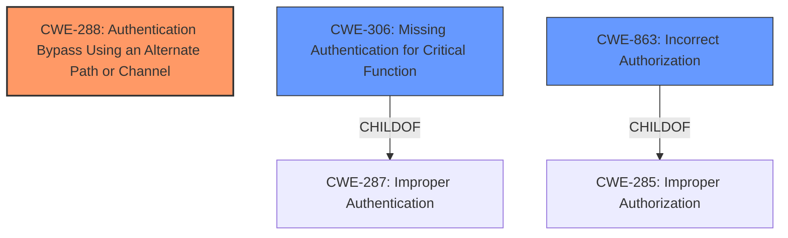

# Analysis Report for CVE-2024-10327

# Vulnerability Analysis Report: CVE-2024-10327

## Description

A vulnerability in Okta Verify for iOS versions 9.25.1 (beta) and 9.27.0 (including beta) allows push notification responses through the iOS ContextExtension feature allowing the authentication to proceed regardless of the users selection. When a user long-presses the notification banner and selects an option, both options allow the authentication to succeed. The ContextExtension feature is one of several push mechanisms available when using Okta Verify Push on iOS devices. The vulnerable flows include * When a user is presented with a notification on a locked screen, the user presses on the notification directly and selects their reply without unlocking the device * When a user is presented with a notification on the home screen and drags the notification down and selects their reply * When an Apple Watch is used to reply directly to a notification. A pre-condition for this vulnerability is that the user must have enrolled in Okta Verify while the Okta customer was using Okta Classic. This applies irrespective of whether the organization has since upgraded to Okta Identity Engine.

## Vulnerability Description Key Phrases

- **Weakness:** authentication bypass
- **Vector:** ['push notification responses', 'long-press notification banner', 'select an option']
- **Product:** Okta Verify for iOS
- **Version:** 9.25.1 (beta) and 9.27.0 (including beta)

## Analysis (with Relationship Data)

# Summary
| CWE ID | CWE Name | Confidence | CWE Abstraction Level | CWE Vulnerability Mapping Label | CWE-Vulnerability Mapping Notes |
|---|---|---|---|---|---|
| CWE-288 | Authentication Bypass Using an Alternate Path or Channel | 0.9 | Base | Allowed | Primary CWE: The application allows authentication to proceed through an alternate path (push notification response) without proper validation, effectively bypassing the intended user decision.|
| CWE-306 | Missing Authentication for Critical Function | 0.7 | Base | Allowed | Secondary Candidate: The application fails to properly authenticate the response received via the push notification context extension. |
| CWE-863 | Incorrect Authorization | 0.6 | Class | Allowed-with-Review | Secondary Candidate: Authorization is performed, but incorrectly, by not properly validating the user's choice within the push notification response. |

## Evidence and Confidence

*   **Confidence Score:** 0.8
*   **Evidence Strength:** HIGH

## Relationship Analysis
The primary CWE is CWE-288, Authentication Bypass Using an Alternate Path or Channel, because the application allows authentication to proceed through an alternate path (push notification response) without proper validation. CWE-288 is a base CWE.

CWE-306, Missing Authentication for Critical Function, is a child of CWE-287, Improper Authentication, and is related to the fact that the application doesn't properly authenticate the response received via the push notification context extension.

CWE-863, Incorrect Authorization, is a class CWE, suggesting that authorization is performed, but incorrectly, by not properly validating the user's choice within the push notification response.



## Vulnerability Chain
1.  **Root Cause:** **Improper handling of push notification responses** via the iOS ContextExtension feature. The application **fails** to properly validate the user's response (Approve/Deny).
2.  **Weakness:** **Authentication Bypass** (CWE-288) - The application allows authentication to proceed regardless of the user's selection in the push notification.
3.  **Impact:** **Unauthorized Access** - An attacker can potentially bypass MFA and gain access to the user's account.

## Summary of Analysis
The analysis identified that the vulnerability is primarily an authentication bypass due to the improper handling of push notification responses. The **weakness** is that the authentication proceeds regardless of the user's choice (approve or deny).

The primary CWE is CWE-288, Authentication Bypass Using an Alternate Path or Channel, as the application uses an alternate path (push notifications) for authentication but **fails** to properly validate the response. The evidence is: "allows push notification responses through the iOS ContextExtension feature allowing the authentication to proceed regardless of the users selection."

CWE-306, Missing Authentication for Critical Function, was considered because the **root cause** is that the authentication mechanism does not properly validate the response, which can be viewed as **missing authentication**. However, since there *is* an authentication mechanism in place, but it's being bypassed, CWE-288 is more appropriate.

CWE-863, Incorrect Authorization, was also considered because the user's choice could be seen as an authorization decision. However, the core issue is that the **authentication** is bypassed, not that the authorization is incorrect after successful authentication.

The final decision is based on the evidence that the authentication process is proceeding incorrectly due to the **weakness** in handling push notification responses. Therefore, CWE-288 is selected as the primary CWE.

Relevant CWE Information:
* CWE-288, Authentication Bypass Using an Alternate Path or Channel: "The product requires authentication, but the product has an alternate path or channel that does not require authentication." The vulnerable application does require authentication, but allows an alternate path (push notification responses) to bypass the intended validation of the user's choice.


## CWE Relationship Analysis

Current CWEs represent these abstraction levels: .


### Vulnerability Chain Analysis

**Chain starting from CWE-288:**
- 288 (Authentication Bypass Using an Alternate Path or Channel) - ROOT


**Chain starting from CWE-863:**
- 863 (Incorrect Authorization) - ROOT


### CWE Relationship Diagram

```mermaid
graph TD
    classDef primary fill:#f96,stroke:#333,stroke-width:2px
    classDef secondary fill:#69f,stroke:#333
    classDef tertiary fill:#9e9,stroke:#333
```


*Report generated on 2025-07-13 00:03:51*
