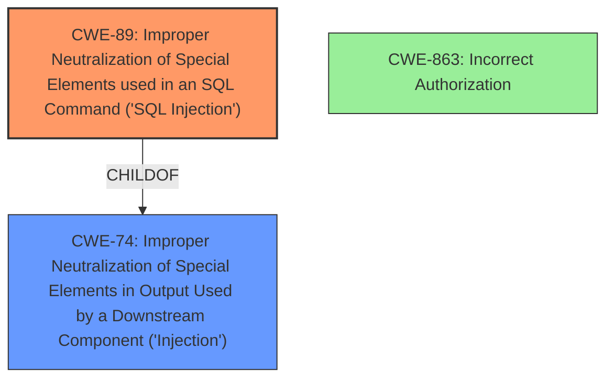

# Raw Analyzer Response for CVE-2024-10341

# Summary
| CWE ID | CWE Name | Confidence | CWE Abstraction Level | CWE Vulnerability Mapping Label | CWE-Vulnerability Mapping Notes |
|---|---|---|---|---|---|
| CWE-89 | Improper Neutralization of Special Elements used in an SQL Command ('SQL Injection') | 1.0 | Base | Allowed | Primary CWE |
| CWE-863 | Incorrect Authorization | 0.5 | Class | Allowed-with-Review | Secondary Candidate |

## Evidence and Confidence

*   **Confidence Score:** 0.8
*   **Evidence Strength:** HIGH

## Relationship Analysis
The primary relationship that influenced the CWE selection was the parent-child relationship between CWE-74 (Improper Neutralization of Special Elements in Output Used by a Downstream Component ('Injection')) and CWE-89 (Improper Neutralization of Special Elements used in an SQL Command ('SQL Injection')). Since the vulnerability specifically involves SQL injection, the more specific CWE-89 was chosen over the more general CWE-74. CWE-863 was considered because the vulnerability involves authenticated users, but the core issue is SQL injection, so it's a secondary concern.

## Vulnerability Chain
The vulnerability chain starts with **insufficient escaping on the user supplied parameter and lack of sufficient preparation on the existing SQL query** (CWE-89), leading to the ability for authenticated attackers to inject SQL code. This injection can then be used to extract sensitive information from the database (information disclosure).

## Summary of Analysis
The analysis is based on the provided evidence, which includes a clear description of the **root cause** as **insufficient escaping on the user supplied parameter and lack of sufficient preparation on the existing SQL query**, leading to an **SQL injection** vulnerability. The Retriever Results also strongly support CWE-89 as the primary weakness. The graph relationships confirm that CWE-89 is a specific type of injection, making it more appropriate than a generic injection CWE. The selected CWEs are at the optimal level of specificity because CWE-89 directly addresses the SQL injection vulnerability described, while CWE-863 addresses an authentication issue, but the primary vulnerability is SQL injection.

Relevant CWE Information:

# Enhanced Context (25 CWEs)
The following CWEs were identified as potentially relevant to this vulnerability:

## CWE-89: Improper Neutralization of Special Elements used in an SQL Command ('SQL Injection')
**Abstraction Level**: base
**Similarity Score**: 3.07
**Source**: graph

**Description**:
CWE-89: Improper Neutralization of Special Elements used in an SQL Command ('SQL Injection')

**Mapping Guidance**:
- Usage: Allowed
- Rationale: This CWE entry is at the Base level of abstraction, which is a preferred level of abstraction for mapping to the root causes of vulnerabilities.

**Relationships**:
- PARENTOF -> CWE-564
- CANFOLLOW -> CWE-456
- CHILDOF -> CWE-74
- CHILDOF -> CWE-943
- PARENTOF -> CWE-89

**Technical explanation for CWE-89:** The vulnerability description explicitly states that the League of Legends Shortcodes plugin is vulnerable to SQL Injection due to **insufficient escaping on the user supplied parameter and lack of sufficient preparation on the existing SQL query**. This aligns directly with the characteristics of CWE-89, which involves improper neutralization of special elements in an SQL command. The security implication is that attackers can inject arbitrary SQL code, potentially leading to data breaches, data manipulation, or denial of service.

**Security implications and potential impact:** Attackers can inject malicious SQL queries that can be used to extract, modify, or delete sensitive data from the database. This can lead to data breaches, data corruption, or complete system compromise.

**Parent-child relationships or chain patterns:** CWE-89 is a child of CWE-74 (Improper Neutralization of Special Elements in Output Used by a Downstream Component ('Injection')), indicating that it's a specific type of injection vulnerability.

**Whether the weakness is primary or secondary in the vulnerability:** This is the primary weakness, as it is the direct cause of the vulnerability.

**How the official MITRE mapping guidance influenced your decision:** The MITRE mapping guidance for CWE-89 states that it's at the Base level of abstraction, which is preferred for mapping to root causes.

## CWE-863: Incorrect Authorization
**Abstraction Level**: Class
**Similarity Score**: 1616.87
**Source**: sparse

**Description**:
The product performs an authorization check when an actor attempts to access a resource or perform an action, but it does not correctly perform the check.

**Mapping Guidance**:
- Usage: Allowed-with-Review
- Rationale: This CWE entry is a Class and might have Base-level children that would be more appropriate

**Technical explanation for CWE-863:** While the vulnerability requires authenticated users to exploit the SQL injection, the core issue isn't an authorization failure. The problem is that, even with valid authentication, the user-supplied input isn't properly sanitized, leading to SQL injection. Thus, while authorization is a prerequisite, it's not the **root cause** of the vulnerability.

**Security implications and potential impact:** Incorrect authorization can lead to unauthorized access to resources or actions, potentially resulting in data breaches, privilege escalation, or other security compromises.

**Parent-child relationships or chain patterns:** N/A

**Whether the weakness is primary or secondary in the vulnerability:** This is a secondary concern. The primary issue is SQL Injection (CWE-89).

**How the official MITRE mapping guidance influenced your decision:** The MITRE mapping guidance for CWE-863 suggests that Base-level children might be more appropriate, but none of the children directly address the SQL injection issue.

**CWEs considered but not used:**

*   CWE-74: Although it's a parent of CWE-89, it's less specific and doesn't directly reflect the SQL injection nature of the vulnerability.
*   CWE-862: Missing Authorization. This was not selected because authorization is present, but there is **insufficient escaping on the user supplied parameter and lack of sufficient preparation on the existing SQL query**.
*   CWE-285: Improper Authorization. This was not selected because the vulnerability is not about improperly implemented authorization logic.