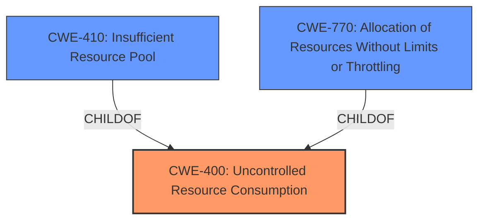

# Analysis for CVE-2024-10344

# Summary
| CWE ID | CWE Name | Confidence | CWE Abstraction Level | CWE Vulnerability Mapping Label | CWE-Vulnerability Mapping Notes |
|---|---|---|---|---|---|
| CWE-400 | Uncontrolled Resource Consumption | 0.7 | Class | Primary | Allowed |

## Evidence and Confidence

*   **Confidence Score:** 0.7
*   **Evidence Strength:** LOW

## Relationship Analysis
CWE-400 is a Class-level CWE, which is higher than the preferred Base or Variant level, but given the limited information, it is the most appropriate choice. The retriever results suggest potential child CWEs like CWE-410 (Insufficient Resource Pool) and CWE-770 (Allocation of Resources Without Limits or Throttling), but without more details, it's difficult to determine if those are more accurate.

## Vulnerability Chain
The vulnerability chain is quite simple in this case: An unauthenticated remote attacker exploits the **refuse function** to cause **Uncontrolled Resource Consumption**, which leads to a Denial of Service. There isn't enough information to determine a more specific root cause.

## Summary of Analysis
The vulnerability description indicates an unauthenticated remote attacker can cause a Denial of Service (DoS) via the **refuse function** in Helix Core. Given the limited information, the most appropriate CWE is CWE-400 **Uncontrolled Resource Consumption**.

The description points to a scenario where the attacker can somehow exhaust resources, leading to a DoS. CWE-400 is a general class for this type of vulnerability.

The retriever results suggest other CWEs like CWE-410 (Insufficient Resource Pool) and CWE-770 (Allocation of Resources Without Limits or Throttling). However, without further details about the root cause (e.g., whether it's due to an insufficient resource pool or unlimited allocation), choosing a more specific CWE would be speculative.

Therefore, CWE-400 is the most accurate classification based on the available evidence. The evidence is weak.