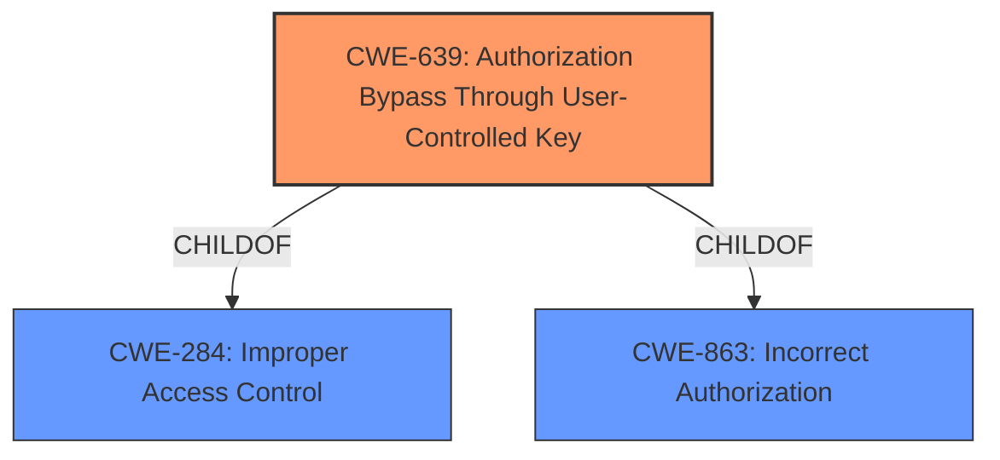

# Analysis for CVE-2024-10366

# Summary
| CWE ID | CWE Name | Confidence | CWE Abstraction Level | CWE Vulnerability Mapping Label | CWE-Vulnerability Mapping Notes |
|---|---|---|---|---|---|
| CWE-639 | Authorization Bypass Through User-Controlled Key | 1.0 | Base | Allowed | Primary CWE. The application **does not verify whether the provided attachment ID belongs to the current user, allowing any authenticated user to delete attachments of other users**. This fits the description of Authorization Bypass Through User-Controlled Key. |
| CWE-863 | Incorrect Authorization | 0.7 | Class | Allowed-with-Review | Secondary candidate. The application performs an authorization check when an actor attempts to access a resource or perform an action, but it does not correctly perform the check. This is a higher level CWE. |

## Evidence and Confidence

*   **Confidence Score:** 1.0
*   **Evidence Strength:** HIGH

## Relationship Analysis
The primary CWE is CWE-639, which is a Base level CWE. CWE-639 is a child of CWE-284 (Improper Access Control) and CWE-863 (Incorrect Authorization). CWE-639 is more specific and accurately describes the vulnerability compared to its parents.

## Vulnerability Chain
The vulnerability chain starts with **improper access control**. An authenticated user can then use this **improper access control** to delete attachments belonging to other users, thus bypassing authorization.
  - The root cause is **improper access control**
  - The impact is deleting attachments of other users.

## Summary of Analysis
The vulnerability is an **improper access control** issue in the delete attachments functionality of danny-avila/librechat. The application **does not verify whether the provided attachment ID belongs to the current user, allowing any authenticated user to delete attachments of other users**.

The Retriever Results listed CWE-639 as the top candidate. The description for CWE-639 is "The system's authorization functionality does not prevent one user from gaining access to another user's data or record by modifying the key value identifying the data." This accurately describes the vulnerability.

The vulnerability description key phrases also indicate that the **rootcause** is **improper access control** and the **weakness** is an **improper access control vulnerability**.

The CWE classification guidance indicates that when the access control policy is unclear or inconsistently enforced, but it's not due to missing checks, consider **CWE-284**. However, since the **improper access control** is due to an authorization bypass through a user-controlled key, CWE-639 is more appropriate than CWE-284.

CWE-863 (Incorrect Authorization) was also considered, but CWE-639 is a child of CWE-863 and is more specific, therefore it is a better fit.

Relevant CWE Information:
- CWE-639: Authorization Bypass Through User-Controlled Key
- CWE-863: Incorrect Authorization
- CWE-285: Improper Authorization
- CWE-620: Unverified Password Change
- CWE-862: Missing Authorization
- CWE-269: Improper Privilege Management
- CWE-306: Missing Authentication for Critical Function
- CWE-472: External Control of Assumed-Immutable Web Parameter
- CWE-359: Exposure of Private Personal Information to an Unauthorized Actor
- CWE-183: Permissive List of Allowed Inputs