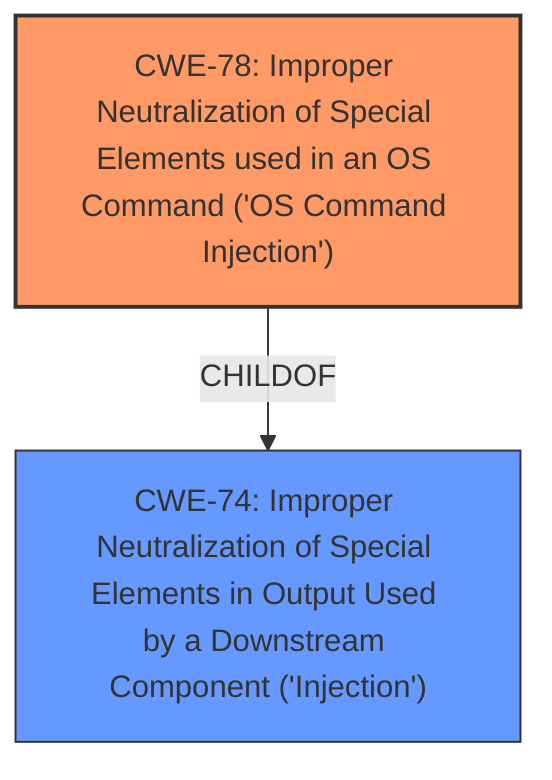

# Raw Analyzer Response for CVE-2024-10443

# Summary

| CWE ID | CWE Name | Confidence | CWE Abstraction Level | CWE Vulnerability Mapping Label | CWE-Vulnerability Mapping Notes |
|---|---|---|---|---|---|
| CWE-78 | Improper Neutralization of Special Elements used in an OS Command ('OS Command Injection') | 1.0 | Base | Allowed | Primary CWE |
| CWE-74 | Improper Neutralization of Special Elements in Output Used by a Downstream Component ('Injection') | 0.7 | Class | Discouraged | Secondary Candidate |

## Evidence and Confidence

*   **Confidence Score:** 1.0
*   **Evidence Strength:** HIGH

## Relationship Analysis

The primary relationship that influenced my decision was the hierarchical relationship between CWE-74 (Improper Neutralization of Special Elements in Output Used by a Downstream Component ('Injection')) and CWE-78 (Improper Neutralization of Special Elements used in an OS Command ('OS Command Injection')). CWE-78 is a specific type of CWE-74, focusing on OS command injection. Since the vulnerability description explicitly mentions "command injection", CWE-78 is the more precise and appropriate choice.

## Vulnerability Chain

The vulnerability chain starts with the **improper neutralization of special elements** in commands, leading to a command injection vulnerability, which ultimately allows remote attackers to execute arbitrary code.

Improper Neutralization (Root Cause) -> Command Injection (CWE-78) -> Arbitrary Code Execution (Impact)

## Summary of Analysis

Based on the vulnerability description, the **root cause** is the **improper neutralization of special elements** used in a command, leading to a command injection vulnerability. The impact is that remote attackers can execute arbitrary code.

The vulnerability description explicitly mentions "command injection," making CWE-78 (Improper Neutralization of Special Elements used in an OS Command ('OS Command Injection')) the most suitable primary CWE.

CWE-74 (Improper Neutralization of Special Elements in Output Used by a Downstream Component ('Injection')) was considered as a more general option, since CWE-78 is a ChildOf CWE-74. However, the explicit mention of "command injection" in the description makes CWE-78 a more specific and accurate classification.

The evidence supporting this decision is the "Vulnerability Description Key Phrases" which clearly states:
- **rootcause:** **Improper neutralization of special elements**
- **weakness:** **command injection**

Relevant CWE Information:

# Enhanced Context (25 CWEs)
The following CWEs were identified as potentially relevant to this vulnerability:

## CWE-74: Improper Neutralization of Special Elements in Output Used by a Downstream Component ('Injection')
**Abstraction Level**: Class
**Similarity Score**: 0.77
**Source**: dense

**Description**:
The product constructs all or part of a command, data structure, or record using externally-influenced input from an upstream component, but it does not neutralize or incorrectly neutralizes special elements that could modify how it is parsed or interpreted when it is sent to a downstream component.

**Mapping Guidance**:
- Usage: Discouraged
- Rationale: CWE-74 is high-level and often misused when lower-level weaknesses are more appropriate.

## CWE-78: Improper Neutralization of Special Elements used in an OS Command ('OS Command Injection')
**Abstraction Level**: base
**Similarity Score**: 4.31
**Source**: graph

**Description**:
CWE-78: Improper Neutralization of Special Elements used in an OS Command ('OS Command Injection')

**Mapping Guidance**:
- Usage: Allowed
- Rationale: This CWE entry is at the Base level of abstraction, which is a preferred level of abstraction for mapping to the root causes of vulnerabilities.

**Relationships**:
- CANFOLLOW -> CWE-184
- CANALSOBE -> CWE-88
- CHILDOF -> CWE-77
- CHILDOF -> CWE-77
- CHILDOF -> CWE-74