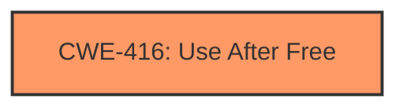

# Analysis for CVE-2024-10488

# Summary
| CWE ID | CWE Name | Confidence | CWE Abstraction Level | CWE Vulnerability Mapping Label | CWE-Vulnerability Mapping Notes |
|---|---|---|---|---|---|
| CWE-416 | Use After Free | 1.0 | Variant | Primary | Allowed |

## Evidence and Confidence

*   **Confidence Score:** 1.0
*   **Evidence Strength:** HIGH

## Relationship Analysis
The primary identified CWE is CWE-416 **Use After Free**, which is a Variant level CWE. No other relationships significantly influenced the decision, as the description clearly points to a use-after-free vulnerability. The retriever results also strongly support this selection.

## Vulnerability Chain
The vulnerability chain starts with a **use after free** (**CWE-416**) which leads to potential heap corruption.

## Summary of Analysis
The vulnerability description explicitly states "Use after free in WebRTC," and the CVE Reference Links Content Summary confirms the **root cause** as "**Use after free**". The primary CWE match is **CWE-416 Use After Free**, and it is the top CWE from the retriever results. The confidence is very high (1.0) due to the explicit mention of "use after free" in both the vulnerability description and the CVE summary. **CWE-416** is a Variant, which is an appropriate level of abstraction.

Relevant CWE Information:

# Enhanced Context (25 CWEs)
The following CWEs were identified as potentially relevant to this vulnerability:

## CWE-416: Use After Free
**Abstraction Level**: Variant
**Similarity Score**: 0.79
**Source**: dense

**Description**:
The product reuses or references memory after it has been freed. At some point afterward, the memory may be allocated again and saved in another pointer, while the original pointer references a location somewhere within the new allocation. Any operations using the original pointer are no longer valid because the memory "belongs" to the code that operates on the new pointer.

**Mapping Guidance**:
- Usage: Allowed
- Rationale: This CWE entry is at the Variant level of abstraction, which is a preferred level of abstraction for mapping to the root causes of vulnerabilities.