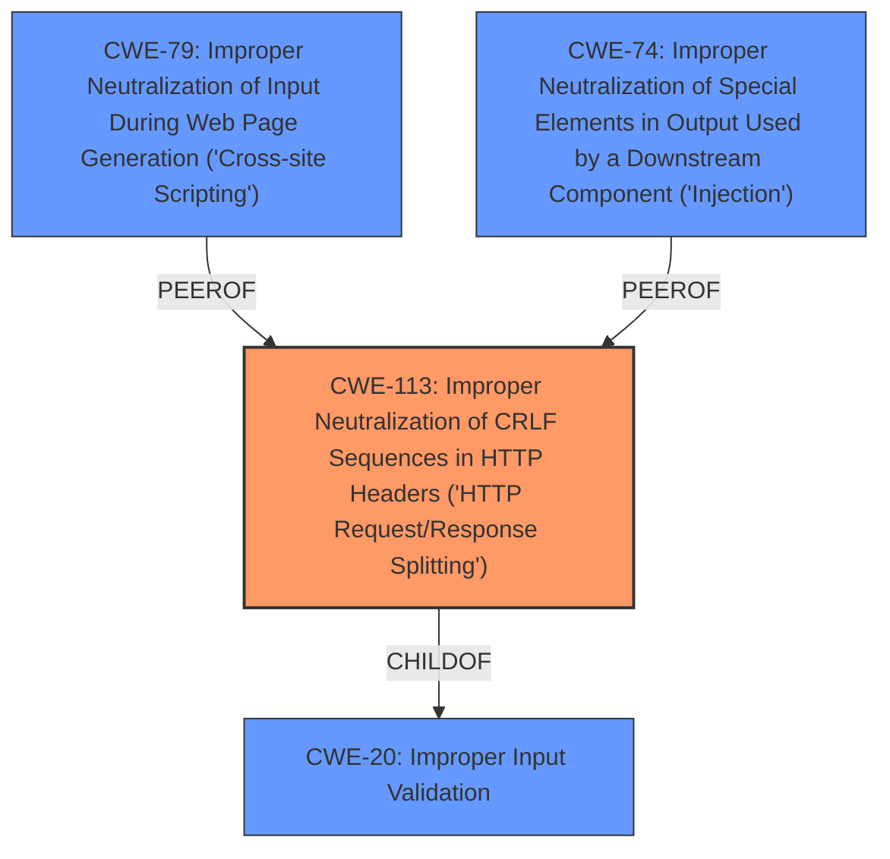

# Analysis for CVE-2024-10491

# Summary
| CWE ID | CWE Name | Confidence | CWE Abstraction Level | CWE Vulnerability Mapping Label | CWE-Vulnerability Mapping Notes |
|---|---|---|---|---|---|
| CWE-113 | Improper Neutralization of CRLF Sequences in HTTP Headers ('HTTP Request/Response Splitting') | 0.8 | Variant | Primary | Allowed |
| CWE-79 | Improper Neutralization of Input During Web Page Generation ('Cross-site Scripting') | 0.6 | Base | Secondary | Allowed |
| CWE-74 | Improper Neutralization of Special Elements in Output Used by a Downstream Component ('Injection') | 0.5 | Class | Secondary | Discouraged |

## Evidence and Confidence

*   **Confidence Score:** 0.7
*   **Evidence Strength:** HIGH

## Relationship Analysis
The primary CWE identified is CWE-113 Improper Neutralization of CRLF Sequences in HTTP Headers ('HTTP Request/Response Splitting'), a variant of CWE-20 Improper Input Validation. CWE-79 Improper Neutralization of Input During Web Page Generation ('Cross-site Scripting') and CWE-74 Improper Neutralization of Special Elements in Output Used by a Downstream Component ('Injection') were considered as potential secondary CWEs due to the possibility of XSS and general injection vulnerabilities, respectively. The hierarchical relationship influenced the decision to select the most specific variant, CWE-113, as the primary weakness, with CWE-79 and CWE-74 representing potential impacts or related weaknesses.

## Vulnerability Chain
The vulnerability chain starts with **improper sanitization** of input, specifically related to characters used in HTTP headers. This **improper sanitization** leads to the injection of arbitrary resources via the Link header, potentially resulting in the preloading of malicious resources, cross-site scripting, or other injection-related impacts.

Improper Sanitization -> Resource Injection -> Malicious Resource Preload/XSS

## Summary of Analysis
The initial analysis focused on identifying the root cause of the vulnerability, which is the **improper sanitization** within the `response.links` function. The primary evidence for this comes from the "Vulnerability Description Key Phrases" and the "CVE Reference Links Content Summary," both of which highlight the lack of proper sanitization as the core issue.

CWE-113, Improper Neutralization of CRLF Sequences in HTTP Headers ('HTTP Request/Response Splitting'), was selected as the primary CWE because the vulnerability involves the injection of characters into HTTP headers due to **improper sanitization**. The "CVE Reference Links Content Summary" explicitly mentions that the application "does not adequately validate and restrict input before using it in the header." This directly aligns with CWE-113, which focuses on the **improper neutralization** of CR and LF characters in HTTP headers.

CWE-79, Improper Neutralization of Input During Web Page Generation ('Cross-site Scripting'), was considered as a secondary CWE because the "CVE Reference Links Content Summary" mentions the possibility of XSS due to the ability to preload resources. However, this is a potential impact rather than the root cause.

CWE-74, Improper Neutralization of Special Elements in Output Used by a Downstream Component ('Injection'), was also considered as a secondary CWE because the vulnerability involves resource injection. However, CWE-74 is a more general CWE, and CWE-113 is more specific to the context of HTTP headers.

The selection of CWE-113 as the primary CWE is based on its direct alignment with the **improper sanitization** of input in HTTP headers, as described in the vulnerability description and the CVE reference links content summary. The graph relationships influenced this decision by highlighting the connections between input validation, HTTP header manipulation, and potential injection vulnerabilities. CWE-113 is at the optimal level of specificity because it directly addresses the weakness in the context of HTTP headers, whereas other CWEs are either more general or represent potential impacts.