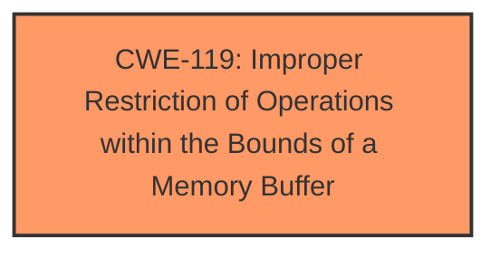

# Analysis for CVE-2024-10498

# Summary
| CWE ID | CWE Name | Confidence | CWE Abstraction Level | CWE Vulnerability Mapping Label | CWE-Vulnerability Mapping Notes |
|---|---|---|---|---|---|
| CWE-119 | Improper Restriction of Operations within the Bounds of a Memory Buffer | 1.0 | Class | Allowed | Primary CWE. Matches the description and is the root cause. |

## Evidence and Confidence

*   **Confidence Score:** 1.0
*   **Evidence Strength:** HIGH

## Relationship Analysis
The primary CWE is CWE-119, which is a Class-level CWE. While more specific CWEs exist that are children of CWE-119 such as CWE-122 (Heap-based Buffer Overflow) and CWE-787 (Out-of-bounds Write), there isn't enough information provided to determine that the buffer is heap-based or that a write occurred. Therefore, the Class level is more appropriate.

## Vulnerability Chain
The vulnerability chain starts with **CWE-119 Improper Restriction of Operations within the Bounds of a Memory Buffer**. This leads to the attacker's ability to modify configuration values outside of the normal range, resulting in invalid data or loss of web interface functionality.

## Summary of Analysis
The analysis is based on the provided evidence, which explicitly states the **root cause** as **CWE-119 Improper Restriction of Operations within the Bounds of a Memory Buffer**. The description indicates that the vulnerability allows an attacker to modify configuration values outside of the normal range by sending specific Modbus write packets. This aligns with the definition of CWE-119, which describes operations on a memory buffer outside its intended boundary.

The retriever results also list CWE-119 as the top candidate, supporting its selection. While other CWEs such as CWE-787 (Out-of-bounds Write) and CWE-125 (Out-of-bounds Read) are related to buffer operations, there's no specific information provided that confirms a write or read operation occurred outside the bounds of the buffer. The description focuses on the **improper restriction** which allows for modification of configuration values, making CWE-119 the most accurate and specific choice based on the available information.

The selection of CWE-119 is at the optimal level of specificity, as it captures the essence of the vulnerability without over-specifying the type of buffer operation.

Relevant CWE Information:

# Enhanced Context (25 CWEs)
The following CWEs were identified as potentially relevant to this vulnerability:

## CWE-119: Improper Restriction of Operations within the Bounds of a Memory Buffer
**Abstraction Level**: Class
**Similarity Score**: 0.77
**Source**: dense

**Description**:
The product performs operations on a memory buffer, but it reads from or writes to a memory location outside the buffer's intended boundary. This may result in read or write operations on unexpected memory locations that could be linked to other variables, data structures, or internal program data.

**Mapping Guidance**:
- Usage: Discouraged
- Rationale: CWE-119 is commonly misused in low-information vulnerability reports when lower-level CWEs could be used instead, or when more details about the vulnerability are available.

**Justification for not selecting other CWEs:**

*   CWE-125 (Out-of-bounds Read), CWE-787 (Out-of-bounds Write): These are more specific types of buffer errors. The current description doesn't specify whether the operation is a read or a write.
*   CWE-823 (Use of Out-of-range Pointer Offset): This could be related but there is no mention of pointers.
*   CWE-190 (Integer Overflow or Wraparound), CWE-193 (Off-by-one Error): These are integer-related errors and there is no evidence of these.
*   CWE-122 (Heap-based Buffer Overflow): It is more specific than CWE-119, and the provided information does not specify that the buffer is heap-based.
*   CWE-824: (Access of Uninitialized Pointer): There's no mention of uninitialized pointers.
*   CWE-1260: Improper Handling of Overlap Between Protected Memory Ranges: There's no information about overlaps.
*   CWE-128: Wrap-around Error and CWE-1339: Insufficient Precision or Accuracy of a Real Number: Not relevant to the vulnerability description.
*   CWE-755: Improper Handling of Exceptional Conditions, CWE-345: Insufficient Verification of Data Authenticity, CWE-798: Use of Hard-coded Credentials, CWE-1285: Improper Validation of Specified Index, Position, or Offset in Input, CWE-280: Improper Handling of Insufficient Permissions or Privileges , CWE-294: Authentication Bypass by Capture-replay, CWE-912: Hidden Functionality, CWE-130: Improper Handling of Length Parameter Inconsistency: These do not seem relevant based on the vulnerability description.