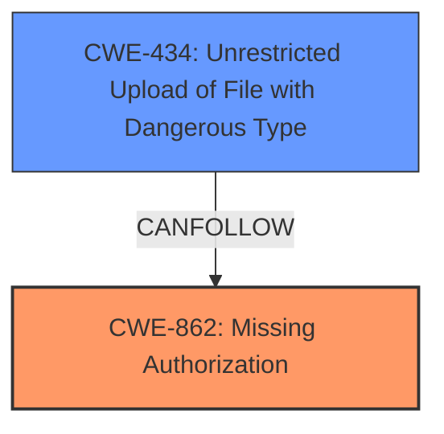

# Analysis for CVE-2024-10578

# Summary
| CWE ID | CWE Name | Confidence | CWE Abstraction Level | CWE Vulnerability Mapping Label | CWE-Vulnerability Mapping Notes |
|---|---|---|---|---|---|
| CWE-862 | Missing Authorization | 1.0 | Class | Allowed-with-Review | Primary CWE. The vulnerability is due to a **missing capability check** in the identified function. |
| CWE-434 | Unrestricted Upload of File with Dangerous Type | 0.7 | Base | Allowed | Secondary. The **missing capability check** allows for arbitrary plugin installation, which can be seen as an unrestricted upload of a file with a dangerous type, as the plugin can contain malicious code. |

## Evidence and Confidence

*   **Confidence Score:** 0.9
*   **Evidence Strength:** HIGH

## Relationship Analysis
The primary weakness is the **missing authorization** (CWE-862) which allows an attacker to perform actions they should not be able to. This can lead to secondary weaknesses, such as uploading dangerous file types (CWE-434).

## Vulnerability Chain
The vulnerability chain starts with the **missing authorization** check (CWE-862) in the `pubnews_importer_plugin_action_for_notice()` function. This allows authenticated users with Subscriber-level access or higher to install arbitrary plugins, which can be seen as an unrestricted upload of a file with a dangerous type (CWE-434). The installed plugins can then be leveraged to exploit other vulnerabilities, potentially leading to full site takeover.

## Summary of Analysis
The analysis is based on the provided evidence, particularly the vulnerability description and the CVE Reference Links Content Summary. The **root cause** is identified as a **missing capability check**, which directly corresponds to CWE-862 (Missing Authorization). The ability to install arbitrary plugins is then classified as CWE-434 (Unrestricted Upload of File with Dangerous Type) as a consequence of the missing authorization.

The evidence from the Vulnerability Description Key Phrases states:
- **rootcause:** **missing capability check**
- **impact:** unauthorized arbitrary plugin installation

The evidence from the CVE Reference Links Content Summary states:
"The vulnerability is due to a **missing capability check** in the `pubnews_importer_plugin_action_for_notice()` function within the Pubnews theme. This allows any authenticated user, including those with Subscriber-level access, to trigger arbitrary plugin installations."

CWE-862 is a Class-level CWE, but given the information provided, it is the most accurate representation of the **missing authorization**. While more specific Base-level CWEs might exist, there isn't enough information to pinpoint a more specific cause.

CWE-434 is included because the impact of missing authorization is the ability to upload arbitrary plugins, which are essentially dangerous file types.

Other CWEs considered but not used:

*   CWE-352: Cross-Site Request Forgery (CSRF) - While CSRF could be a potential attack vector, the primary weakness is the **missing authorization** check, not the lack of CSRF protection.
*   CWE-306: Missing Authentication for Critical Function - Authentication is present (the attacker needs to be authenticated), but authorization is missing, making CWE-862 more relevant.
*   CWE-863: Incorrect Authorization - This CWE implies that an authorization check exists but is flawed. The description clearly states that authorization is missing.