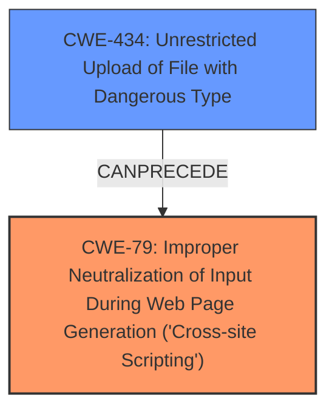

# Analysis Report for CVE-2024-10584

# Vulnerability Analysis Report: CVE-2024-10584

## Description

The DirectoryPress Business Directory And Classified Ad Listing plugin for WordPress is vulnerable to **Stored Cross-Site Scripting** via SVG File uploads in all versions up to, and including, 3.6.16 due to **insufficient input sanitization and output escaping**. This makes it possible for authenticated attackers, with author-level access and above, to inject arbitrary web scripts in pages that will execute whenever a user accesses the SVG file. When DirectoryPress Frontend is installed, this can be exploited by unauthenticated users.

## Vulnerability Description Key Phrases

- **Rootcause:** insufficient input sanitization and output escaping
- **Weakness:** Stored Cross-Site Scripting
- **Impact:** inject arbitrary web scripts
- **Vector:** SVG File uploads
- **Attacker:** authenticated attackers
- **Product:** DirectoryPress Business Directory And Classified Ad Listing plugin for WordPress
- **Version:** all versions up to and including 3.6.16

## Analysis (with Relationship Data)

# Summary
| CWE ID | CWE Name | Confidence | CWE Abstraction Level | CWE Vulnerability Mapping Label | CWE-Vulnerability Mapping Notes |
|---|---|---|---|---|---|
| CWE-79 | Improper Neutralization of Input During Web Page Generation ('Cross-site Scripting') | 1.0 | Base | Primary | Allowed |
| CWE-434 | Unrestricted Upload of File with Dangerous Type | 0.9 | Base | Secondary | Allowed |

## Evidence and Confidence

*   **Confidence Score:** 0.95
*   **Evidence Strength:** HIGH

## Relationship Analysis
The primary weakness is **CWE-79 Improper Neutralization of Input During Web Page Generation ('Cross-site Scripting')**, caused by **insufficient input sanitization and output escaping**. The attack vector involves uploading a file with a dangerous type, specifically an SVG file, which is **CWE-434 Unrestricted Upload of File with Dangerous Type**. This relationship indicates that the unrestricted file upload enables the XSS vulnerability.



## Vulnerability Chain
The vulnerability chain starts with the **Unrestricted Upload of File with Dangerous Type (CWE-434)**, which allows the attacker to upload a malicious SVG file. Due to **insufficient input sanitization and output escaping**, the malicious script within the SVG is not neutralized, leading to **Improper Neutralization of Input During Web Page Generation ('Cross-site Scripting') (CWE-79)**. When a user accesses the SVG file, the injected script executes, resulting in the XSS vulnerability.

## Summary of Analysis
The analysis is based on the provided evidence, which includes the vulnerability description and CVE reference summary. The vulnerability description clearly states that the root cause is **insufficient input sanitization and output escaping**, leading to a **Stored Cross-Site Scripting** vulnerability via SVG file uploads. The CVE reference summary confirms this by stating the root cause and the presence of both the XSS vulnerability and unrestricted file upload.

The graph relationships show that **CWE-434** can precede **CWE-79**, which aligns with the vulnerability chain where the unrestricted file upload enables the XSS vulnerability.

The selected CWEs are at the optimal level of specificity, as they accurately represent the weaknesses described in the vulnerability. **CWE-79** is a Base-level CWE that directly addresses the **improper neutralization of input**, while **CWE-434** is a Base-level CWE that describes the **unrestricted file upload vulnerability**.

Relevant CWE Information:

# Enhanced Context (25 CWEs)
The following CWEs were identified as potentially relevant to this vulnerability:

## CWE-352: Cross-Site Request Forgery (CSRF)
**Abstraction Level**: Compound
**Similarity Score**: 0.74
**Source**: dense

**Description**:
The web application does not, or can not, sufficiently verify whether a well-formed, valid, consistent request was intentionally provided by the user who submitted the request.

**Mapping Guidance**:
- Usage: Allowed
- Rationale: This is a well-known Composite of multiple weaknesses that must all occur simultaneously, although it is attack-oriented in nature.

*Not Selected*: This CWE is not related to the described vulnerability, as it focuses on request forgery, not input sanitization or file uploads.

## CWE-434: Unrestricted Upload of File with Dangerous Type
**Abstraction Level**: Base
**Similarity Score**: 0.74
**Source**: dense

**Description**:
The product allows the upload or transfer of dangerous file types that are automatically processed within its environment.

**Mapping Guidance**:
- Usage: Allowed
- Rationale: This CWE entry is at the Base level of abstraction, which is a preferred level of abstraction for mapping to the root causes of vulnerabilities.

*Selected as Secondary*: This CWE is relevant because the vulnerability involves uploading a malicious SVG file, which is a dangerous file type.

## CWE-425: Direct Request ('Forced Browsing')
**Abstraction Level**: Base
**Similarity Score**: 0.71
**Source**: dense

**Description**:
The web application does not adequately enforce appropriate authorization on all restricted URLs, scripts, or files.

**Mapping Guidance**:
- Usage: Allowed
- Rationale: This CWE entry is at the Base level of abstraction, which is a preferred level of abstraction for mapping to the root causes of vulnerabilities.

*Not Selected*: Although unauthenticated users can exploit this vulnerability when DirectoryPress Frontend is installed, the primary issue is still the lack of sanitization/escaping.

## CWE-79: Improper Neutralization of Input During Web Page Generation ('Cross-site Scripting')
**Abstraction Level**: Base
**Similarity Score**: 0.70
**Source**: dense

**Description**:
The product does not neutralize or incorrectly neutralizes user-controllable input before it is placed in output that is used as a web page that is served to other users.

**Mapping Guidance**:
- Usage: Allowed
- Rationale: This CWE entry is at the Base level of abstraction, which is a preferred level of abstraction for mapping to the root causes of vulnerabilities.

*Selected as Primary*: This CWE is the best fit because the vulnerability involves **insufficient input sanitization and output escaping**, which directly leads to the **Stored Cross-Site Scripting** vulnerability.

## CWE-116: Improper Encoding or Escaping of Output
**Abstraction Level**: Class
**Similarity Score**: 0.70
**Source**: dense

**Description**:
The product prepares a structured message for communication with another component, but encoding or escaping of the data is either missing or done incorrectly. As a result, the intended structure of the message is not preserved.

**Mapping Guidance**:
- Usage: Allowed-with-Review
- Rationale: This CWE entry is a Class and might have Base-level children that would be more appropriate

*Not Selected*: While related, **CWE-79** is more specific to XSS and the context of web page generation.

## CWE-138: Improper Neutralization of Special Elements
**Abstraction Level**: Class
**Similarity Score**: 0.69
**Source**: dense

**Description**:
The product receives input from an upstream component, but it does not neutralize or incorrectly neutralizes special elements that could be interpreted as control elements or syntactic markers when they are sent to a downstream component.

**Mapping Guidance**:
- Usage: Discouraged
- Rationale: This CWE entry is a level-1 Class (i.e., a child of a Pillar). It might have lower-level children that would be more appropriate

*Not Selected*: This CWE is too broad and less specific than **CWE-79**.

## CWE-639: Authorization Bypass Through User-Controlled Key
**Abstraction Level**: Base
**Similarity Score**: 0.69
**Source**: dense

**Description**:
The system's authorization functionality does not prevent one user from gaining access to another user's data or record by modifying the key value identifying the data.

**Mapping Guidance**:
- Usage: Allowed
- Rationale: This CWE entry is at the Base level of abstraction, which is a preferred level of abstraction for mapping to the root causes of vulnerabilities.

*Not Selected*: This CWE is not related to the described vulnerability, as it focuses on authorization bypass, not input sanitization or file uploads.

## CWE-95: Improper Neutralization of Directives in Dynamically Evaluated Code ('Eval Injection')
**Abstraction Level**: Variant
**Similarity Score**: 0.69
**Source**: dense

**Description**:
The product receives input from an upstream component, but it does not neutralize or incorrectly neutralizes code syntax before using the input in a dynamic evaluation call (e.g. "eval").

**Mapping Guidance**:
- Usage: Allowed
- Rationale: This CWE entry is at the Variant level of abstraction, which is a preferred level of abstraction for mapping to the root causes of vulnerabilities.

*Not Selected*: This CWE is not related to the described vulnerability, as it focuses on eval injection, not input sanitization or file uploads.

## CWE-472: External Control of Assumed-Immutable Web Parameter
**Abstraction Level**: Base
**Similarity Score**: 0.69
**Source**: dense

**Description**:
The web application does not sufficiently verify inputs that are assumed to be immutable but are actually externally controllable, such as hidden form fields.

**Mapping Guidance**:
- Usage: Allowed
- Rationale: This CWE entry is at the Base level of abstraction, which is a preferred level of abstraction for mapping to the root causes of vulnerabilities.

*Not Selected*: This CWE is not related to the described vulnerability, as it focuses on immutable web parameters, not input sanitization or file uploads.

## CWE-184: Incomplete List of Disallowed Inputs
**Abstraction Level**: Base
**Similarity Score**: 0


## CWE Relationship Analysis

Current CWEs represent these abstraction levels: .


### Vulnerability Chain Analysis

**Chain starting from CWE-116:**
- 116 (Improper Encoding or Escaping of Output) - ROOT


**Chain starting from CWE-639:**
- 639 (Authorization Bypass Through User-Controlled Key) - ROOT


### CWE Relationship Diagram

```mermaid
graph TD
    classDef primary fill:#f96,stroke:#333,stroke-width:2px
    classDef secondary fill:#69f,stroke:#333
    classDef tertiary fill:#9e9,stroke:#333
```


*Report generated on 2025-07-13 00:16:08*
