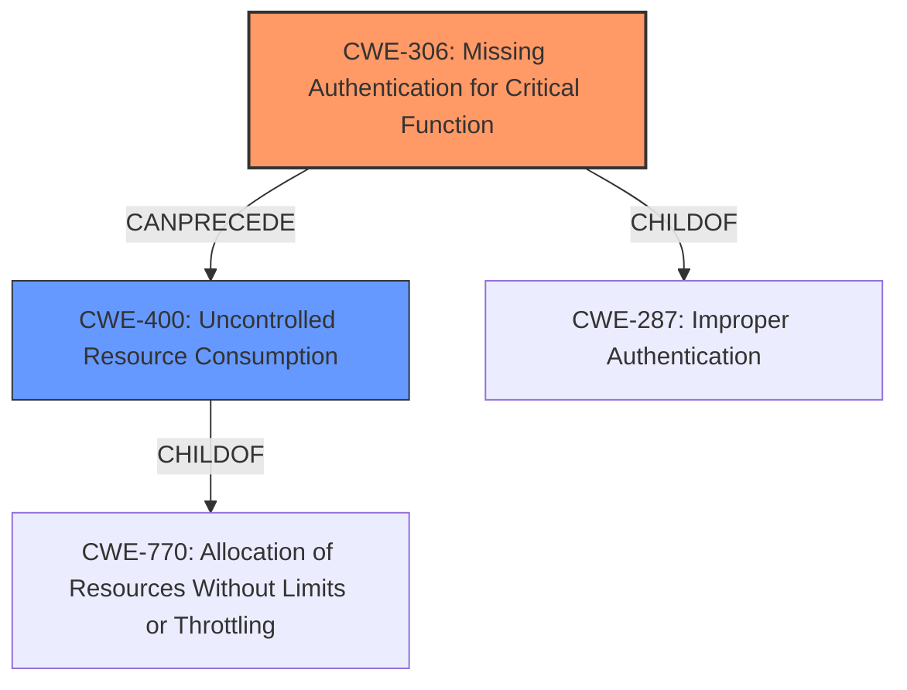

# Analysis Report for CVE-2024-10599

# Vulnerability Analysis Report: CVE-2024-10599

## Description

A vulnerability, which was classified as problematic, has been found in Tongda OA 2017 up to 11.7. This issue affects some unknown processing of the file /inc/package_static_resources.php. The manipulation leads to resource consumption. The attack may be initiated remotely. The exploit has been disclosed to the public and may be used.

## Vulnerability Description Key Phrases

- **Impact:** resource consumption
- **Product:** Tongda OA
- **Version:** 2017 up to 11.7
- **Component:** /inc/package_static_resources.php

## Analysis (with Relationship Data)

# Summary
| CWE ID | CWE Name | Confidence | CWE Abstraction Level | CWE Vulnerability Mapping Label | CWE-Vulnerability Mapping Notes |
|---|---|---|---|---|---|
| **CWE-306** | **Missing Authentication for Critical Function** | 1.0 | Base | Primary CWE | Allowed |
| CWE-400 | Uncontrolled Resource Consumption | 0.7 | Base | Secondary Candidate | Allowed |

## Evidence and Confidence

*   **Confidence Score:** 0.85
*   **Evidence Strength:** HIGH

## Relationship Analysis
The primary weakness is the **missing authentication** which directly leads to the uncontrolled resource consumption. CWE-306 [Base] is a child of CWE-287 [Class: Improper Authentication] and a parent of more specific authentication flaws. CWE-400 [Base] is a child of CWE-770 [Class: Allocation of Resources Without Limits or Throttling]



## Vulnerability Chain
The vulnerability chain starts with **missing authentication** for a critical function, allowing unauthorized access to `/inc/package_static_resources.php`. This lack of access control leads to **uncontrolled resource consumption** as the file can be repeatedly accessed without any restrictions, ultimately resulting in a denial-of-service.

## Summary of Analysis
The primary **weakness** is the **missing authentication** (**CWE-306**) for `/inc/package_static_resources.php`, which allows unauthenticated access and leads to **uncontrolled resource consumption** (**CWE-400**), causing a denial-of-service. The vulnerability description and the CVE reference links content summary clearly point to the absence of login verification, making **CWE-306** the most appropriate primary classification. The resulting resource consumption is a consequence of the missing authentication, justifying **CWE-400** as a secondary classification.

Relevant CWE Information:

# Enhanced Context (25 CWEs)
The following CWEs were identified as potentially relevant to this vulnerability:

## CWE-425: Direct Request ('Forced Browsing')
**Abstraction Level**: Base
**Similarity Score**: 0.75
**Source**: dense

**Description**:
The web application does not adequately enforce appropriate authorization on all restricted URLs, scripts, or files.

**Mapping Guidance**:
- Usage: Allowed
- Rationale: This CWE entry is at the Base level of abstraction, which is a preferred level of abstraction for mapping to the root causes of vulnerabilities.

**CWE-425** was considered because the attack vector involves a direct request to a specific URL. However, **CWE-306** is a better fit because it explicitly describes the **missing authentication**, which is the root cause that allows the direct request to succeed.

## CWE-434: Unrestricted Upload of File with Dangerous Type
**Abstraction Level**: Base
**Similarity Score**: 0.75
**Source**: dense

**Description**:
The product allows the upload or transfer of dangerous file types that are automatically processed within its environment.

**Mapping Guidance**:
- Usage: Allowed
- Rationale: This CWE entry is at the Base level of abstraction, which is a preferred level of abstraction for mapping to the root causes of vulnerabilities.

**CWE-434** is not relevant because the vulnerability does not involve file uploads.

## CWE-790: Improper Filtering of Special Elements
**Abstraction Level**: Class
**Similarity Score**: 0.74
**Source**: dense

**Description**:
The product receives data from an upstream component, but does not filter or incorrectly filters special elements before sending it to a downstream component.

**Mapping Guidance**:
- Usage: Allowed-with-Review
- Rationale: This CWE entry is a Class and might have Base-level children that would be more appropriate

**CWE-790** is not relevant because the vulnerability does not involve improper filtering of special elements.

## CWE-303: Incorrect Implementation of Authentication Algorithm
**Abstraction Level**: Base
**Similarity Score**: 0.74
**Source**: dense

**Description**:
The requirements for the product dictate the use of an established authentication algorithm, but the implementation of the algorithm is incorrect.

**Mapping Guidance**:
- Usage: Allowed
- Rationale: This CWE entry is at the Base level of abstraction, which is a preferred level of abstraction for mapping to the root causes of vulnerabilities.

**CWE-303** is not relevant because the vulnerability involves **missing authentication** rather than an incorrect implementation of an authentication algorithm.

## CWE-472: External Control of Assumed-Immutable Web Parameter
**Abstraction Level**: Base
**Similarity Score**: 0.74
**Source**: dense

**Description**:
The web application does not sufficiently verify inputs that are assumed to be immutable but are actually externally controllable, such as hidden form fields.

**Mapping Guidance**:
- Usage: Allowed
- Rationale: This CWE entry is at the Base level of abstraction, which is a preferred level of abstraction for mapping to the root causes of vulnerabilities.

**CWE-472** is not relevant because the vulnerability does not involve externally controllable parameters.

## CWE-755: Improper Handling of Exceptional Conditions
**Abstraction Level**: Class
**Similarity Score**: 0.74
**Source**: dense

**Description**:
The product does not handle or incorrectly handles an exceptional condition.

**Mapping Guidance**:
- Usage: Discouraged
- Rationale: This CWE entry is a level-1 Class (i.e., a child of a Pillar). It might have lower-level children that would be more appropriate

**CWE-755** is too generic and does not accurately describe the root cause of the vulnerability.

## CWE-923: Improper Restriction of Communication Channel to Intended Endpoints
**Abstraction Level**: Class
**Similarity Score**: 0.74
**Source**: dense

**Description**:
The product establishes a communication channel to (or from) an endpoint for privileged or protected operations, but it does not properly ensure that it is communicating with the correct endpoint.

**Mapping Guidance**:
- Usage: Allowed-with-Review
- Rationale: This CWE entry is a Class and might have Base-level children that would be more appropriate

**CWE-923** is not relevant because the vulnerability does not involve improper restriction of a communication channel.

## CWE-668: Exposure of Resource to Wrong Sphere
**Abstraction Level**: Class
**Similarity Score**: 0.73
**Source**: dense

**Description**:
The product exposes a resource to the wrong control sphere, providing unintended actors with inappropriate access to the resource.

**Mapping Guidance**:
- Usage: Discouraged
- Rationale: CWE-668 is high-level and is often misused as a catch-all when lower-level CWE IDs might be applicable. It is sometimes used for low-information vulnerability reports [REF-1287]. It is a level-1 Class (i.e., a child of a Pillar). It is not useful for trend analysis.

**CWE-668** is too generic and does not accurately describe the root cause of the vulnerability. **CWE-306** provides a more specific and accurate classification.

## CWE-346: Origin Validation Error
**Abstraction Level**: Class
**Similarity Score**: 0.73
**Source**: dense

**Description**:
The product does not properly verify that the source of data or communication is valid.

**Mapping Guidance**:
- Usage: Allowed-with-Review
- Rationale: This CWE entry is a Class and might have Base-level children that would be more appropriate

**CWE-346** is not relevant because the vulnerability does not involve origin validation errors.

## CWE-294: Authentication Bypass by Capture-replay
**Abstraction Level**: Base
**Similarity Score**: 0.73
**Source**: dense

**Description**:
A capture-replay flaw exists when the design of the product makes it possible for a malicious user to sniff network traffic and bypass authentication by replaying it to the server in question to the same effect as the original message (or with minor changes).

**Mapping Guidance**:
- Usage: Allowed
- Rationale: This CWE entry is at the Base level of abstraction, which is a preferred level of abstraction for mapping to the root causes of vulnerabilities.

**CWE-294** is not relevant because the vulnerability involves **


## CWE Relationship Analysis

Current CWEs represent these abstraction levels: .


### Vulnerability Chain Analysis

**Chain starting from CWE-400:**
- 400 (Uncontrolled Resource Consumption) - ROOT


**Chain starting from CWE-770:**
- 770 (Allocation of Resources Without Limits or Throttling) - ROOT


### CWE Relationship Diagram

```mermaid
graph TD
    classDef primary fill:#f96,stroke:#333,stroke-width:2px
    classDef secondary fill:#69f,stroke:#333
    classDef tertiary fill:#9e9,stroke:#333
```


*Report generated on 2025-07-13 00:16:51*
