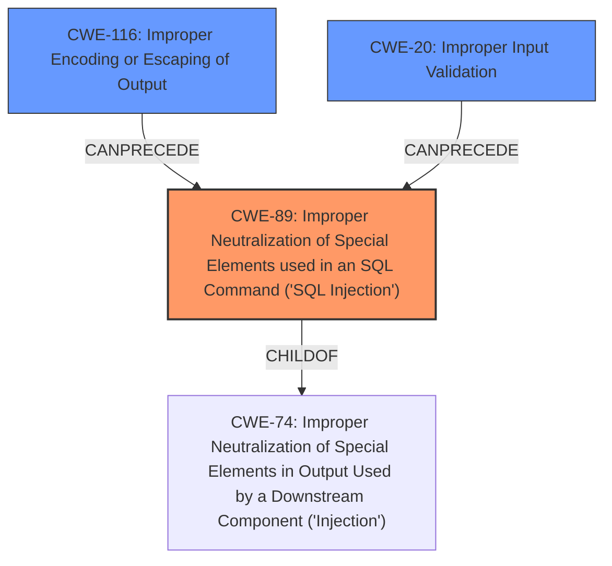

# Enhanced Analysis for CVE-2024-10628

# Summary
| CWE ID | CWE Name | Confidence | CWE Abstraction Level | CWE Vulnerability Mapping Label | CWE-Vulnerability Mapping Notes |
|---|---|---|---|---|---|
| **CWE-89** | **Improper Neutralization of Special Elements used in an SQL Command ('SQL Injection')** | 1.0 | Base | Primary | Allowed |
| CWE-116 | Improper Encoding or Escaping of Output | 0.7 | Class | Secondary | Allowed-with-Review |
| CWE-20 | Improper Input Validation | 0.6 | Class | Secondary | Discouraged |

## Evidence and Confidence

*   **Confidence Score:** 0.9
*   **Evidence Strength:** HIGH

## Relationship Analysis
The primary weakness is **CWE-89** [Improper Neutralization of Special Elements used in an SQL Command ('SQL Injection')], which stems from **insufficient escaping** and **lack of sufficient preparation** in the SQL query. This is further supported by the high scores and frequency of **CWE-89** [Improper Neutralization of Special Elements used in an SQL Command ('SQL Injection')] in the keyphrase analysis. **CWE-116** [Improper Encoding or Escaping of Output] and **CWE-20** [Improper Input Validation] are considered secondary because they represent more general weaknesses that contribute to the root cause. **CWE-89** [Improper Neutralization of Special Elements used in an SQL Command ('SQL Injection')] is a child of **CWE-74** [Improper Neutralization of Special Elements in Output Used by a Downstream Component ('Injection')], but **CWE-89** [Improper Neutralization of Special Elements used in an SQL Command ('SQL Injection')] is more specific and therefore more appropriate.



## Vulnerability Chain
The vulnerability chain starts with **insufficient escaping** and **lack of sufficient preparation** in the SQL query (leading to **CWE-89** [Improper Neutralization of Special Elements used in an SQL Command ('SQL Injection')]). This allows unauthenticated attackers to inject SQL queries, which can then be used to **extract sensitive information from the database**.

## Summary of Analysis
The primary CWE is **CWE-89** [Improper Neutralization of Special Elements used in an SQL Command ('SQL Injection')] due to the **insufficient escaping** and **lack of sufficient preparation** on the existing SQL query. The evidence is strong as the vulnerability description explicitly mentions "SQL Injection" and the root cause analysis identifies the **lack of escaping** and **preparation** as the underlying issue. While other CWEs like **CWE-116** [Improper Encoding or Escaping of Output] and **CWE-20** [Improper Input Validation] are related, **CWE-89** [Improper Neutralization of Special Elements used in an SQL Command ('SQL Injection')] is the most precise classification for this vulnerability, especially considering the high scores in the keyphrase analysis.

**CWE-78** [Improper Neutralization of Special Elements used in an OS Command ('OS Command Injection')], **CWE-79** [Improper Neutralization of Input During Web Page Generation ('Cross-site Scripting')], and **CWE-90** [Improper Neutralization of Special Elements used in an LDAP Query ('LDAP Injection')] were considered but not selected because the vulnerability specifically involves SQL injection, not OS command injection, XSS, or LDAP injection. **CWE-20** [Improper Input Validation] and **CWE-116** [Improper Encoding or Escaping of Output] are too general. **CWE-89** [Improper Neutralization of Special Elements used in an SQL Command ('SQL Injection')] provides the right level of specificity.


## CWE Relationship Analysis

Current CWEs represent these abstraction levels: .


### Vulnerability Chain Analysis

**Chain starting from CWE-90:**
- 90 (Improper Neutralization of Special Elements used in an LDAP Query ('LDAP Injection')) - ROOT


**Chain starting from CWE-89:**
- 89 (Improper Neutralization of Special Elements used in an SQL Command ('SQL Injection')) - ROOT


### CWE Relationship Diagram

```mermaid
graph TD
    classDef primary fill:#f96,stroke:#333,stroke-width:2px
    classDef secondary fill:#69f,stroke:#333
    classDef tertiary fill:#9e9,stroke:#333
```