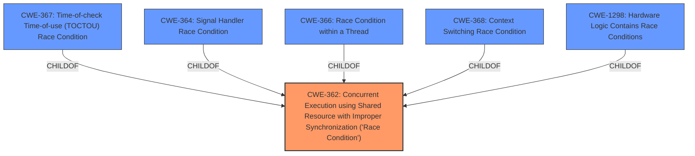

# Enhanced Analysis for CVE-2024-10630

# Summary
| CWE ID | CWE Name | Confidence | CWE Abstraction Level | CWE Vulnerability Mapping Label | CWE-Vulnerability Mapping Notes |
|---|---|---|---|---|---|
| CWE-362 | Concurrent Execution using Shared Resource with Improper Synchronization ('**Race Condition**') | 0.8 | Class | Primary | Allowed-with-Review |

## Evidence and Confidence

*   **Confidence Score:** 0.8
*   **Evidence Strength:** LOW

## Relationship Analysis
The primary CWE is CWE-362, a Class-level CWE, indicating a general **race condition** due to improper synchronization. Several potential child CWEs exist, such as CWE-367, CWE-364, CWE-366, CWE-368, and CWE-1298, which represent more specific types of race conditions. However, the provided information lacks the detail required to select a more specific Base-level CWE.



## Vulnerability Chain
The vulnerability chain starts with a **race condition** (CWE-362) due to concurrent execution and improper synchronization. This leads to the ability for a local authenticated attacker to bypass the application blocking functionality. The description only highlights the initial weakness and the final impact, without specifying the intermediate steps.

## Summary of Analysis
The vulnerability description indicates a **race condition** that allows bypassing application blocking. The primary evidence is the phrase "**race condition**" in the description. The best match from the retriever results is CWE-362 (Concurrent Execution using Shared Resource with Improper Synchronization ('**Race Condition**')), which is a Class-level CWE. While more specific CWEs exist for different types of race conditions (e.g., CWE-367, CWE-364), the provided information doesn't contain enough details to determine the specific type of **race condition**. Therefore, CWE-362 is the most appropriate choice. The confidence is relatively high (0.8) because the description explicitly mentions "**race condition**", but the evidence strength is low because the reference links content summary is unrelated.

CWEs considered but not used:

*   CWE-367 (Time-of-check Time-of-use (TOCTOU) **Race Condition**): Considered, but there's no specific evidence to suggest a TOCTOU vulnerability.
*   CWE-364 (Signal Handler **Race Condition**): Considered, but no evidence of signal handlers being involved.
*   CWE-366 (**Race Condition** within a Thread): Considered, but the description doesn't specify whether the **race condition** occurs within a thread.
*   CWE-368 (Context Switching **Race Condition**): Considered, but there is no context switching.
*   CWE-421 (**Race Condition** During Access to Alternate Channel): Considered, but there is no alternate channel.
*   CWE-662 (Improper Synchronization): Considered, but CWE-362 is more specific, covering concurrent execution with improper synchronization.
*   CWE-667 (Improper Locking): Considered, but the description doesn't specifically point to a locking issue, only a general **race condition**.
*   CWE-1298 (Hardware Logic Contains **Race Conditions**): Considered, but this vulnerability is in software, not hardware logic.


## CWE Relationship Analysis

Current CWEs represent these abstraction levels: .


### Vulnerability Chain Analysis

**Chain starting from CWE-662:**
- 662 (Improper Synchronization) - ROOT


**Chain starting from CWE-368:**
- 368 (Context Switching Race Condition) - ROOT


### CWE Relationship Diagram

```mermaid
graph TD
    classDef primary fill:#f96,stroke:#333,stroke-width:2px
    classDef secondary fill:#69f,stroke:#333
    classDef tertiary fill:#9e9,stroke:#333
```