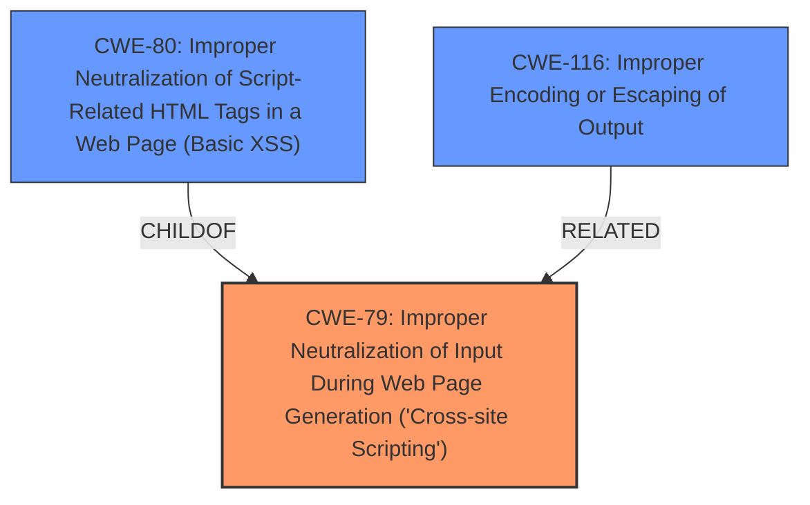

# Analysis Report for CVE-2024-10631

# Vulnerability Analysis Report: CVE-2024-10631

## Description

The Countdown Timer for WordPress Block Editor WordPress plugin through 1.0.5 **does not validate and escape some of its block options** before outputting them back in a page/post where the block is embed, which could allow users with the contributor role and above to perform Stored **Cross-Site Scripting attacks**.

## Vulnerability Description Key Phrases

- **Rootcause:** does not validate and escape some of its block options
- **Weakness:** Cross-Site Scripting attacks
- **Impact:** Stored Cross-Site Scripting attacks
- **Attacker:** users with the contributor role and above
- **Product:** Countdown Timer for WordPress Block Editor WordPress plugin
- **Version:** through 1.0.5

## Analysis (with Relationship Data)

# Summary

| CWE ID | CWE Name | Confidence | CWE Abstraction Level | CWE Vulnerability Mapping Label | CWE-Vulnerability Mapping Notes |
|---|---|---|---|---|---|
| CWE-79 | Improper Neutralization of Input During Web Page Generation ('Cross-site Scripting') | 1.0 | Base | Allowed | Primary CWE. The plugin **does not validate and escape some of its block options** before outputting them, leading to XSS. |

## Evidence and Confidence

*   **Confidence Score:** 1.0
*   **Evidence Strength:** HIGH

## Relationship Analysis

The primary relationship influencing the decision is that CWE-79 is a base-level weakness directly addressing the **improper neutralization of input**, leading to XSS. There are no child CWEs that provide a more specific classification for this particular vulnerability based on the provided information. CWE-79's relationships with other CWEs, such as those related to encoding and escaping (CWE-116), are relevant but do not change the primary classification.



## Vulnerability Chain

The vulnerability chain starts with the **improper validation and escaping of block options**. This leads directly to the injection of malicious scripts into the web page, resulting in a Stored **Cross-Site Scripting vulnerability**.

Improper Input Handling (CWE-79) -> Stored XSS

## Summary of Analysis

The analysis is primarily based on the vulnerability description, which clearly states that the plugin **does not validate and escape some of its block options**. This directly corresponds to the definition of CWE-79, "Improper Neutralization of Input During Web Page Generation ('Cross-site Scripting')".

The CVE Reference Links Content Summary reinforces this, stating: "The plugin **does not validate and escape some of its block options** before outputting them back in a page/post where the block is embedded."

The retriever results also list CWE-79 as a relevant CWE.

CWE-79 is at the optimal level of specificity, as it directly describes the root cause. While CWE-116 (Improper Encoding or Escaping of Output) is related, CWE-79 is more precise because it encompasses the broader issue of improper neutralization, which includes both encoding/escaping and other forms of input validation.

Relevant CWE Information:

# Enhanced Context (25 CWEs)
The following CWEs were identified as potentially relevant to this vulnerability:

## CWE-352: Cross-Site Request Forgery (CSRF)
**Abstraction Level**: Compound
**Similarity Score**: 0.77
**Source**: dense

**Description**:
The web application does not, or can not, sufficiently verify whether a well-formed, valid, consistent request was intentionally provided by the user who submitted the request.

**Mapping Guidance**:
- Usage: Allowed
- Rationale: This is a well-known Composite of multiple weaknesses that must all occur simultaneously, although it is attack-oriented in nature.

*Not Used:* CSRF is not applicable here because the vulnerability is related to the **lack of proper input validation and escaping**, not the verification of request origins.

## CWE-425: Direct Request ('Forced Browsing')
**Abstraction Level**: Base
**Similarity Score**: 0.72
**Source**: dense

**Description**:
The web application does not adequately enforce appropriate authorization on all restricted URLs, scripts, or files.

**Mapping Guidance**:
- Usage: Allowed
- Rationale: This CWE entry is at the Base level of abstraction, which is a preferred level of abstraction for mapping to the root causes of vulnerabilities.

*Not Used:* This CWE is related to authorization issues, but the vulnerability is caused by **improper input handling**.

## CWE-208: Observable Timing Discrepancy
**Abstraction Level**: Base
**Similarity Score**: 0.72
**Source**: dense

**Description**:
Two separate operations in a product require different amounts of time to complete, in a way that is observable to an actor and reveals security-relevant information about the state of the product, such as whether a particular operation was successful or not.

**Mapping Guidance**:
- Usage: Allowed
- Rationale: This CWE entry is at the Base level of abstraction, which is a preferred level of abstraction for mapping to the root causes of vulnerabilities.

*Not Used:* Timing discrepancies are not relevant to this vulnerability.

## CWE-116: Improper Encoding or Escaping of Output
**Abstraction Level**: Class
**Similarity Score**: 0.72
**Source**: dense

**Description**:
The product prepares a structured message for communication with another component, but encoding or escaping of the data is either missing or done incorrectly. As a result, the intended structure of the message is not preserved.

**Mapping Guidance**:
- Usage: Allowed-with-Review
- Rationale: This CWE entry is a Class and might have Base-level children that would be more appropriate

*Not Used:* While encoding/escaping is part of the solution to prevent XSS, the **root cause is the lack of proper neutralization** of input, which is best described by CWE-79.

## CWE-472: External Control of Assumed-Immutable Web Parameter
**Abstraction Level**: Base
**Similarity Score**: 0.72
**Source**: dense

**Description**:
The web application does not sufficiently verify inputs that are assumed to be immutable but are actually externally controllable, such as hidden form fields.

**Mapping Guidance**:
- Usage: Allowed
- Rationale: This CWE entry is at the Base level of abstraction, which is a preferred level of abstraction for mapping to the root causes of vulnerabilities.

*Not Used:* This vulnerability doesn't involve assumed-immutable parameters.

## CWE-434: Unrestricted Upload of File with Dangerous Type
**Abstraction Level**: Base
**Similarity Score**: 0.71
**Source**: dense

**Description**:
The product allows the upload or transfer of dangerous file types that are automatically processed within its environment.

**Mapping Guidance**:
- Usage: Allowed
- Rationale: This CWE entry is at the Base level of abstraction, which is a preferred level of abstraction for mapping to the root causes of vulnerabilities.

*Not Used:* File uploads are not involved in this vulnerability.

## CWE-80: Improper Neutralization of Script-Related HTML Tags in a Web Page (Basic XSS)
**Abstraction Level**: Variant
**Similarity Score**: 0.71
**Source**: dense

**Description**:
The product receives input from an upstream component, but it does not neutralize or incorrectly neutralizes special characters such as "<", ">", and "&" that could be interpreted as web-scripting elements when they are sent to a downstream component that processes web pages.

**Mapping Guidance**:
- Usage: Allowed
- Rationale: This CWE entry is at the Variant level of abstraction, which is a preferred level of abstraction for mapping to the root causes of vulnerabilities.

*Not Used:* While closely related to CWE-79, CWE-80 is a variant focusing on HTML tags, and CWE-79 is the more general and appropriate base class.

## CWE-79: Improper Neutralization of Input During Web Page Generation ('Cross-site Scripting')
**Abstraction Level**: Base
**Similarity Score**: 0.71
**Source**: dense

**Description**:
The product does not neutralize or incorrectly neutralizes user-controllable input before it is placed in output that is used as a web page that is served to other users.

**Mapping Guidance**:
- Usage: Allowed
- Rationale: This CWE entry is at the Base level of abstraction, which is a preferred level of abstraction for mapping to the root causes of vulnerabilities.

*USED:* The vulnerability is directly caused by the **lack of input neutralization**, leading to XSS.

## CWE-184: Incomplete List of Disallowed Inputs
**Abstraction Level**: Base
**Similarity Score**: 0.70
**Source**: dense

**Description**:
The product implements a protection mechanism that relies on a list of inputs (or properties of inputs) that are not allowed by policy or otherwise require other action to neutralize before additional processing takes place, but the list is incomplete.

**Mapping Guidance**:
- Usage: Allowed
- Rationale: This CWE entry is at the Base level of abstraction, which is a preferred level of abstraction for mapping to the root causes of vulnerabilities.

*Not Used:* The vulnerability is due to a complete **lack of validation and escaping**, not an incomplete list.

## CWE-96: Improper Neutralization of Directives in Statically Saved Code ('Static Code Injection')
**Abstraction


## CWE Relationship Analysis

Current CWEs represent these abstraction levels: .


### Vulnerability Chain Analysis

**Chain starting from CWE-116:**
- 116 (Improper Encoding or Escaping of Output) - ROOT


**Chain starting from CWE-80:**
- 80 (Improper Neutralization of Script-Related HTML Tags in a Web Page (Basic XSS)) - ROOT


### CWE Relationship Diagram

```mermaid
graph TD
    classDef primary fill:#f96,stroke:#333,stroke-width:2px
    classDef secondary fill:#69f,stroke:#333
    classDef tertiary fill:#9e9,stroke:#333
```


*Report generated on 2025-07-13 00:18:25*
