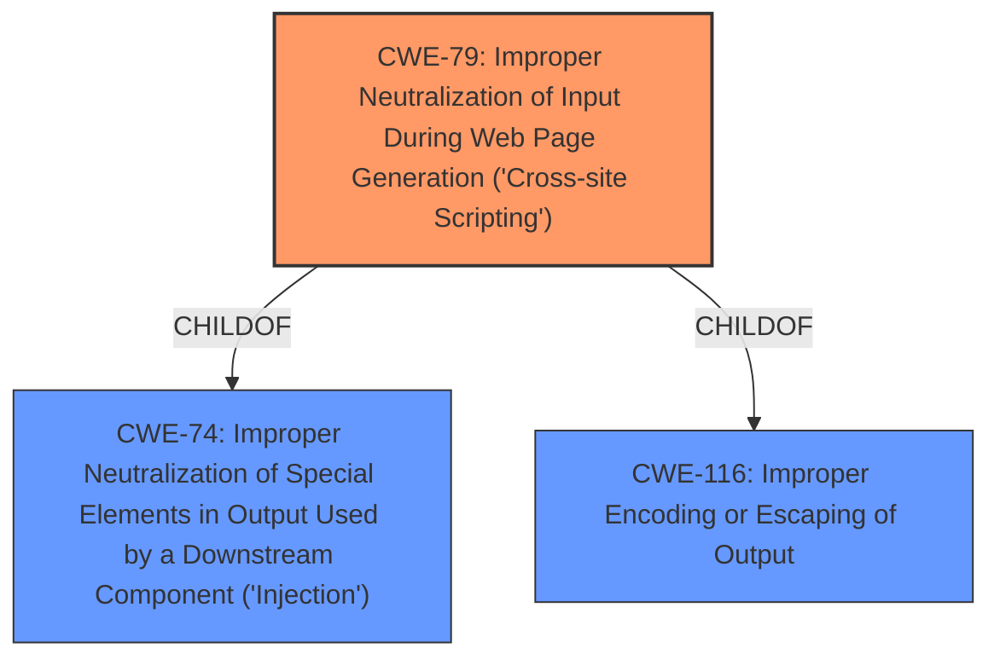

# Analysis for CVE-2024-10632

# Summary
| CWE ID | CWE Name | Confidence | CWE Abstraction Level | CWE Vulnerability Mapping Label | CWE-Vulnerability Mapping Notes |
|---|---|---|---|---|---|
| CWE-79 | Improper Neutralization of Input During Web Page Generation ('Cross-site Scripting') | 1.0 | Base | Allowed | Primary CWE. The plugin **does not sanitize and escape some of its settings**, leading to XSS. |

## Evidence and Confidence

*   **Confidence Score:** 1.0
*   **Evidence Strength:** HIGH

## Relationship Analysis
The primary CWE is CWE-79, which is a Base level CWE and therefore specific. There are several parent CWEs of CWE-79, such as CWE-116 (Improper Encoding or Escaping of Output) and CWE-74 (Improper Neutralization of Special Elements in Output Used by a Downstream Component ('Injection')). However, CWE-79 is the most specific and accurate representation of the vulnerability.

## Vulnerability Chain
The vulnerability chain starts with the **failure to sanitize and escape settings**, leading to the injection of malicious code into the web page, which then executes in the context of other users.
  - The root cause is the **improper neutralization of input**, specifically CWE-79.
  - The impact is the execution of Stored Cross-Site Scripting attacks.

## Summary of Analysis
The vulnerability is a Stored Cross-Site Scripting (XSS) vulnerability in the Nokaut Offers Box WordPress plugin. The plugin **does not sanitize and escape some of its settings**, which allows high-privilege users to inject malicious code into the settings, leading to the execution of the code in the context of other users.

The primary CWE is CWE-79, which is the most specific and accurate representation of the vulnerability. The retriever results also list CWE-79 as a potential candidate, further supporting this decision.

The evidence for this assessment is the vulnerability description, which states that the plugin **does not sanitize and escape some of its settings**.

The graph relationships influenced the final selection by showing the parent-child relationships between CWE-79 and other CWEs. This helped to ensure that the most specific and accurate CWE was selected.

CWE-79 is at the optimal level of specificity because it is a Base level CWE and accurately represents the weakness described in the vulnerability description.

Relevant CWE Information:
* CWE-79: Improper Neutralization of Input During Web Page Generation ('Cross-site Scripting') - The product **does not neutralize or incorrectly neutralizes user-controllable input** before it is placed in output that is used as a web page that is served to other users. This matches the vulnerability description, which states that the plugin **does not sanitize and escape some of its settings**.

Other CWEs Considered:
* CWE-352: Cross-Site Request Forgery (CSRF) - This CWE was considered because it is a common web application vulnerability. However, it was not selected because the vulnerability description does not mention CSRF.
* CWE-116: Improper Encoding or Escaping of Output - This CWE was considered because it is a parent of CWE-79. However, CWE-79 is more specific and accurately represents the vulnerability.
* CWE-434: Unrestricted Upload of File with Dangerous Type - This CWE was considered because it is a common web application vulnerability. However, it was not selected because the vulnerability description does not mention file uploads.
* CWE-862: Missing Authorization - This CWE was considered because the vulnerability description mentions high-privilege users. However, the vulnerability is not related to missing authorization. It is related to improper neutralization of input.