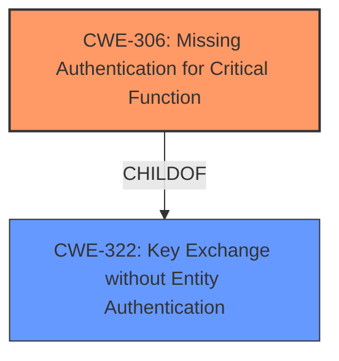

# Analysis Report for CVE-2024-10654

# Vulnerability Analysis Report: CVE-2024-10654

## Description

A vulnerability has been found in TOTOLINK LR350 up to 9.3.5u.6369 and classified as critical. Affected by this vulnerability is an unknown functionality of the file /formLoginAuth.htm. The manipulation of the argument authCode with the input 1 leads to authorization bypass. The attack can be launched remotely. The exploit has been disclosed to the public and may be used.

## Vulnerability Description Key Phrases

- **Impact:** authorization bypass
- **Vector:** manipulation of authCode argument with input 1
- **Product:** TOTOLINK LR350
- **Version:** up to 9.3.5u.6369
- **Component:** /formLoginAuth.htm

## Analysis (with Relationship Data)

# Summary
| CWE ID | CWE Name | Confidence | CWE Abstraction Level | CWE Vulnerability Mapping Label | CWE-Vulnerability Mapping Notes |
|---|---|---|---|---|---|
| CWE-306 | Missing Authentication for Critical Function | 1.0 | Base | Primary CWE | Allowed |

## Evidence and Confidence

*   **Confidence Score:** 1.0
*   **Evidence Strength:** HIGH

## Relationship Analysis
The primary CWE is CWE-306 (Missing Authentication for Critical Function). There is a parent relationship from CWE-306 to CWE-322 (Key Exchange without Entity Authentication), however, the description focuses on the missing authentication, not the key exchange.



## Vulnerability Chain
The vulnerability chain starts with the **missing authentication** (CWE-306), which leads to the **authorization bypass**.

## Summary of Analysis
The analysis indicates a **missing authentication** issue in the TOTOLINK LR350 router's `/formLoginAuth.htm` file. The **manipulation** of the `authCode` argument leads to an **authorization bypass**, allowing unauthorized access.

The primary CWE is CWE-306 (Missing Authentication for Critical Function), as it directly addresses the **root cause** of the vulnerability. The system **does not perform any authentication** for a critical function, enabling the bypass.

The retriever results also listed CWE-306 as a top candidate. The vulnerability description clearly states an authorization bypass due to the ability to **manipulate** the `authCode` argument **without proper authentication**. This aligns perfectly with CWE-306.

The evidence is strong, and the selected CWE is at the optimal level of specificity (Base).

Relevant CWE Information:

# Enhanced Context (25 CWEs)
The following CWEs were identified as potentially relevant to this vulnerability:

## CWE-472: External Control of Assumed-Immutable Web Parameter
**Abstraction Level**: Base
**Similarity Score**: 0.77
**Source**: dense

**Description**:
The web application does not sufficiently verify inputs that are assumed to be immutable but are actually externally controllable, such as hidden form fields.

**Mapping Guidance**:
- Usage: Allowed
- Rationale: This CWE entry is at the Base level of abstraction, which is a preferred level of abstraction for mapping to the root causes of vulnerabilities.

*Not Used*: This CWE focuses on the lack of verification of parameters that are assumed to be immutable. While the `authCode` parameter is being manipulated, the core issue is the lack of authentication, making CWE-306 a better fit.

## CWE-425: Direct Request ('Forced Browsing')
**Abstraction Level**: Base
**Similarity Score**: 0.77
**Source**: dense

**Description**:
The web application does not adequately enforce appropriate authorization on all restricted URLs, scripts, or files.

**Mapping Guidance**:
- Usage: Allowed
- Rationale: This CWE entry is at the Base level of abstraction, which is a preferred level of abstraction for mapping to the root causes of vulnerabilities.

*Not Used*: This CWE is about the lack of authorization checks on restricted URLs. While the vulnerability does lead to an authorization bypass, the root cause is the missing authentication, making CWE-306 the better choice.

## CWE-41: Improper Resolution of Path Equivalence
**Abstraction Level**: Base
**Similarity Score**: 0.77
**Source**: dense

**Description**:
The product is vulnerable to file system contents disclosure through path equivalence. Path equivalence involves the use of special characters in file and directory names. The associated manipulations are intended to generate multiple names for the same object.

**Mapping Guidance**:
- Usage: Allowed
- Rationale: This CWE entry is at the Base level of abstraction, which is a preferred level of abstraction for mapping to the root causes of vulnerabilities.

*Not Used*: This CWE is not relevant as the vulnerability does not involve path equivalence or file system disclosure.

## CWE-74: Improper Neutralization of Special Elements in Output Used by a Downstream Component ('Injection')
**Abstraction Level**: Class
**Similarity Score**: 0.76
**Source**: dense

**Description**:
The product constructs all or part of a command, data structure, or record using externally-influenced input from an upstream component, but it does not neutralize or incorrectly neutralizes special elements that could modify how it is parsed or interpreted when it is sent to a downstream component.

**Mapping Guidance**:
- Usage: Discouraged
- Rationale: CWE-74 is high-level and often misused when lower-level weaknesses are more appropriate.

*Not Used*: This CWE is about injection vulnerabilities, which are not present in this scenario. The vulnerability focuses on the missing authentication.

## CWE-923: Improper Restriction of Communication Channel to Intended Endpoints
**Abstraction Level**: Class
**Similarity Score**: 0.76
**Source**: dense

**Description**:
The product establishes a communication channel to (or from) an endpoint for privileged or protected operations, but it does not properly ensure that it is communicating with the correct endpoint.

**Mapping Guidance**:
- Usage: Allowed-with-Review
- Rationale: This CWE entry is a Class and might have Base-level children that would be more appropriate

*Not Used*: This CWE is not relevant as the vulnerability does not involve communication channel restrictions.

## CWE-345: Insufficient Verification of Data Authenticity
**Abstraction Level**: Class
**Similarity Score**: 0.76
**Source**: dense

**Description**:
The product does not sufficiently verify the origin or authenticity of data, in a way that causes it to accept invalid data.

**Mapping Guidance**:
- Usage: Discouraged
- Rationale: This CWE entry is a level-1 Class (i.e., a child of a Pillar). It might have lower-level children that would be more appropriate

*Not Used*: While data authenticity is related, the core issue is the missing authentication, making CWE-306 more appropriate.

## CWE-303: Incorrect Implementation of Authentication Algorithm
**Abstraction Level**: Base
**Similarity Score**: 0.76
**Source**: dense

**Description**:
The requirements for the product dictate the use of an established authentication algorithm, but the implementation of the algorithm is incorrect.

**Mapping Guidance**:
- Usage: Allowed
- Rationale: This CWE entry is at the Base level of abstraction, which is a preferred level of abstraction for mapping to the root causes of vulnerabilities.

*Not Used*: This CWE does not apply because the vulnerability is not related to an incorrect authentication algorithm, but rather to a completely missing authentication step.

## CWE-1391: Use of Weak Credentials
**Abstraction Level**: Class
**Similarity Score**: 0.76
**Source**: dense

**Description**:
The product uses weak credentials (such as a default key or hard-coded password) that can be calculated, derived, reused, or guessed by an attacker.

**Mapping Guidance**:
- Usage: Allowed-with-Review
- Rationale: This CWE entry is a Class and might have Base-level children that would be more appropriate

*Not Used*: This CWE is not applicable since the vulnerability is not about weak credentials but about bypassing authentication entirely.

## CWE-807: Reliance on Untrusted Inputs in a Security Decision
**Abstraction Level**: Base
**Similarity Score**: 0.75
**Source**: dense

**Description**:
The product uses a protection mechanism that relies on the existence or values of an input, but the input can be modified by an untrusted actor in a way that bypasses the protection mechanism.

**Mapping Guidance**:
- Usage: Allowed
- Rationale: This CWE entry is at the Base level of abstraction, which is a preferred level of abstraction for mapping to the root causes of vulnerabilities.

*Not Used*: This CWE could be considered, but the root cause is the lack of initial authentication, which allows the untrusted input to be used in a security decision. Therefore, CWE-306 is the more direct cause.

## CWE-23: Relative Path Traversal
**Abstraction Level**: Base
**Similarity Score**: 0.75
**Source**: dense

**Description**:
The product uses external input to construct a pathname that should be within a restricted directory, but it does not properly neutralize sequences such as ".." that can resolve to a location that is outside of that directory.

*Not Used*: This CWE is not relevant since the vulnerability doesn't involve path traversal issues.

## CWE-306: Missing Authentication for Critical Function
**Abstraction Level**: Base
**Similarity Score**: 1903.53
**Source**: sparse

**Description**:
The product does not perform any authentication for functionality that requires a provable user identity or consumes a significant amount of resources.

**Mapping Guidance**:


## CWE Relationship Analysis

Current CWEs represent these abstraction levels: .


### Vulnerability Chain Analysis

**Chain starting from CWE-345:**
- 345 (Insufficient Verification of Data Authenticity) - ROOT


**Chain starting from CWE-306:**
- 306 (Missing Authentication for Critical Function) - ROOT


### CWE Relationship Diagram

```mermaid
graph TD
    classDef primary fill:#f96,stroke:#333,stroke-width:2px
    classDef secondary fill:#69f,stroke:#333
    classDef tertiary fill:#9e9,stroke:#333
```


*Report generated on 2025-07-13 00:20:52*
