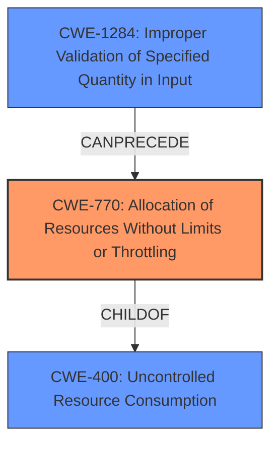

# Enhanced Analysis for CVE-2024-10714

# Summary
| CWE ID | CWE Name | Confidence | CWE Abstraction Level | CWE Vulnerability Mapping Label | CWE-Vulnerability Mapping Notes |
|---|---|---|---|---|---|
| CWE-770 | Allocation of Resources Without Limits or Throttling | 0.8 | Base | Allowed | Primary CWE |
| CWE-400 | Uncontrolled Resource Consumption | 0.6 | Class | Discouraged | Secondary Candidate |
| CWE-1284 | Improper Validation of Specified Quantity in Input | 0.5 | Base | Allowed | Secondary Candidate |

## Evidence and Confidence

*   **Confidence Score:** 0.7
*   **Evidence Strength:** MEDIUM

## Relationship Analysis
The primary CWE is CWE-770, which is a base-level CWE. CWE-400 is a class-level CWE and a parent of CWE-770, representing a broader category of resource consumption issues. CWE-1284 represents the **improper validation** of the input that leads to the excessive resource allocation, and it can precede CWE-770.



## Vulnerability Chain
The vulnerability chain starts with the attacker providing excessive characters in the multipart boundary. The **lack of limits or throttling** (CWE-770) on resource allocation during the processing of this boundary leads to **uncontrolled resource consumption** (CWE-400), ultimately resulting in a Denial of Service (DoS). **Improper input validation** (CWE-1284) is a prerequisite to CWE-770 because the excessive characters should have been validated.

## Summary of Analysis
The vulnerability involves a Denial of Service caused by adding excessive characters to a multipart boundary during file upload. The server continuously processes each character, displaying warnings and rendering the application inaccessible.

The primary weakness is the **allocation of resources without limits or throttling (CWE-770)**. The description clearly states that the server continues processing each character without any restrictions, which aligns perfectly with the definition of CWE-770. The "Retriever Results" also lists CWE-770 as one of the Top Combined Results.

CWE-400 (Uncontrolled Resource Consumption) is a related weakness, as the **unlimited allocation** directly leads to uncontrolled consumption of server resources. However, CWE-770 is more specific to the root cause.

CWE-1284 (Improper Validation of Specified Quantity in Input) is another potential candidate, as the vulnerability involves adding excessive characters to the multipart boundary. The input quantity (number of characters) is not properly validated, leading to the issue. This is a prerequisite to CWE-770.

I am selecting CWE-770 as the primary CWE because it directly addresses the root cause: **the lack of limits on resource allocation**. CWE-400 describes the impact, and CWE-1284 is a related weakness, but CWE-770 best captures the fundamental flaw.

The evidence for CWE-770 is from the "Vulnerability Description": "This results in the server continuously processing each character and displaying warnings, rendering the application inaccessible." This clearly indicates that the server is allocating resources (processing time) without any limits.


## CWE Relationship Analysis

Current CWEs represent these abstraction levels: .


### Vulnerability Chain Analysis

**Chain starting from CWE-1284:**
- 1284 (Improper Validation of Specified Quantity in Input) - ROOT


**Chain starting from CWE-400:**
- 400 (Uncontrolled Resource Consumption) - ROOT


### CWE Relationship Diagram

```mermaid
graph TD
    classDef primary fill:#f96,stroke:#333,stroke-width:2px
    classDef secondary fill:#69f,stroke:#333
    classDef tertiary fill:#9e9,stroke:#333
```