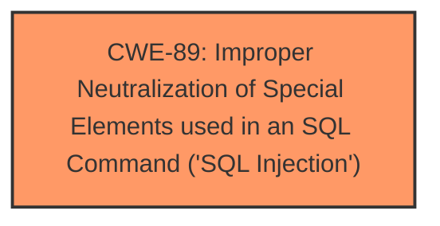

# Analysis Report for CVE-2024-10752

# Vulnerability Analysis Report: CVE-2024-10752

## Description

A vulnerability was found in Codezips Pet Shop Management System 1.0. It has been classified as critical. This affects an unknown part of the file /productsadd.php. The manipulation of the argument id/name leads to **sql injection**. It is possible to initiate the attack remotely. The exploit has been disclosed to the public and may be used. The initial researcher advisory mentions contradicting file names to be affected.

## Vulnerability Description Key Phrases

- **Weakness:** sql injection
- **Product:** Codezips Pet Shop Management System
- **Version:** 1
- **Component:** /productsadd.php

## Analysis (with Relationship Data)

# Summary
| CWE ID | CWE Name | Confidence | CWE Abstraction Level | CWE Vulnerability Mapping Label | CWE-Vulnerability Mapping Notes |
|---|---|---|---|---|---|
| CWE-89 | Improper Neutralization of Special Elements used in an SQL Command ('SQL Injection') | 1.0 | Base | Allowed | Primary CWE |

## Evidence and Confidence

*   **Confidence Score:** 1.0
*   **Evidence Strength:** HIGH

## Relationship Analysis
The primary relationship that influenced the decision was the direct match of the vulnerability description to **CWE-89** Improper Neutralization of Special Elements used in an SQL Command ('SQL Injection'). This CWE represents the root cause of the vulnerability. The Retriever Results also gave **CWE-89** the highest score and it is listed as "Allowed" for usage.



## Vulnerability Chain
The vulnerability chain starts with the **improper neutralization of special elements used in an SQL command** (**CWE-89**). The lack of proper input sanitization allows an attacker to inject malicious SQL code, leading to unauthorized database access, data leakage, data tampering, system compromise, and service interruption.

## Summary of Analysis
The analysis strongly supports the classification of this vulnerability as **CWE-89** Improper Neutralization of Special Elements used in an SQL Command ('SQL Injection'). The vulnerability description clearly states that the **manipulation of the argument id/name leads to sql injection**, and the CVE reference confirms that the root cause is due to the application directly using the "id" parameter in SQL queries without proper sanitization or validation. This aligns perfectly with the definition of **CWE-89**.

The Retriever Results also listed **CWE-89** as the top candidate with a score of 1.0. The suggested mitigations in the CVE reference, such as using prepared statements and input validation, are also directly relevant to preventing **CWE-89**.

The decision to map this vulnerability to **CWE-89** is based on the clear evidence of SQL injection, the high confidence score from the Retriever Results, and the alignment of the suggested mitigations with the characteristics of **CWE-89**. Other CWEs like **CWE-79** (Cross-site Scripting) and **CWE-434** (Unrestricted Upload of File with Dangerous Type) were considered but ultimately deemed less relevant as the primary issue is the SQL injection vulnerability and not related to web page generation or file uploads.

Relevant CWE Information:
*   **CWE-89**: Improper Neutralization of Special Elements used in an SQL Command ('SQL Injection')
    *   The product constructs all or part of an SQL command using externally-influenced input from an upstream component, but it does not neutralize or incorrectly neutralizes special elements that could modify the intended SQL command when it is sent to a downstream component.
    *   This aligns with the vulnerability where the "id" parameter is directly used in SQL queries without proper sanitization.


## CWE Relationship Analysis

Current CWEs represent these abstraction levels: .


### Vulnerability Chain Analysis

**Chain starting from CWE-89:**
- 89 (Improper Neutralization of Special Elements used in an SQL Command ('SQL Injection')) - ROOT


**Chain starting from CWE-79:**
- 79 (Improper Neutralization of Input During Web Page Generation ('Cross-site Scripting')) - ROOT


### CWE Relationship Diagram

```mermaid
graph TD
    classDef primary fill:#f96,stroke:#333,stroke-width:2px
    classDef secondary fill:#69f,stroke:#333
    classDef tertiary fill:#9e9,stroke:#333
```


*Report generated on 2025-07-13 00:24:00*
