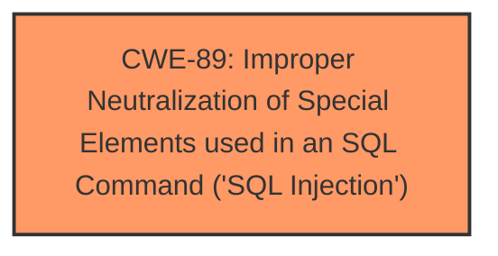

# Raw Analyzer Response for CVE-2024-10791

# Summary
| CWE ID | CWE Name | Confidence | CWE Abstraction Level | CWE Vulnerability Mapping Label | CWE-Vulnerability Mapping Notes |
|---|---|---|---|---|---|
| CWE-89 | Improper Neutralization of Special Elements used in an SQL Command ('SQL Injection') | 1.0 | Base | Allowed | Primary CWE. The **root cause** is a SQL Injection vulnerability due to the lack of proper sanitization or validation of user-supplied input. |

## Evidence and Confidence

*   **Confidence Score:** 1.0
*   **Evidence Strength:** HIGH

## Relationship Analysis
The primary relationship that influenced the decision was the direct match of the vulnerability description to the CWE-89 description. The retriever results also strongly suggested CWE-89 as the primary candidate.

## Vulnerability Chain
The vulnerability chain starts with the **improper neutralization** of input, leading directly to SQL injection.

## Summary of Analysis
The analysis is based on the provided evidence, which clearly indicates a SQL injection vulnerability. The vulnerability description and CVE Reference Links Content Summary explicitly mention the lack of sanitization of user-supplied input leading to the ability to inject malicious SQL code. The retriever results also strongly support CWE-89 as the primary candidate. The final selection is based on a direct match of the vulnerability details to the CWE-89 description and the absence of any indication of other contributing factors.

Relevant CWE Information:

# Enhanced Context (25 CWEs)
The following CWEs were identified as potentially relevant to this vulnerability:

## CWE-89: Improper Neutralization of Special Elements used in an SQL Command ('SQL Injection')
**Abstraction Level**: Base
**Similarity Score**: 0.79
**Source**: dense

**Description**:
The product constructs all or part of an SQL command using externally-influenced input from an upstream component, but it does not neutralize or incorrectly neutralizes special elements that could modify the intended SQL command when it is sent to a downstream component. Without sufficient removal or quoting of SQL syntax in user-controllable inputs, the generated SQL query can cause those inputs to be interpreted as SQL instead of ordinary user data.

**Mapping Guidance**:
- Usage: Allowed
- Rationale: This CWE entry is at the Base level of abstraction, which is a preferred level of abstraction for mapping to the root causes of vulnerabilities.

## CWE-89: Improper Neutralization of Special Elements used in an SQL Command ('SQL Injection')
**Abstraction Level**: Base
**Similarity Score**: 1052.51
**Source**: sparse

**Description**:
The product constructs all or part of an SQL command using externally-influenced input from an upstream component, but it does not neutralize or incorrectly neutralizes special elements that could modify the intended SQL command when it is sent to a downstream component. Without sufficient removal or quoting of SQL syntax in user-controllable inputs, the generated SQL query can cause those inputs to be interpreted as SQL instead of ordinary user data.

**Mapping Guidance**:
- Usage: Allowed
- Rationale: This CWE entry is at the Base level of abstraction, which is a preferred level of abstraction for mapping to the root causes of vulnerabilities.

The vulnerability description states that the manipulation of the argument Name leads to **sql injection** in `/doctorAction.php`. The CVE Reference Links Content Summary confirms that the **root cause** is SQL injection due to the **lack of proper sanitization** of user-supplied input. This directly aligns with the description of CWE-89, "Improper Neutralization of Special Elements used in an SQL Command ('SQL Injection')". Therefore, CWE-89 is the most appropriate classification.

CWE-79 ("Improper Neutralization of Input During Web Page Generation ('Cross-site Scripting')") was considered because it appears in the Retriever Results, but it was rejected because the vulnerability is related to SQL injection, not cross-site scripting.

CWE-434 ("Unrestricted Upload of File with Dangerous Type") was also considered from the Retriever Results, but it was rejected because the vulnerability does not involve file uploads.

The other CWEs listed in the Retriever Results were not considered because they did not directly relate to the vulnerability description or CVE Reference Links Content Summary.