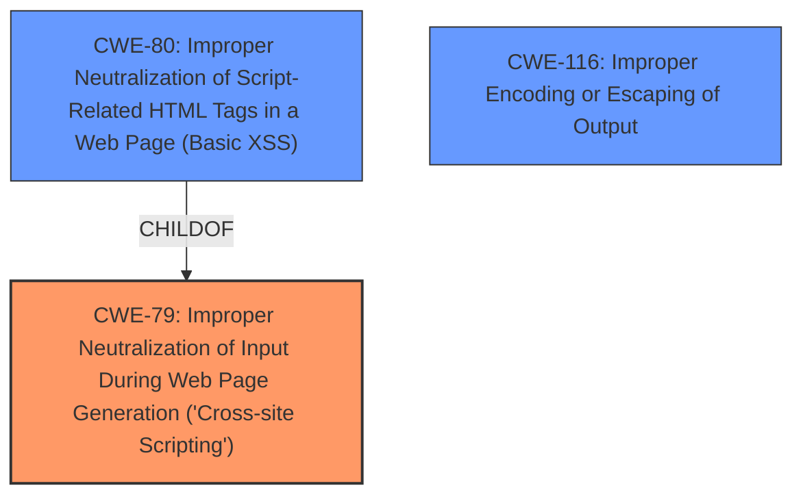

# Analysis Report for CVE-2024-10818

# Vulnerability Analysis Report: CVE-2024-10818

## Description

The JSFiddle Shortcode WordPress plugin before 1.1.3 **does not validate and escape some of its shortcode attributes** before outputting them back in a page/post where the shortcode is embed, which could allow users with the contributor role and above to perform Stored **Cross-Site Scripting** attacks.

## Vulnerability Description Key Phrases

- **Rootcause:** does not validate and escape some of its shortcode attributes
- **Weakness:** Cross-Site Scripting
- **Impact:** Stored Cross-Site Scripting attacks
- **Attacker:** users with the contributor role and above
- **Product:** JSFiddle Shortcode WordPress plugin
- **Version:** before 1.1.3

## Analysis (with Relationship Data)

# Summary

| CWE ID | CWE Name | Confidence | CWE Abstraction Level | CWE Vulnerability Mapping Label | CWE-Vulnerability Mapping Notes |
|---|---|---|---|---|---|
| CWE-79 | Improper Neutralization of Input During Web Page Generation ('Cross-site Scripting') | 1.0 | Base | Allowed | Primary CWE. The plugin **does not validate and escape some of its shortcode attributes** before outputting them back in a page/post, which leads to XSS. |
| CWE-80 | Improper Neutralization of Script-Related HTML Tags in a Web Page (Basic XSS) | 0.7 | Variant | Allowed | Secondary candidate. More specific than CWE-79, but the description doesn't explicitly state that script-related HTML tags are the only problem. |
| CWE-116 | Improper Encoding or Escaping of Output | 0.6 | Class | Allowed-with-Review | Secondary candidate. High retriever score, but it is a class-level CWE and less specific than CWE-79. |

## Evidence and Confidence

*   **Confidence Score:** 1.0
*   **Evidence Strength:** HIGH

## Relationship Analysis

The primary relationship influencing the selection is the parent-child relationship between CWE-79 (Base) and CWE-80 (Variant). CWE-80 is a more specific type of XSS that focuses on script-related HTML tags. However, the vulnerability description only says "**does not validate and escape some of its shortcode attributes**," so I selected CWE-79 (Base) as the Primary CWE, but I am noting that CWE-80 is a candidate. CWE-116 is a class-level CWE, making it less specific and less preferred than CWE-79 and CWE-80.



## Vulnerability Chain

The vulnerability chain starts with the **failure to validate and escape shortcode attributes** (CWE-Unknown), leading to **Improper Neutralization of Input During Web Page Generation** (CWE-79), which results in Stored Cross-Site Scripting attacks.

## Summary of Analysis

The primary CWE is CWE-79 because the plugin **does not validate and escape some of its shortcode attributes** before outputting them. The CVE Reference Links Content Summary states: "The plugin does not validate and escape shortcode attributes before outputting them, leading to XSS." This is a clear case of **Improper Neutralization of Input During Web Page Generation** ('Cross-site Scripting'). The retriever results and CVE details confirm this assessment. The choice of CWE-79 is at the optimal level of specificity, as it directly addresses the root cause. While CWE-80 (Basic XSS) is more specific, the provided information doesn't restrict the vulnerability to only script-related HTML tags, so I'm listing it as a secondary candidate.

Relevant CWE Information:
*   **CWE-79: Improper Neutralization of Input During Web Page Generation ('Cross-site Scripting')** - The product does not neutralize or incorrectly neutralizes user-controllable input before it is placed in output that is used as a web page that is served to other users.
*   **CWE-80: Improper Neutralization of Script-Related HTML Tags in a Web Page (Basic XSS)** - The product receives input from an upstream component, but it does not neutralize or incorrectly neutralizes special characters such as "<", ">", and "&" that could be interpreted as web-scripting elements when they are sent to a downstream component that processes web pages.
*   **CWE-116: Improper Encoding or Escaping of Output** - The product prepares a structured message for communication with another component, but encoding or escaping of the data is either missing or done incorrectly. As a result, the intended structure of the message is not preserved.


## CWE Relationship Analysis

Current CWEs represent these abstraction levels: .


### Vulnerability Chain Analysis

**Chain starting from CWE-79:**
- 79 (Improper Neutralization of Input During Web Page Generation ('Cross-site Scripting')) - ROOT


**Chain starting from CWE-116:**
- 116 (Improper Encoding or Escaping of Output) - ROOT


### CWE Relationship Diagram

```mermaid
graph TD
    classDef primary fill:#f96,stroke:#333,stroke-width:2px
    classDef secondary fill:#69f,stroke:#333
    classDef tertiary fill:#9e9,stroke:#333
```


*Report generated on 2025-07-13 00:28:30*
