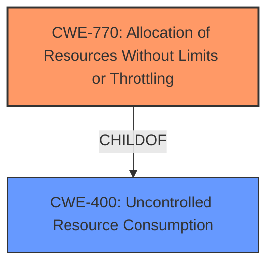

# Analysis Report for CVE-2024-10912

# Vulnerability Analysis Report: CVE-2024-10912

## Description

A Denial of Service (DoS) vulnerability exists in the file upload feature of lm-sys/fastchat version 0.2.36. The vulnerability is due to **improper handling of form-data with a large filename** in the file upload request. An attacker can exploit this by sending a payload with an excessively large filename, causing the server to become overwhelmed and unavailable to legitimate users.

## Vulnerability Description Key Phrases

- **Rootcause:** improper handling of form-data with a large filename
- **Impact:** Denial of Service
- **Vector:** payload with an excessively large filename
- **Product:** lm-sys/fastchat
- **Version:** version 0.2.36
- **Component:** file upload feature

## Analysis (with Relationship Data)

# Summary
| CWE ID | CWE Name | Confidence | CWE Abstraction Level | CWE Vulnerability Mapping Label | CWE-Vulnerability Mapping Notes |
|---|---|---|---|---|---|
| CWE-770 | Allocation of Resources Without Limits or Throttling | 0.9 | Base | Allowed | Primary CWE - Root cause of the vulnerability |
| CWE-400 | Uncontrolled Resource Consumption | 0.7 | Class | Discouraged | Secondary CWE - Impact of the vulnerability |

## Evidence and Confidence

*   **Confidence Score:** 0.8
*   **Evidence Strength:** MEDIUM

## Relationship Analysis
The primary relationship is between CWE-770 and its parent CWE-400. CWE-770 is a more specific case of uncontrolled resource consumption, focusing on the allocation of resources without limits or throttling. This aligns well with the vulnerability description, which mentions "improper handling of form-data with a large filename" leading to the server becoming overwhelmed. The "improper handling" is directly related to allocating resources without limits (the excessively large filename). I chose CWE-770 over CWE-400 as CWE-770 is a Base level, and CWE-400 is a Class level, so CWE-770 is more specific and preferred.



## Vulnerability Chain
The vulnerability chain starts with **improper handling of form-data with a large filename** (CWE-770), leading to the server becoming overwhelmed, resulting in a Denial of Service (CWE-400).

## Summary of Analysis
The vulnerability is due to the **improper handling of form-data with a large filename** in the file upload request. This leads to excessive resource allocation, causing a denial of service.

CWE-770 (Allocation of Resources Without Limits or Throttling) is the most appropriate primary CWE. It accurately describes the **root cause** of the vulnerability: the system's failure to limit or throttle resource allocation when handling a large filename. The vulnerability description explicitly states the **improper handling of form-data with a large filename**.
> *   **rootcause:** **improper handling of form-data with a large filename**

CWE-400 (Uncontrolled Resource Consumption) is a secondary CWE that represents the impact of the vulnerability. The excessive resource allocation leads to the server becoming overwhelmed and unavailable, which is a denial of service.

Other CWEs Considered:

*   CWE-799 (Improper Control of Interaction Frequency): While related to DoS, it focuses more on the frequency of interactions rather than the size of the request causing resource exhaustion.
*   CWE-1284 (Improper Validation of Specified Quantity in Input): This could be applicable if the size of the filename was explicitly specified in the input and not validated. However, the description focuses on the **improper handling** rather than explicit size validation, thus making CWE-770 a better fit.

The selection of CWE-770 is based on the **root cause** evidence from the vulnerability description. The relationship analysis further solidifies this decision, as CWE-770 is a more specific child of CWE-400, representing the allocation aspect of resource consumption.


## CWE Relationship Analysis

Current CWEs represent these abstraction levels: .


### Vulnerability Chain Analysis

**Chain starting from CWE-1284:**
- 1284 (Improper Validation of Specified Quantity in Input) - ROOT


**Chain starting from CWE-400:**
- 400 (Uncontrolled Resource Consumption) - ROOT


### CWE Relationship Diagram

```mermaid
graph TD
    classDef primary fill:#f96,stroke:#333,stroke-width:2px
    classDef secondary fill:#69f,stroke:#333
    classDef tertiary fill:#9e9,stroke:#333
```


*Report generated on 2025-07-13 00:34:29*
