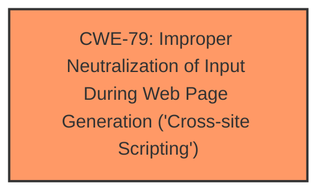

# Analysis for CVE-2024-10926

# Summary
| CWE ID | CWE Name | Confidence | CWE Abstraction Level | CWE Vulnerability Mapping Label | CWE-Vulnerability Mapping Notes |
|---|---|---|---|---|---|
| CWE-79 | Improper Neutralization of Input During Web Page Generation ('Cross-site Scripting') | 1.0 | Base | Allowed | Primary CWE. The vulnerability description explicitly states "cross site scripting". |

## Evidence and Confidence

*   **Confidence Score:** 1.0
*   **Evidence Strength:** HIGH

## Relationship Analysis
The primary CWE is CWE-79, which is a base level CWE. There are parent and child relationships, but the description is a direct match. There are no chain relationships to consider.

## Vulnerability Chain
The chain of root cause and weaknesses for the Vulnerability Description:
  - The **root cause** is the **improper neutralization of input** in the `/toggle_fold_panel.php` file.
  - The **weakness** is **cross site scripting**.

## Summary of Analysis
The vulnerability is a **cross site scripting** (**weakness**).
The primary CWE is CWE-79 Improper Neutralization of Input During Web Page Generation ('Cross-site Scripting').
The evidence is that the Vulnerability Description Key Phrases indicate the **weakness** is **cross site scripting**. The CVE Reference Links Content Summary also indicates the **root cause of the vulnerability** is a Cross-Site Scripting vulnerability.
The graph relationships show that CWE-79 is a base class, so it is specific enough.
My assessment is based on the provided evidence only. The vulnerability description explicitly states "cross site scripting".

Relevant CWE Information:

# Enhanced Context (25 CWEs)
The following CWEs were identified as potentially relevant to this vulnerability:

## CWE-80: Improper Neutralization of Script-Related HTML Tags in a Web Page (Basic XSS)
**Abstraction Level**: Variant
**Similarity Score**: 0.79
**Source**: dense

**Description**:
The product receives input from an upstream component, but it does not neutralize or incorrectly neutralizes special characters such as "<", ">", and "&" that could be interpreted as web-scripting elements when they are sent to a downstream component that processes web pages.

**Mapping Guidance**:
- Usage: Allowed
- Rationale: This CWE entry is at the Variant level of abstraction, which is a preferred level of abstraction for mapping to the root causes of vulnerabilities.

CWE-80 was considered but not used because the vulnerability description does not indicate that the issue is specifically related to script-related HTML tags. CWE-79 is more general and a better fit.

## CWE-79: Improper Neutralization of Input During Web Page Generation ('Cross-site Scripting')
**Abstraction Level**: Base
**Similarity Score**: 0.77
**Source**: dense

**Description**:
The product does not neutralize or incorrectly neutralizes user-controllable input before it is placed in output that is used as a web page that is served to other users.

**Mapping Guidance**:
- Usage: Allowed
- Rationale: This CWE entry is at the Base level of abstraction, which is a preferred level of abstraction for mapping to the root causes of vulnerabilities.

CWE-79 is the selected CWE.

## CWE-116: Improper Encoding or Escaping of Output
**Abstraction Level**: Class
**Similarity Score**: 0.75
**Source**: dense

**Description**:
The product prepares a structured message for communication with another component, but encoding or escaping of the data is either missing or done incorrectly. As a result, the intended structure of the message is not preserved.

**Mapping Guidance**:
- Usage: Allowed-with-Review
- Rationale: This CWE entry is a Class and might have Base-level children that would be more appropriate

CWE-116 was considered but not used because the vulnerability is more specifically related to cross-site scripting.

## CWE-74: Improper Neutralization of Special Elements in Output Used by a Downstream Component ('Injection')
**Abstraction Level**: Class
**Similarity Score**: 0.75
**Source**: dense

**Description**:
The product constructs all or part of a command, data structure, or record using externally-influenced input from an upstream component, but it does not neutralize or incorrectly neutralizes special elements that could modify how it is parsed or interpreted when it is sent to a downstream component.

**Mapping Guidance**:
- Usage: Discouraged
- Rationale: CWE-74 is high-level and often misused when lower-level weaknesses are more appropriate.

CWE-74 was considered but not used because the vulnerability is more specifically related to cross-site scripting.