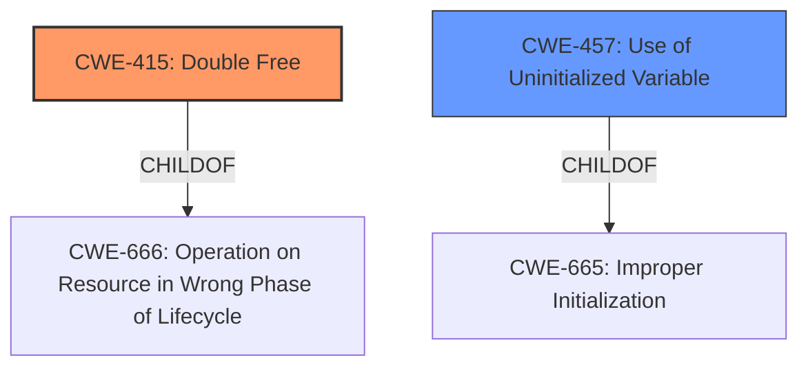

# Enhanced Analysis for CVE-2024-10934

# Summary
| CWE ID  | CWE Name                                                      | Confidence | CWE Abstraction Level | CWE Vulnerability Mapping Label | CWE-Vulnerability Mapping Notes |
| :-------- | :------------------------------------------------------------ | :--------- | :-------------------- | :------------------------------ | :------------------------------ |
| CWE-415   | Double Free                                                   | 0.9        | Variant               | Primary                         | Allowed                         |
| CWE-457   | Use of Uninitialized Variable                               | 0.9        | Variant               | Secondary                       | Allowed                         |

## Evidence and Confidence

*   **Confidence Score:** 0.9
*   **Evidence Strength:** HIGH

## Relationship Analysis

The primary CWEs identified are CWE-415 (**Double Free**) and CWE-457 (**Use of Uninitialized Variable**). CWE-415 is a variant of CWE-666 (**Operation on Resource in Wrong Phase of Lifecycle**), while CWE-457 is a variant of CWE-665 (**Improper Initialization**). The relationship analysis reveals that the double free can potentially follow a use-after-free scenario, but in this instance, the description specifically indicates a double free condition without detailing a prior use-after-free. The **use of an uninitialized variable** is a separate issue, as indicated in the description. Both weaknesses are independent issues in the NFS client and server implementation.



## Vulnerability Chain

The vulnerability involves two distinct weaknesses:

1.  **Double Free**: The **root cause** is calling `free()` twice on the same memory address.
2.  **Use of Uninitialized Variable**: The **root cause** is using a variable without proper initialization in the error handling of the NFS server.

These are separate vulnerabilities and do not form a chain.

## Summary of Analysis

The analysis is based on the provided vulnerability description, which clearly states two independent issues: a **double free** and the **use of an uninitialized variable**.

*   "avoid possible mbuf **double free** in NFS client and server implementation"
*   "do not **use uninitialized variable** in error handling of NFS server"

The retriever results and the explicit mention of these issues in the description strongly support the selection of CWE-415 (**Double Free**) and CWE-457 (**Use of Uninitialized Variable**). These CWEs are at the Variant level of abstraction, which is the most specific level available for these weaknesses, thus providing the optimal level of specificity.

Other CWEs considered but not used:

*   CWE-665 (**Improper Initialization**): While related to CWE-457, it's a more general Class-level CWE. CWE-457 provides more specific information about the **use of an uninitialized variable**, making it a better choice.
*   CWE-908 (**Use of Uninitialized Resource**) and CWE-909 (**Missing Initialization of Resource**): Similar to CWE-665, these are broader than CWE-457. The description explicitly refers to an "uninitialized variable," making CWE-457 the most accurate.
*   CWE-364 (**Signal Handler Race Condition**), CWE-362 (**Concurrent Execution using Shared Resource with Improper Synchronization ('Race Condition')**): These are related to concurrency issues but are not directly relevant to the described weaknesses.
*   CWE-755 (**Improper Handling of Exceptional Conditions**): Could be related, but the description clearly mentions the **use of an uninitialized variable** in the error handling of the NFS server, and not the handling of the exceptional conditions.

Therefore, the primary CWE is CWE-415 and the secondary CWE is CWE-457.


## CWE Relationship Analysis

Current CWEs represent these abstraction levels: .


### Vulnerability Chain Analysis

**Chain starting from CWE-457:**
- 457 (Use of Uninitialized Variable) - ROOT


**Chain starting from CWE-666:**
- 666 (Operation on Resource in Wrong Phase of Lifetime) - ROOT


### CWE Relationship Diagram

```mermaid
graph TD
    classDef primary fill:#f96,stroke:#333,stroke-width:2px
    classDef secondary fill:#69f,stroke:#333
    classDef tertiary fill:#9e9,stroke:#333
```