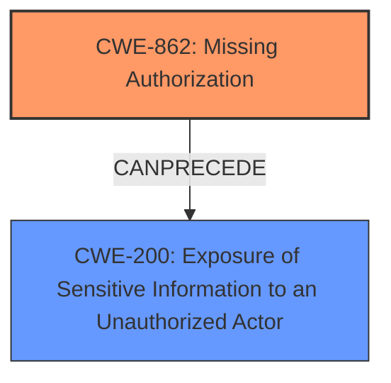

# Analysis for CVE-2024-10937

# Summary
| CWE ID | CWE Name | Confidence | CWE Abstraction Level | CWE Vulnerability Mapping Label | CWE-Vulnerability Mapping Notes |
|---|---|---|---|---|---|
| CWE-862 | Missing Authorization | 1.0 | Class | Primary | Allowed-with-Review |
| CWE-200 | Exposure of Sensitive Information to an Unauthorized Actor | 0.9 | Class | Secondary | Discouraged |

## Evidence and Confidence

*   **Confidence Score:** 0.95
*   **Evidence Strength:** HIGH

## Relationship Analysis
The primary CWE is CWE-862 [**Missing Authorization**], which is a Class-level CWE. While it would be ideal to find a more specific Base or Variant CWE, the description explicitly mentions the absence of authorization checks, making this the most fitting choice. CWE-200 [**Exposure of Sensitive Information to an Unauthorized Actor**] is a consequence of the missing authorization. Thus, CWE-862 CanPrecede CWE-200.

## Vulnerability Chain
The vulnerability chain starts with **Missing Authorization** (CWE-862) on an AJAX action, leading to **Sensitive Information Exposure** (CWE-200), specifically the titles of draft posts.

## Summary of Analysis
The initial analysis identified that the root cause of the vulnerability is the **missing authorization** on the `wp_ajax_nopriv_related_post_ajax_get_post_ids` AJAX action. This allows unauthenticated attackers to access sensitive information, namely the titles of posts in draft status.

The evidence strongly supports the selection of CWE-862 [**Missing Authorization**] as the primary weakness. The CVE Reference Links Content Summary explicitly states: "The vulnerability stems from improper access control... This action was accessible to unauthenticated users due to the use of `wp_ajax_nopriv_`." Further, it notes, "**Improper Access Control**: The AJAX action `related_post_ajax_get_post_ids` lacked proper authentication checks, making it accessible to unauthenticated users."

CWE-200 [**Exposure of Sensitive Information to an Unauthorized Actor**] is a secondary weakness as it describes the impact of the **missing authorization**. The vulnerability description states that it makes it "possible for unauthenticated attackers to extract sensitive data including titles of posts in draft status."

I considered other CWEs from the Retriever Results, such as CWE-863 [**Incorrect Authorization**], but it is less appropriate because the primary issue is not an incorrect authorization check but the complete absence of one.

CWE-352 [**Cross-Site Request Forgery (CSRF)**] was also considered, but it does not fit the vulnerability description because there's no mention or indication of CSRF being involved.

CWE-201 [**Insertion of Sensitive Information Into Sent Data**] was also considered, but is less appropriate than CWE-200 as it describes a scenario where sensitive data is *included* within a larger dataset being sent, whereas this vulnerability is about exposing sensitive information directly due to lack of access control.

The selected CWEs are at the optimal level of specificity, with CWE-862 directly addressing the **missing authorization** and CWE-200 describing the resulting **sensitive information exposure**.