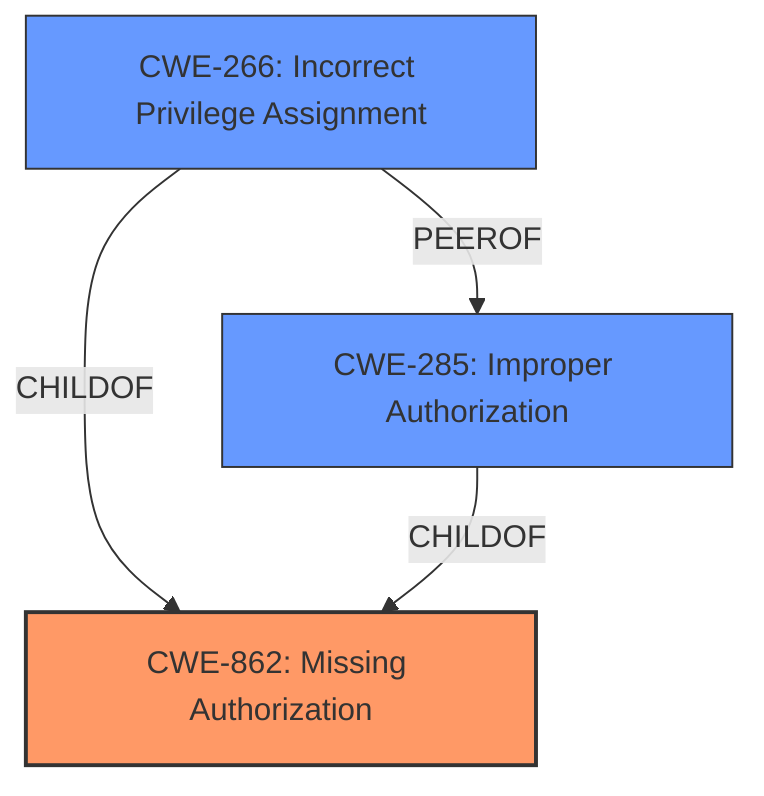

# Analysis for CVE-2024-1094

# Summary
| CWE ID  | CWE Name                                                              | Confidence | CWE Abstraction Level | CWE Vulnerability Mapping Label | CWE-Vulnerability Mapping Notes |
| :-------- | :-------------------------------------------------------------------- | :--------- | :-------------------- | :------------------------------ | :------------------------------ |
| CWE-862 | Missing Authorization                                                 | 1          | Class                 | Primary                         | Allowed-with-Review           |
| CWE-266 | Incorrect Privilege Assignment                                        | 0.75          | Base                  | Secondary                       | Allowed                       |
| CWE-285 | Improper Authorization                                                | 0.5          | Class                 | Secondary                       | Discouraged                    |

## Evidence and Confidence

*   **Confidence Score:** 0.85
*   **Evidence Strength:** HIGH

## Relationship Analysis
The primary relationship influencing the CWE selection is the hierarchical structure. CWE-862 **Missing Authorization** is a Class-level CWE, and several Base-level CWEs could potentially be more specific. However, the description clearly states a "**missing capability check**," making CWE-862 the most direct fit. CWE-266 **Incorrect Privilege Assignment** is considered as a potential child, and CWE-285 **Improper Authorization** is considered due to the potential for misconfiguration leading to incorrect privilege assignments.

## Vulnerability Chain
The vulnerability chain starts with the **missing authorization** check (**CWE-862**), which allows unauthenticated attackers to grant staff permissions. This leads to unauthorized modification of data.
  - **Root Cause:** CWE-862 **Missing Authorization** due to the "**missing capability check**" on the make_staff() function.
  - **Impact:** Grant users staff permissions and unauthorized modification of data.

## Summary of Analysis
The initial analysis pointed towards CWE-862 **Missing Authorization** as the primary weakness due to the explicit mention of a "**missing capability check**" in the vulnerability description. This is further supported by the CVE Reference Links Content Summary, which states, "The primary weakness is the absence of proper capability checks before granting or removing staff permissions."

The retriever results also list CWE-862 with the highest score.

The evidence for CWE-862 is strong: "The Timetics- AI-powered Appointment Booking with Visual Seat Plan and ultimate Calendar Scheduling plugin for WordPress is vulnerable to unauthorized modification of data due to a **missing capability check** on the make_staff() function in all versions up to, and including, 1.0.21."

CWE-266 **Incorrect Privilege Assignment** was considered as a secondary factor due to the possibility that the missing check could lead to incorrect privilege assignments, although this is less direct than the **missing authorization**.

CWE-285 **Improper Authorization** was also considered, but the root cause is that there is no authorization taking place.

The selected CWEs are at the optimal level of specificity. CWE-862 directly addresses the **missing authorization**, while CWE-266 and CWE-285 capture potential consequences of the **missing authorization** (though are less direct).

Relevant CWE Information:

# Enhanced Context (25 CWEs)
The following CWEs were identified as potentially relevant to this vulnerability:

## CWE-266: Incorrect Privilege Assignment
**Abstraction Level**: Base
**Similarity Score**: 0.79
**Source**: dense

**Description**:
A product incorrectly assigns a privilege to a particular actor, creating an unintended sphere of control for that actor.

**Mapping Guidance**:
- Usage: Allowed
- Rationale: This CWE entry is at the Base level of abstraction, which is a preferred level of abstraction for mapping to the root causes of vulnerabilities.

## CWE-285: Improper Authorization
**Abstraction Level**: Class
**Similarity Score**: 1904.52
**Source**: sparse

**Description**:
The product does not perform or incorrectly performs an authorization check when an actor attempts to access a resource or perform an action.

**Mapping Guidance**:
- Usage: Discouraged
- Rationale: CWE-285 is high-level and lower-level CWEs can frequently be used instead. It is a level-1 Class (i.e., a child of a Pillar).

## CWE-862: Missing Authorization
**Abstraction Level**: Class
**Similarity Score**: 1867.26
**Source**: sparse

**Description**:
The product does not perform an authorization check when an actor attempts to access a resource or perform an action.

**Mapping Guidance**:
- Usage: Allowed-with-Review
- Rationale: This CWE entry is a Class and might have Base-level children that would be more appropriate