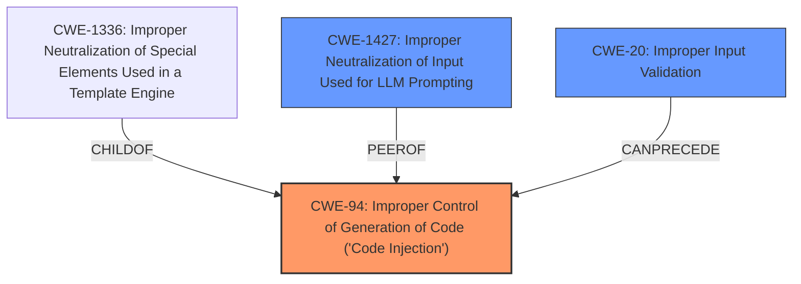

# Enhanced Analysis for CVE-2024-10954

# Summary
| CWE ID | CWE Name | Confidence | CWE Abstraction Level | CWE Vulnerability Mapping Label | CWE-Vulnerability Mapping Notes |
|---|---|---|---|---|---|
| CWE-94 | Improper Control of Generation of Code ('Code Injection') | 0.9 | Base | Allowed-with-Review | Primary CWE |
| CWE-1427 | Improper Neutralization of Input Used for LLM Prompting | 0.7 | Base | Allowed | Secondary Candidate |
| CWE-20 | Improper Input Validation | 0.5 | Class | Discouraged | Secondary Candidate |

## Evidence and Confidence

*   **Confidence Score:** 0.8
*   **Evidence Strength:** MEDIUM

## Relationship Analysis
The primary relationship that influenced the selection was the parent-child relationship, specifically how CWE-94 has a child CWE-1336 (Improper Neutralization of Special Elements Used in a Template Engine). This suggests a potential path for code injection. The chain relationship also played a role, as `CWE-94` can follow other weaknesses like `CWE-98` (Improper Control of Filename or Pathname), indicating a potential prerequisite vulnerability. The abstraction levels were considered to ensure the selected CWEs were at the appropriate level of specificity.



## Vulnerability Chain
The vulnerability chain starts with the **improper handling of user-provided prompts**, leading to the generation of untrusted code. This untrusted code is then executed without a proper sandbox, resulting in remote code execution (RCE).

*   **Root Cause:** Improper handling of user-provided prompts leading to the generation of untrusted code (`CWE-94`).
*   **Weakness:** Execution of untrusted code without a proper sandbox.
*   **Impact:** Remote Code Execution (RCE).

## Summary of Analysis
The initial analysis focused on identifying the root cause of the vulnerability. The description clearly states that the **improper handling of user-provided prompts** is the issue. This led to the consideration of CWEs related to input validation and code injection.

The selection of `CWE-94` as the primary CWE is based on the fact that the LLM generates code that is then executed without proper sanitization or sandboxing. This aligns directly with the description of `CWE-94`: Improper Control of Generation of Code ('Code Injection'). The vulnerability description states: "The root cause is the execution of untrusted code generated by the LLM without a proper sandbox." This directly indicates that the generated code is not being properly controlled, leading to the vulnerability.

`CWE-1427` was considered because the vulnerability involves user-provided prompts being used to influence the behavior of the LLM. However, `CWE-94` was deemed more appropriate as it focuses on the actual generation and execution of the malicious code.

`CWE-20` was also considered but ultimately deemed too generic, as the vulnerability description provides more specific details about the nature of the input handling issue.

The graph relationships influenced the final selection by highlighting the potential for code injection based on the improper handling of user-provided prompts.

The selected CWEs are at the optimal level of specificity because they directly address the root cause and the immediate consequences of the vulnerability. `CWE-94` captures the essence of the code injection aspect, while `CWE-1427` and `CWE-20` represent contributing factors.


## CWE Relationship Analysis

Current CWEs represent these abstraction levels: .


### Vulnerability Chain Analysis

**Chain starting from CWE-94:**
- 94 (Improper Control of Generation of Code ('Code Injection')) - ROOT


**Chain starting from CWE-1336:**
- 1336 (Improper Neutralization of Special Elements Used in a Template Engine) - ROOT


### CWE Relationship Diagram

```mermaid
graph TD
    classDef primary fill:#f96,stroke:#333,stroke-width:2px
    classDef secondary fill:#69f,stroke:#333
    classDef tertiary fill:#9e9,stroke:#333
```