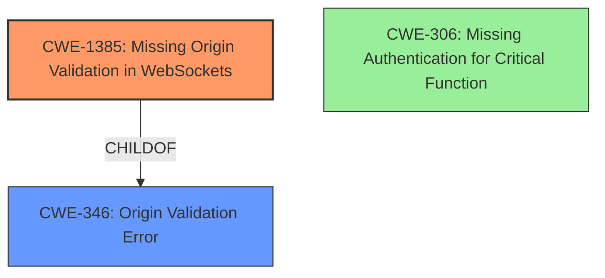

# Analysis for CVE-2024-10956

# Summary
| CWE ID | CWE Name | Confidence | CWE Abstraction Level | CWE Vulnerability Mapping Label | CWE-Vulnerability Mapping Notes |
|---|---|---|---|---|---|
| CWE-1385 | Missing Origin Validation in WebSockets | 1.0 | Variant | Primary CWE | Allowed |
| CWE-306 | Missing Authentication for Critical Function | 0.7 | Base | Secondary Candidate | Allowed |

## Evidence and Confidence

*   **Confidence Score:** 0.9
*   **Evidence Strength:** MEDIUM

## Relationship Analysis
The primary CWE is CWE-1385, which is a Variant of CWE-346 (Origin Validation Error). CWE-306, Missing Authentication for Critical Function, is a possible secondary issue if authentication is completely missing, but the description leans more towards origin validation. The relationships influenced the decision by providing a hierarchy for selecting the most specific CWE.

## Vulnerability Chain
The vulnerability chain starts with **insufficient WebSocket authentication and lack of origin validation** which leads to **Cross-Site WebSocket Hijacking** allowing an attacker to **delete conversation history without the victim's consent**.

## Summary of Analysis
The vulnerability description clearly states the root cause as "**insufficient WebSocket authentication and lack of origin validation**". The primary weakness is **Cross-Site WebSocket Hijacking**.

CWE-1385 (Missing Origin Validation in WebSockets) is a strong match because the description explicitly mentions "lack of origin validation". The retriever results also list it as the top match. This is a variant level CWE, making it more specific.

CWE-306 (Missing Authentication for Critical Function) is a possible secondary weakness because the description mentions "**insufficient WebSocket authentication**". If authentication is completely missing, then this CWE is appropriate.

The choice of CWE-1385 is based on the explicit mention of "origin validation" and its higher specificity as a variant. If origin validation was present, but flawed, then CWE-346 would be more appropriate. Given the description, CWE-1385 is the best fit.

Relevant CWE Information:
# Enhanced Context (25 CWEs)
The following CWEs were identified as potentially relevant to this vulnerability:

CWE-1385: Missing Origin Validation in WebSockets
Abstraction Level: Variant
Similarity Score: 0.75
Source: dense

Description:
The product uses a WebSocket, but it does not properly verify that the source of data or communication is valid.

Mapping Guidance:
- Usage: Allowed
- Rationale: This CWE entry is at the Variant level of abstraction, which is a preferred level of abstraction for mapping to the root causes of vulnerabilities.