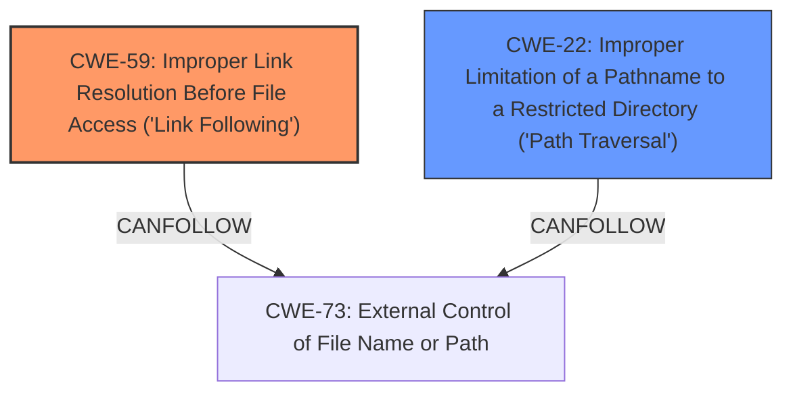

# Analysis for CVE-2024-10986

# Summary
| CWE ID | CWE Name | Confidence | CWE Abstraction Level | CWE Vulnerability Mapping Label | CWE-Vulnerability Mapping Notes |
|---|---|---|---|---|---|
| CWE-59 | Improper Link Resolution Before File Access ('Link Following') | 0.9 | Base | Primary | Allowed |
| CWE-22 | Improper Limitation of a Pathname to a Restricted Directory ('Path Traversal') | 0.7 | Base | Secondary | Allowed |

## Evidence and Confidence

*   **Confidence Score:** 0.8
*   **Evidence Strength:** HIGH

## Relationship Analysis
The primary weakness is CWE-59, which directly addresses the **improper handling of symlinks** leading to **unintended file access**. While CWE-22 is related to **path traversal**, it is a broader category. The vulnerability description specifically mentions protections against path traversal, but the oversight of symlinks. Thus, CWE-59 is more precise. CWE-61, a compound weakness, was considered but deemed less appropriate as it represents a combination of conditions rather than the fundamental flaw. The Base abstraction level of CWE-59 is ideal for capturing the root cause.

## Vulnerability Chain
The vulnerability chain begins with the **improper link resolution** (CWE-59) in the HotReload function, bypassing existing path traversal protections. This leads to the ability to perform a **local file read**, effectively bypassing intended access controls and leading to **unauthorized access** to sensitive files.

## Summary of Analysis
The initial assessment, based on the vulnerability description's focus on symlink handling and the resulting local file read, pointed towards CWE-59 as the primary weakness. The description explicitly states: "Despite implementing protections against **path traversal**, the application overlooks the Tarslip triggered by symlinks. This oversight allows attackers to read arbitrary local files from the victim server." This statement highlights the **improper handling of symlinks** as the root cause, making CWE-59 the most appropriate choice. CWE-22 was considered due to the mention of **path traversal**, but the description indicates existing protections, making it a secondary concern.

The graph relationships reinforced the choice of CWE-59 as the primary weakness because it directly addresses the symlink issue. The retriever scores also supported this decision, with CWE-59 consistently ranking high across different keyphrases.

The selected CWEs are at the optimal level of specificity because they directly address the root cause and impact of the vulnerability. CWE-59 captures the specific flaw in symlink handling, while CWE-22 acknowledges the broader context of **path traversal** vulnerabilities.

Relevant CWE Information:

# Enhanced Context (25 CWEs)
The following CWEs were identified as potentially relevant to this vulnerability:

## CWE-59: Improper Link Resolution Before File Access ('Link Following')
**Abstraction Level**: Base
**Similarity Score**: 0.77
**Source**: dense

**Description**:
The product attempts to access a file based on the filename, but it does not properly prevent that filename from identifying a link or shortcut that resolves to an unintended resource.

**Mapping Guidance**:
- Usage: Allowed
- Rationale: This CWE entry is at the Base level of abstraction, which is a preferred level of abstraction for mapping to the root causes of vulnerabilities.

## CWE-23: Relative Path Traversal
**Abstraction Level**: Base
**Similarity Score**: 0.75
**Source**: dense

**Description**:
The product uses external input to construct a pathname that should be within a restricted directory, but it does not properly neutralize sequences such as ".." that can resolve to a location that is outside of that directory.

**Mapping Guidance**:
- Usage: Allowed
- Rationale: This CWE entry is at the Base level of abstraction, which is a preferred level of abstraction for mapping to the root causes of vulnerabilities.

CWE-59: Improper Link Resolution Before File Access ('Link Following') matches the vulnerability because the **rootcause** is the application overlooked the Tarslip triggered by symlinks.
This oversight allows attackers to read arbitrary local files from the victim server.
Confidence: 0.9

CWE-22: Improper Limitation of a Pathname to a Restricted Directory ('Path Traversal') matches the weakness in the context of the path traversal mitigations that were in place, but were bypassed.
Confidence: 0.7

CWE-61: UNIX Symbolic Link (Symlink) Following was not selected because it's a compound weakness. Confidence: 0.5