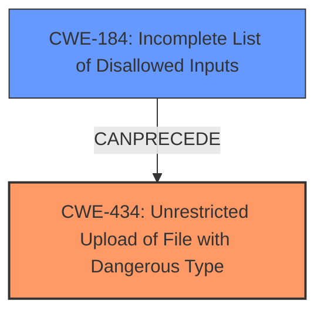

# Analysis for CVE-2024-10993

# Summary
| CWE ID | CWE Name | Confidence | CWE Abstraction Level | CWE Vulnerability Mapping Label | CWE-Vulnerability Mapping Notes |
|---|---|---|---|---|---|
| CWE-434 | Unrestricted Upload of File with Dangerous Type | 1.0 | Base | Allowed | Primary CWE. The vulnerability description explicitly mentions **unrestricted upload**, and the analysis of the CVE reference links confirms the lack of input validation as the root cause, leading to this vulnerability. |
| CWE-184 | Incomplete List of Disallowed Inputs | 0.75 | Base | Allowed | Secondary CWE. The uploaded file type is not checked against a comprehensive list of disallowed/dangerous file types. |

## Evidence and Confidence

*   **Confidence Score:** 1.0
*   **Evidence Strength:** HIGH

## Relationship Analysis
The primary CWE is CWE-434, which is a base-level CWE. Several other CWEs were considered, especially those related to input validation and neutralization.

## Vulnerability Chain
The vulnerability chain starts with the **lack of input validation** on the uploaded file, leading to an **unrestricted upload** of potentially dangerous file types, and finally potentially leading to impacts like file overwrite, file injection, directory traversal, or even remote code execution.

`Lack of Input Validation` -> `CWE-434: Unrestricted Upload of File with Dangerous Type` -> `File Overwrite/Injection/Traversal/RCE`

## Summary of Analysis
The analysis is based on the provided evidence. The vulnerability description clearly states "**unrestricted upload**". The CVE reference links content summary confirms that the root cause is the lack of input validation and sanitization on the `website_image` parameter in the `manage_website.php` file.

The selection of CWE-434 is optimal because it precisely describes the vulnerability and is at the Base level of abstraction. CWE-184 is related since it implies that the list of disallowed file types might be incomplete, contributing to the **unrestricted upload**.

Relevant CWE Information:

# Enhanced Context (25 CWEs)
The following CWEs were identified as potentially relevant to this vulnerability:

## CWE-434: Unrestricted Upload of File with Dangerous Type
**Abstraction Level**: Base
**Similarity Score**: 0.84
**Source**: dense

**Description**:
The product allows the upload or transfer of dangerous file types that are automatically processed within its environment.

**Mapping Guidance**:
- Usage: Allowed
- Rationale: This CWE entry is at the Base level of abstraction, which is a preferred level of abstraction for mapping to the root causes of vulnerabilities.

## CWE-184: Incomplete List of Disallowed Inputs
**Abstraction Level**: base
**Similarity Score**: 2.21
**Source**: graph

**Description**:
CWE-184: Incomplete List of Disallowed Inputs

**Mapping Guidance**:
- Usage: Allowed
- Rationale: This CWE entry is at the Base level of abstraction, which is a preferred level of abstraction for mapping to the root causes of vulnerabilities.

**Relationships**:
- PARENTOF -> CWE-692
- CANPRECEDE -> CWE-98
- CANPRECEDE -> CWE-434
- CANPRECEDE -> CWE-78
- CANPRECEDE -> CWE-79

---
CWEs considered but not used:

*   CWE-79 (Improper Neutralization of Input During Web Page Generation ('Cross-site Scripting')): While the uploaded file might be displayed on a web page, the primary issue is the **unrestricted upload** itself, not necessarily the improper neutralization of input during web page generation.
*   CWE-89 (Improper Neutralization of Special Elements used in an SQL Command ('SQL Injection')): There is no indication of SQL injection in the provided description.
*   CWE-96 (Improper Neutralization of Directives in Statically Saved Code ('Static Code Injection')): There is no indication of static code injection in the provided description.
*   CWE-1336 (Improper Neutralization of Special Elements Used in a Template Engine): There is no indication of usage of a template engine in the provided description.
*   CWE-425 (Direct Request ('Forced Browsing')): This is related to authorization issues, but the primary issue is the **unrestricted upload**.
*   CWE-74 (Improper Neutralization of Special Elements in Output Used by a Downstream Component ('Injection')): This is a high-level CWE, and CWE-434 is a more specific and appropriate choice.