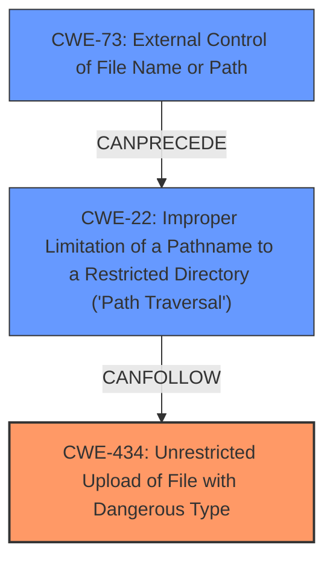

# Raw Analyzer Response for CVE-2024-10994

# Summary

| CWE ID | CWE Name | Confidence | CWE Abstraction Level | CWE Vulnerability Mapping Label | CWE-Vulnerability Mapping Notes |
|---|---|---|---|---|---|
| CWE-434 | Unrestricted Upload of File with Dangerous Type | 1.0 | Base | Allowed | Primary CWE. The **unrestricted upload** of a file without validation is the root cause. |
| CWE-22 | Improper Limitation of a Pathname to a Restricted Directory ('Path Traversal') | 0.7 | Base | Allowed | Secondary CWE. If the filename is not properly sanitized, it could lead to path traversal. |
| CWE-73 | External Control of File Name or Path | 0.6 | Base | Allowed | Secondary CWE. Closely related to CWE-22 and part of the directory traversal attack. |

## Evidence and Confidence

*   **Confidence Score:** 0.9
*   **Evidence Strength:** HIGH

## Relationship Analysis
The primary weakness is CWE-434, which describes the **unrestricted upload** vulnerability directly. CWE-22 and CWE-73 can be chained together to represent the path traversal aspect that could arise from a missing filename sanitization.

## Vulnerability Chain
The vulnerability chain starts with the **unrestricted upload** (CWE-434). If the filename is not sanitized properly, it can lead to path traversal (CWE-22) and external control of filename (CWE-73), allowing overwriting of critical files or potentially RCE.
- CWE-434: Unrestricted Upload of File with Dangerous Type (**Root Cause**)
- CWE-73: External Control of File Name or Path (If Filename not Sanitized)
- CWE-22: Improper Limitation of a Pathname to a Restricted Directory ('Path Traversal') (If Filename not Sanitized)

## Summary of Analysis
The primary CWE is CWE-434, given the description focuses on the **unrestricted file upload**. The `edit_user.php` file directly uses the `$_FILES` variable to determine the file storage location without validation, indicating a clear case of **unrestricted upload**. The other CWEs were considered as possible secondary weaknesses.

The vulnerability description clearly states "**unrestricted upload**". The CVE Reference Links Content Summary also mentions "Lack of input validation and sanitization for file uploads". This aligns directly with CWE-434.

CWE-22 and CWE-73 are included as potential secondary weaknesses, as an attacker might be able to leverage the **unrestricted upload** together with missing filename sanitization to perform a directory traversal attack.

Relevant CWE Information:

# Enhanced Context (25 CWEs)
The following CWEs were identified as potentially relevant to this vulnerability:

## CWE-434: Unrestricted Upload of File with Dangerous Type
**Abstraction Level**: Base
**Similarity Score**: 0.82
**Source**: dense

**Description**:
The product allows the upload or transfer of dangerous file types that are automatically processed within its environment.

**Mapping Guidance**:
- Usage: Allowed
- Rationale: This CWE entry is at the Base level of abstraction, which is a preferred level of abstraction for mapping to the root causes of vulnerabilities.

## CWE-89: Improper Neutralization of Special Elements used in an SQL Command ('SQL Injection')
**Abstraction Level**: Base
**Similarity Score**: 796.56
**Source**: sparse

**Description**:
The product constructs all or part of an SQL command using externally-influenced input from an upstream component, but it does not neutralize or incorrectly neutralizes special elements that could modify the intended SQL command when it is sent to a downstream component. Without sufficient removal or quoting of SQL syntax in user-controllable inputs, the generated SQL query can cause those inputs to be interpreted as SQL instead of ordinary user data.

**Mapping Guidance**:
- Usage: Allowed
- Rationale: This CWE entry is at the Base level of abstraction, which is a preferred level of abstraction for mapping to the root causes of vulnerabilities.

## CWE-79: Improper Neutralization of Input During Web Page Generation ('Cross-site Scripting')
**Abstraction Level**: Base
**Similarity Score**: 737.57
**Source**: sparse

**Description**:
The product does not neutralize or incorrectly neutralizes user-controllable input before it is placed in output that is used as a web page that is served to other users.

**Mapping Guidance**:
- Usage: Allowed
- Rationale: This CWE entry is at the Base level of abstraction, which is a preferred level of abstraction for mapping to the root causes of vulnerabilities.

## CWE-306: Missing Authentication for Critical Function
**Abstraction Level**: base
**Similarity Score**: 2.33
**Source**: graph

**Description**:
CWE-306: Missing Authentication for Critical Function

**Mapping Guidance**:
- Usage: Allowed
- Rationale: This CWE entry is at the Base level of abstraction, which is a preferred level of abstraction for mapping to the root causes of vulnerabilities.

## CWE-434: Unrestricted Upload of File with Dangerous Type
**Abstraction Level**: Base
**Similarity Score**: 2.92
**Source**: graph

**Description**:
The product allows the upload or transfer of dangerous file types that are automatically processed within its environment.

**Mapping Guidance**:
- Usage: Allowed
- Rationale: This CWE entry is at the Base level of abstraction, which is a preferred level of abstraction for mapping to the root causes of vulnerabilities.

## CWE-73: External Control of File Name or Path
**Abstraction Level**: Base
**Description**: The program uses external input to determine the file name and/or path of a file that is created, opened, or modified.
**Rationale**: This CWE entry is at the Base level of abstraction, which is a preferred level of abstraction for mapping to the root causes of vulnerabilities.

## CWE-22: Improper Limitation of a Pathname to a Restricted Directory ('Path Traversal')
**Abstraction Level**: Base
**Description**: The program uses external input to build a pathname that is intended to identify a file or directory that is located underneath a restricted parent directory, but the program does not properly neutralize special elements within the pathname that can cause the resulting pathname to resolve to a location that is outside of the restricted directory.
**Rationale**: This CWE entry is at the Base level of abstraction, which is a preferred level of abstraction for mapping to the root causes of vulnerabilities.