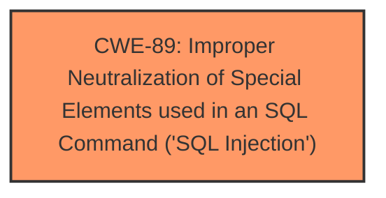

# Analysis Report for CVE-2024-10995

# Vulnerability Analysis Report: CVE-2024-10995

## Description

A vulnerability was found in Codezips Hospital Appointment System 1.0 and classified as critical. Affected by this issue is some unknown functionality of the file /removeDoctorResult.php. The manipulation of the argument Name leads to **sql injection**. The attack may be launched remotely. The exploit has been disclosed to the public and may be used.

## Vulnerability Description Key Phrases

- **Weakness:** sql injection
- **Product:** Codezips Hospital Appointment System
- **Version:** 1
- **Component:** /removeDoctorResult.php

## Analysis (with Relationship Data)

# Summary
| CWE ID | CWE Name | Confidence | CWE Abstraction Level | CWE Vulnerability Mapping Label | CWE-Vulnerability Mapping Notes |
|---|---|---|---|---|---|
| CWE-89 | Improper Neutralization of Special Elements used in an SQL Command ('SQL Injection') | 1.0 | Base | Primary | Allowed |

## Evidence and Confidence

*   **Confidence Score:** 1.0
*   **Evidence Strength:** HIGH

## Relationship Analysis
The primary relationship influencing the CWE selection is the direct match of the vulnerability description to the characteristics of CWE-89. The vulnerability involves the **improper neutralization** of special elements in an SQL command, directly leading to **SQL injection**. There are no identified parent-child or chain relationships that would suggest a more specific or related CWE in this case. The abstraction level is Base, which is appropriate for this root cause analysis.



## Vulnerability Chain
The vulnerability chain consists of a single point: the **improper neutralization** of input leading directly to **SQL injection**.

## Summary of Analysis
The analysis is based on the vulnerability description, which explicitly states that the manipulation of the `Name` argument in `/removeDoctorResult.php` leads to **SQL injection**. This aligns directly with the definition of CWE-89 as the **improper neutralization** of special elements used in an SQL command. The provided "CVE Reference Links Content Summary" confirms that the root cause is the "lack of proper sanitization or validation of the `Name` parameter before it's used in SQL queries."
The retriever results also strongly suggest CWE-89 as the primary candidate, with a score of 1.0. Other CWEs like CWE-79 (Cross-Site Scripting) and CWE-434 (Unrestricted Upload of File with Dangerous Type) are less relevant because the vulnerability is specifically related to **SQL injection** rather than script injection or file upload issues.
CWE-89 is at the optimal level of specificity, as it directly addresses the root cause of the vulnerability.

Relevant CWE Information:

# Enhanced Context (25 CWEs)
The following CWEs were identified as potentially relevant to this vulnerability:

## CWE-89: Improper Neutralization of Special Elements used in an SQL Command ('SQL Injection')
**Abstraction Level**: Base
**Similarity Score**: 0.77
**Source**: dense

**Description**:
The product constructs all or part of an SQL command using externally-influenced input from an upstream component, but it does not neutralize or incorrectly neutralizes special elements that could modify the intended SQL command when it is sent to a downstream component. Without sufficient removal or quoting of SQL syntax in user-controllable inputs, the generated SQL query can cause those inputs to be interpreted as SQL instead of ordinary user data.

**Mapping Guidance**:
- Usage: Allowed
- Rationale: This CWE entry is at the Base level of abstraction, which is a preferred level of abstraction for mapping to the root causes of vulnerabilities.


## CWE Relationship Analysis

Current CWEs represent these abstraction levels: .


### Vulnerability Chain Analysis

**Chain starting from CWE-89:**
- 89 (Improper Neutralization of Special Elements used in an SQL Command ('SQL Injection')) - ROOT


**Chain starting from CWE-79:**
- 79 (Improper Neutralization of Input During Web Page Generation ('Cross-site Scripting')) - ROOT


### CWE Relationship Diagram

```mermaid
graph TD
    classDef primary fill:#f96,stroke:#333,stroke-width:2px
    classDef secondary fill:#69f,stroke:#333
    classDef tertiary fill:#9e9,stroke:#333
```


*Report generated on 2025-07-13 00:45:53*
