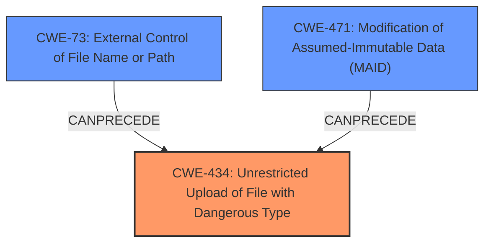

# Enhanced Analysis for CVE-2024-10999

# Summary

| CWE ID | CWE Name | Confidence | CWE Abstraction Level | CWE Vulnerability Mapping Label | CWE-Vulnerability Mapping Notes |
|---|---|---|---|---|---|
| CWE-434 | Unrestricted Upload of File with Dangerous Type | 0.9 | Base | Allowed | Primary CWE |
| CWE-471 | Modification of Assumed-Immutable Data (MAID) | 0.5 | Base | Allowed | Secondary Candidate |
| CWE-73 | External Control of File Name or Path | 0.5 | Base | Allowed | Secondary Candidate |

## Evidence and Confidence

*   **Confidence Score:** 0.9
*   **Evidence Strength:** MEDIUM

## Relationship Analysis

The primary relationship influencing my decision is the direct match of the vulnerability description to the CWE-434 description. CWE-73 and CWE-471 were considered due to the possibility of path manipulation or modification of immutable data related to the upload, but the evidence for these is weaker.



## Vulnerability Chain

The chain starts with the **unrestricted upload** vulnerability, potentially leading to code execution if a malicious file is uploaded and executed by the system.

## Summary of Analysis

The primary assessment is based on the clear indication of an **unrestricted upload** vulnerability in the provided description: "The manipulation of the argument aimage leads to **unrestricted upload**." This directly aligns with CWE-434 (Unrestricted Upload of File with Dangerous Type). The retriever results also list CWE-434 as a potential match.

CWE-73 (External Control of File Name or Path) and CWE-471 (Modification of Assumed-Immutable Data (MAID)) were considered because they could be related if the file name or path can be manipulated, or if the upload process modifies assumed immutable data. However, there is no explicit evidence to confirm these scenarios, lowering the confidence for these mappings.

The selected CWEs are at the optimal level of specificity as CWE-434 directly describes the **unrestricted upload** issue, and CWE-73 and CWE-471 are potential secondary weaknesses that could be present but lack explicit evidence.

Relevant CWE Information:

# Enhanced Context (25 CWEs)
The following CWEs were identified as potentially relevant to this vulnerability:

## CWE-434: Unrestricted Upload of File with Dangerous Type
**Abstraction Level**: Base
**Similarity Score**: 0.79
**Source**: dense

**Description**:
The product allows the upload or transfer of dangerous file types that are automatically processed within its environment.

**Mapping Guidance**:
- Usage: Allowed
- Rationale: This CWE entry is at the Base level of abstraction, which is a preferred level of abstraction for mapping to the root causes of vulnerabilities.

## CWE-471: Modification of Assumed-Immutable Data (MAID)
**Abstraction Level**: base
**Similarity Score**: 2.72
**Source**: graph

**Description**:
CWE-471: Modification of Assumed-Immutable Data (MAID)

**Mapping Guidance**:
- Usage: Allowed
- Rationale: This CWE entry is at the Base level of abstraction, which is a preferred level of abstraction for mapping to the root causes of vulnerabilities.

## CWE-73: External Control of File Name or Path
**Abstraction Level**: base
**Similarity Score**: 4.33
**Source**: graph

**Description**:
CWE-73: External Control of File Name or Path

**Mapping Guidance**:
- Usage: Allowed
- Rationale: This CWE entry is at the Base level of abstraction, which is a preferred level of abstraction for mapping to the root causes of vulnerabilities.


## CWE Relationship Analysis

Current CWEs represent these abstraction levels: .


### Vulnerability Chain Analysis

**Chain starting from CWE-471:**
- 471 (Modification of Assumed-Immutable Data (MAID)) - ROOT


**Chain starting from CWE-73:**
- 73 (External Control of File Name or Path) - ROOT


### CWE Relationship Diagram

```mermaid
graph TD
    classDef primary fill:#f96,stroke:#333,stroke-width:2px
    classDef secondary fill:#69f,stroke:#333
    classDef tertiary fill:#9e9,stroke:#333
```