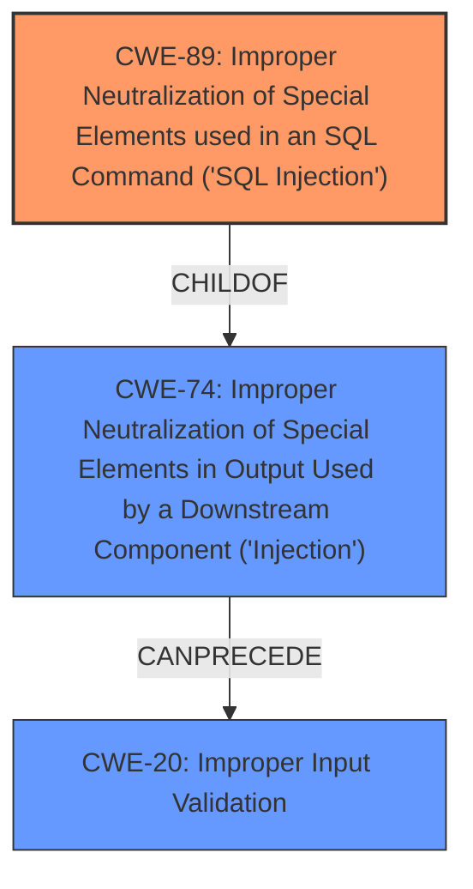

# Raw Analyzer Response for CVE-2024-11009

# Summary
| CWE ID | CWE Name | Confidence | CWE Abstraction Level | CWE Vulnerability Mapping Label | CWE-Vulnerability Mapping Notes |
|---|---|---|---|---|---|
| CWE-89 | Improper Neutralization of Special Elements used in an SQL Command ('SQL Injection') | 1.0 | Base | Primary | Allowed |

## Evidence and Confidence

*   **Confidence Score:** 1.0
*   **Evidence Strength:** HIGH

## Relationship Analysis
The primary relationship identified is that CWE-89 stands as a base-level weakness, directly addressing the **improper neutralization** of SQL special elements. While other CWEs like CWE-74 (Injection) and CWE-20 (Improper Input Validation) are related as broader categories, CWE-89 offers the most specific and accurate representation of the vulnerability's root cause. The other relationships did not impact the decision.

## Vulnerability Chain
The vulnerability chain starts with **insufficient escaping** and **lack of sufficient preparation** in the SQL query, leading to the ability for attackers to inject SQL commands, which results in information disclosure by extracting sensitive data from the database.

## Summary of Analysis
The analysis is based on the vulnerability description, which clearly states the presence of **time-based SQL Injection** due to **insufficient escaping on the user supplied parameter and lack of sufficient preparation on the existing SQL query**. The CVE Reference Links Content Summary reinforces this by detailing that the root cause is **insufficient sanitization** and **lack of prepared statements** when handling the `post_id` parameter. The fix mentioned in the CVE details also confirms the vulnerability, as it involves adding capability checks, sanitizing the post ID, and using prepared statements.

CWE-89, "Improper Neutralization of Special Elements used in an SQL Command ('SQL Injection')", is the most appropriate because it directly addresses the root cause of the vulnerability: the **improper neutralization** of special elements in an SQL command. The retriever results also listed CWE-89 as the top candidate.

Other CWEs Considered but Not Used:
*   CWE-20 (Improper Input Validation): While input validation is related, it's a broader category. CWE-89 is more specific.
*   CWE-74 (Improper Neutralization of Special Elements in Output Used by a Downstream Component ('Injection')): This is a more general "Injection" class, and CWE-89 is a specific type of injection, which is more appropriate.
*   CWE-90 (Improper Neutralization of Special Elements used in an LDAP Query ('LDAP Injection')): This is specific to LDAP, and the vulnerability is in SQL.
*   CWE-96 (Improper Neutralization of Directives in Statically Saved Code ('Static Code Injection')): This is related to static code injection, which is not the case here.
*   CWE-116 (Improper Encoding or Escaping of Output): While escaping is mentioned in the description, the core issue is the lack of proper neutralization in the SQL command itself, making CWE-89 more relevant.
*   CWE-352 (Cross-Site Request Forgery (CSRF)): CSRF is a different type of vulnerability that is not present here.
*   CWE-425: Direct Request ('Forced Browsing'): This is about authorization, not about SQL injection.
*   CWE-434: Unrestricted Upload of File with Dangerous Type: This is about file uploads, not about SQL injection.
*   CWE-471: Modification of Assumed-Immutable Data (MAID): This is about data modification, not directly about SQL injection.
*   CWE-770: Allocation of Resources Without Limits or Throttling: This is about resource allocation, not about SQL injection.
*   CWE-863: Incorrect Authorization: This is about authorization, not about SQL injection.

The selected CWE is at the optimal level of specificity because it directly describes the **improper neutralization** of special elements in an SQL command, which is the root cause of the vulnerability.