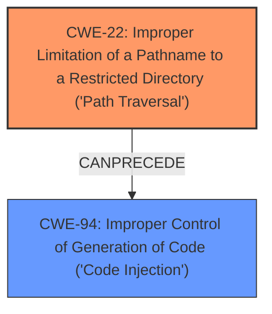

# Analysis Report for CVE-2024-11010

# Vulnerability Analysis Report: CVE-2024-11010

## Description

The FileOrganizer Manage WordPress and Website Files plugin for WordPress is vulnerable to **Local JavaScript File Inclusion** in all versions up to, and including, 1.1.4 via the default_lang parameter. This makes it possible for authenticated attackers, with Administrator-level access and above, to include and execute arbitrary JavaScript files on the server, allowing the execution of any JavaScript code in those files. This can be used to bypass access controls, obtain sensitive data, or achieve code execution in cases where images and other safe file types can be uploaded and included.

## Vulnerability Description Key Phrases

- **Weakness:** Local JavaScript File Inclusion
- **Impact:** ['bypass access controls', 'obtain sensitive data', 'achieve code execution']
- **Vector:** default_lang parameter
- **Attacker:** authenticated attackers with Administrator-level access and above
- **Product:** FileOrganizer Manage WordPress and Website Files plugin for WordPress
- **Version:** all versions up to and including 1.1.4

## Analysis (with Relationship Data)

# Summary
| CWE ID | CWE Name | Confidence | CWE Abstraction Level | CWE Vulnerability Mapping Label | CWE-Vulnerability Mapping Notes |
|---|---|---|---|---|---|
| CWE-22 | Improper Limitation of a Pathname to a Restricted Directory ('Path Traversal') | 0.9 | Base | Allowed | Primary CWE: The vulnerability involves using an unsanitized `default_lang` parameter to construct a file path, leading to the ability to access files outside the intended directory. |
| CWE-94 | Improper Control of Generation of Code ('Code Injection') | 0.6 | Base | Allowed-with-Review | Secondary CWE: While the primary issue is path traversal leading to local file inclusion, the ultimate impact described includes arbitrary code execution, making CWE-94 a relevant, though secondary, consideration. |

## Evidence and Confidence

*   **Confidence Score:** 0.75
*   **Evidence Strength:** MEDIUM

## Relationship Analysis
The primary relationship that influenced the decision was the chain where **CWE-22** Improper Limitation of a Pathname to a Restricted Directory ('Path Traversal') can lead to **CWE-94** Improper Control of Generation of Code ('Code Injection'). The vulnerability description clearly indicates that the path traversal vulnerability is the root cause, allowing for the inclusion of arbitrary JavaScript files. These files can then be executed, resulting in code injection. The relationship between path traversal and code injection is well-established and supported by the vulnerability description.



## Vulnerability Chain
The vulnerability chain starts with **CWE-22** (Improper Limitation of a Pathname to a Restricted Directory ('Path Traversal')), where the **ROOTCAUSE** is the insufficient sanitization of the `default_lang` parameter. This allows an attacker to control the path used to include JavaScript files. The inclusion of arbitrary JavaScript files then leads to **CWE-94** (Improper Control of Generation of Code ('Code Injection')), because the included javascript can be executed. The ultimate **IMPACT** is the ability to bypass access controls, obtain sensitive data, and achieve code execution on the server.

## Summary of Analysis
Initially, several CWEs were considered based on the retriever results, including **CWE-79**, **CWE-434**, and **CWE-184**. However, after carefully analyzing the vulnerability description and the CVE reference content summary, it became clear that **CWE-22** best represents the root cause of the vulnerability, which is the **IMPROPER LIMITATION** of the pathname via the `default_lang` parameter. The description explicitly states that the plugin does not properly sanitize this parameter, allowing for path traversal.

The evidence supporting this decision includes:
- The **Vulnerability Description Key Phrases** that call out "Local Javascript File Inclusion"
- The **CVE Reference Links Content Summary** stating the "The vulnerability stems from a **LACK OF PROPER SANITIZATION** of the `default_lang` parameter" and "By manipulating the `default_lang` parameter, an attacker could include JavaScript files from outside the intended plugin directory."

While other CWEs like **CWE-94** are relevant due to the eventual code execution, they represent the impact of the vulnerability rather than the initial weakness. **CWE-22** is at the optimal level of specificity because it directly addresses the path traversal issue, which is the root cause that enables the subsequent code execution. **CWE-79** was considered but deemed less appropriate because the vulnerability is not directly related to improper neutralization of input during web page generation, but rather the improper handling of file paths.

The confidence in this assessment is high due to the explicit mention of path traversal and the **LACK OF SANITIZATION** in the vulnerability description and CVE reference summary.


## CWE Relationship Analysis

Current CWEs represent these abstraction levels: .


### Vulnerability Chain Analysis

**Chain starting from CWE-94:**
- 94 (Improper Control of Generation of Code ('Code Injection')) - ROOT


**Chain starting from CWE-22:**
- 22 (Improper Limitation of a Pathname to a Restricted Directory ('Path Traversal')) - ROOT


### CWE Relationship Diagram

```mermaid
graph TD
    classDef primary fill:#f96,stroke:#333,stroke-width:2px
    classDef secondary fill:#69f,stroke:#333
    classDef tertiary fill:#9e9,stroke:#333
```


*Report generated on 2025-07-13 00:48:16*
