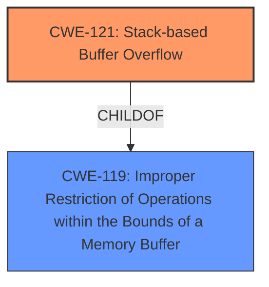

# Analysis for CVE-2024-11061

# Summary
| CWE ID | CWE Name | Confidence | CWE Abstraction Level | CWE Vulnerability Mapping Label | CWE-Vulnerability Mapping Notes |
|---|---|---|---|---|---|
| CWE-121 | Stack-based Buffer Overflow | 1.0 | Variant | Primary | Allowed |

## Evidence and Confidence

*   **Confidence Score:** 1.0
*   **Evidence Strength:** HIGH

## Relationship Analysis
The primary relationship to consider is that CWE-121 is a Variant of the Class CWE-119. Since the description specifies a stack-based buffer overflow, using the more specific CWE-121 is appropriate.

## Vulnerability Chain
The vulnerability chain consists of a **stack-based buffer overflow** due to manipulation of the timeZone argument.

## Summary of Analysis
The vulnerability description clearly states a **stack-based buffer overflow** due to the manipulation of the timeZone argument in the `FUN_0044db3c` function of the `/goform/fast_setting_wifi_set` file. The description uses the phrase "**stack-based buffer overflow**" directly, making CWE-121 the most appropriate choice.

The evidence is the vulnerability description itself which states: "The manipulation of the argument timeZone leads to **stack-based buffer overflow**".

The retriever results also list CWE-121 as a candidate with a good score.

Other CWEs Considered:

*   CWE-119: "Improper Restriction of Operations within the Bounds of a Memory Buffer" - While this is a parent of CWE-121, the description specifies a stack-based overflow, making the child CWE more appropriate.
*   CWE-190: "Integer Overflow or Wraparound" - This is not relevant to a buffer overflow.
*   CWE-89: "Improper Neutralization of Special Elements used in an SQL Command ('SQL Injection')" - This is not relevant because it is related to SQL injections, not buffer overflows.
*   CWE-79: "Improper Neutralization of Input During Web Page Generation ('Cross-site Scripting')" - This is not relevant because it is related to Cross-site Scripting, not buffer overflows.
*   CWE-125: "Out-of-bounds Read" - While related to buffer issues, the description explicitly states a buffer overflow (write), not a read.
*   CWE-1284: "Improper Validation of Specified Quantity in Input" - This could be a contributing factor, but the primary weakness is the overflow itself.
*   CWE-78: "Improper Neutralization of Special Elements used in an OS Command ('OS Command Injection')" - This is not relevant because it is related to OS Command Injection, not buffer overflows.
*   CWE-128: "Wrap-around Error" - This is not relevant to a buffer overflow.